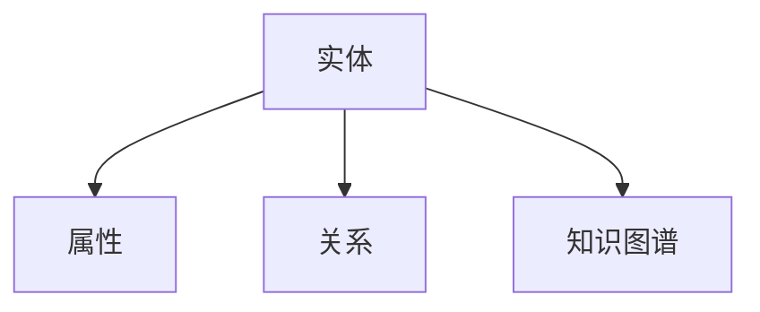

# 6.1 知识表示 主题导航与多表征案例

## 目录结构与本地跳转

- [6.1.1 知识表示基础理论](./6.1.1-知识表示基础理论.md)

---

## 行业案例与多表征

### 6.1.x 典型行业案例

- 金融知识图谱：实体关系建模与风险识别（详见5.1-金融数据分析、6.2-关系建模）
- 医疗知识图谱：疾病、药物、症状的本体建模（详见5.3-机器学习、6.2-关系建模）

### 6.1.x 多表征示例

- 知识表示结构图、本体树、属性关系图、Latex公式等

---

[返回知识图谱与可视化导航](../README.md)
