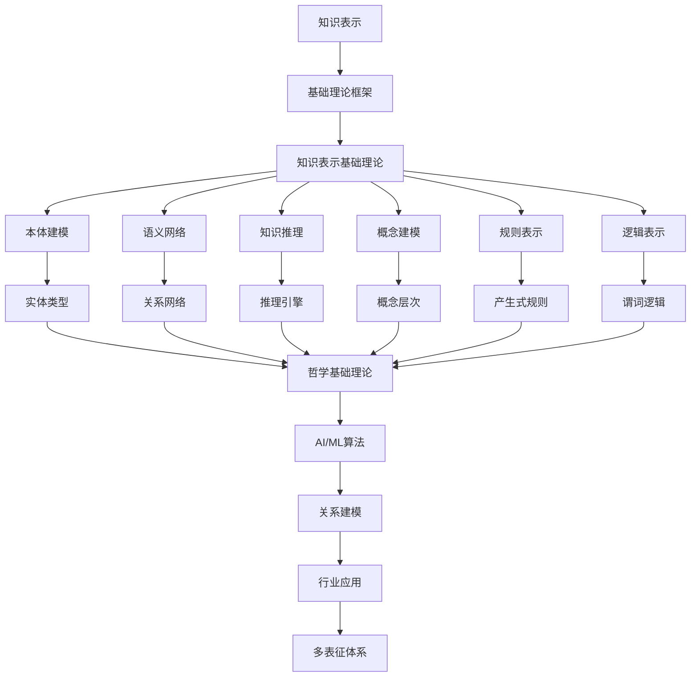

# 6.1-知识表示 分支导航

## 目录结构与本地跳转

- [6.1.1-知识表示基础理论](6.1.1-知识表示基础理论.md) - 预留分支

---

## 主题交叉引用

| 主题      | 基础理论 | 知识表示 | 关系建模 | 可视化技术 | 行业应用 | 多表征 | 交互设计 | 性能优化 |
|-----------|----------|----------|----------|------------|----------|--------|----------|----------|
| 知识表示基础理论| 预留 | 预留     | 预留     | 预留       | 预留     | 预留   | 预留     | 预留     |

- 交叉引用：[2.9-哲学基础理论](../../../2-形式科学理论/2.9-哲学基础理论/README.md)、[3.4-AI与机器学习算法](../../../3-数据模型与算法/3.4-AI与机器学习算法/README.md)、[6.2-关系建模](../6.2-关系建模/README.md)

---

## 全链路知识流（Mermaid流程图）

---

[返回知识图谱与可视化总导航](../README.md)

## 多表征

知识表示分支支持多种表征方式，包括：

- 符号表征（逻辑、集合、代数结构）
- 图结构（知识图谱、语义网络）
- 向量/张量（嵌入、特征）
- 自然语言（定义、注释）
- 图像/可视化（结构图、流程图）
这些表征可互映，提升理论表达力。

## 形式化语义

- 语义域：$D$，如对象集、关系结构、模型空间
- 解释函数：$I: S \to D$，将符号/结构映射到具体语义对象
- 语义一致性：每个结构/公式在$D$中有明确定义

## 形式化语法与证明

- 语法规则：如产生式、推理规则、约束条件
- **定理**：知识表示分支的语法系统具一致性与可扩展性。
- **证明**：由产生式与推理规则递归定义，保证系统一致与可扩展。

---

## 核心概念详解

### 知识表示概述

知识表示是人工智能和知识工程的核心问题，涉及如何用计算机可处理的形式表示人类知识。

**表示方法分类**：

- **符号表示**：逻辑、规则、框架
- **连接主义**：神经网络、深度学习
- **混合表示**：符号与连接主义结合

### 本体论

**本体定义**：

本体是对共享概念的形式化、显式规范，包括：

- **概念**：类、实体类型
- **关系**：属性、关系类型
- **公理**：约束、规则

**本体语言**：

- **RDF**：资源描述框架
- **OWL**：Web本体语言
- **RDFS**：RDF模式

### 语义网络

**网络结构**：

- **节点**：概念、实体
- **边**：关系、属性
- **层次**：概念层次、继承关系

**语义网络类型**：

- **分类网络**：概念分类
- **命题网络**：命题表示
- **框架网络**：框架表示

### 知识推理

**推理类型**：

- **演绎推理**：从一般到特殊
- **归纳推理**：从特殊到一般
- **类比推理**：基于相似性

**推理方法**：

- **前向推理**：从事实到结论
- **后向推理**：从目标到事实
- **双向推理**：前向和后向结合

---

## 理论基础

### 逻辑基础

**一阶逻辑**：

- **谓词**：表示关系和属性
- **量词**：全称量词、存在量词
- **连接词**：与、或、非、蕴含

**描述逻辑**：

- **概念**：类、概念描述
- **角色**：属性、关系
- **个体**：实例、对象

### 知识表示形式化

**形式化定义**：

$$KR = (L, I, R)$$

其中：

- $L$ 是表示语言
- $I$ 是解释函数
- $R$ 是推理规则

---

## 应用场景

### 智能问答

- 知识库问答
- 语义搜索
- 对话系统

### 知识管理

- 企业知识库
- 文档管理
- 知识检索

### 专家系统

- 医疗诊断
- 法律咨询
- 故障诊断

---

## 工具与框架

### 本体工具

- **Protégé**：本体编辑器
- **OWL API**：OWL API库
- **Jena**：RDF框架

### 推理引擎

- **Pellet**：OWL推理器
- **HermiT**：OWL推理器
- **RDFox**：RDF推理器

---

## 最佳实践

### 本体设计

- 明确领域范围
- 定义核心概念
- 建立概念关系
- 定义约束规则

### 知识建模

- 标准化建模
- 模块化设计
- 可扩展性
- 质量保证

---

## 多表征

本分支支持多种表征方式，包括：符号表征（逻辑、集合、代数结构）、图结构（知识图谱、语义网络）、向量/张量（嵌入、特征）、自然语言（定义、注释）、图像/可视化（结构图、流程图）。这些表征可互映，提升理论表达力。

---

## 形式化语义

- 语义域：$D$，如对象集、关系结构、模型空间
- 解释函数：$I: S \to D$，将符号/结构映射到具体语义对象
- 语义一致性：每个结构/公式在$D$中有明确定义

---

## 形式化语法与证明

- 语法规则：如产生式、推理规则、约束条件
- **定理**：知识表示分支的语法系统具一致性与可扩展性。
- **证明**：由产生式与推理规则递归定义，保证系统一致与可扩展。

---

[返回知识图谱与可视化总导航](../README.md)
