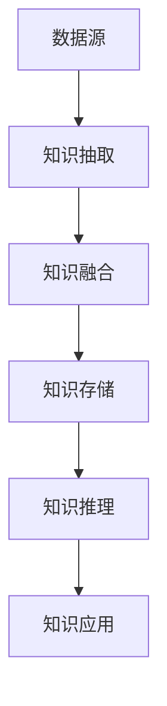

# 知识图谱构建与推理系统

## 📑 目录

- [知识图谱构建与推理系统](#知识图谱构建与推理系统)
  - [📑 目录](#-目录)
  - [1. 概述](#1-概述)
    - [1.1. 理论基础](#11-理论基础)
    - [1.2. 核心概念](#12-核心概念)
    - [1.3. 系统架构](#13-系统架构)
  - [2. 知识抽取理论](#2-知识抽取理论)
    - [2.1. 命名实体识别](#21-命名实体识别)
  - [3. 关系抽取](#3-关系抽取)
  - [4. 知识融合](#4-知识融合)
    - [4.1. 实体链接](#41-实体链接)
    - [4.2. 实体消歧](#42-实体消歧)
  - [5. 知识存储](#5-知识存储)
    - [5.1. 图数据库设计](#51-图数据库设计)
    - [5.2. 存储优化](#52-存储优化)
  - [6. 知识推理](#6-知识推理)
    - [6.1. 逻辑推理](#61-逻辑推理)
    - [6.2. 统计推理](#62-统计推理)
  - [7. 应用案例](#7-应用案例)
    - [7.1. 智能问答系统](#71-智能问答系统)
  - [8. 推荐系统](#8-推荐系统)
  - [9. 性能优化](#9-性能优化)
    - [9.1. 查询优化](#91-查询优化)
  - [10. 缓存策略](#10-缓存策略)
  - [11. 评估指标](#11-评估指标)
    - [11.1. 抽取质量评估](#111-抽取质量评估)
    - [11.2. 推理质量评估](#112-推理质量评估)
  - [12. 最佳实践](#12-最佳实践)
    - [12.1. 数据质量控制](#121-数据质量控制)
    - [12.2. 系统设计原则](#122-系统设计原则)
  - [13. 未来发展方向](#13-未来发展方向)
    - [13.1. 多模态知识图谱](#131-多模态知识图谱)
    - [13.2. 动态知识图谱](#132-动态知识图谱)

---


## 1. 概述

### 1.1. 理论基础

知识图谱构建与推理系统是现代人工智能的重要组成部分，它将结构化知识表示为实体-关系-实体的三元组形式，并通过推理机制发现隐含知识。

### 1.2. 核心概念

- **知识图谱**：以图结构表示的知识库
- **实体识别**：从文本中识别命名实体
- **关系抽取**：识别实体间的关系
- **知识推理**：基于已有知识推导新知识

### 1.3. 系统架构



## 2. 知识抽取理论

### 2.1. 命名实体识别

**定义**：识别文本中的命名实体（人名、地名、机构名等）

**数学表示**：
$$P(y|x) = \prod_{i=1}^{n} P(y_i|y_{i-1}, x_i)$$

**实现方法**：

```python
import torch
import torch.nn as nn

class NERModel(nn.Module):
    def __init__(self, vocab_size, embedding_dim, hidden_dim, num_tags):
        super(NERModel, self).__init__()
        self.embedding = nn.Embedding(vocab_size, embedding_dim)
        self.lstm = nn.LSTM(embedding_dim, hidden_dim, batch_first=True)
        self.linear = nn.Linear(hidden_dim, num_tags)

    def forward(self, x):
        embedded = self.embedding(x)
        lstm_out, _ = self.lstm(embedded)
        output = self.linear(lstm_out)
        return output

# 使用示例
model = NERModel(vocab_size=10000, embedding_dim=128, hidden_dim=256, num_tags=5)
criterion = nn.CrossEntropyLoss()
optimizer = torch.optim.Adam(model.parameters())
```

## 3. 关系抽取

**定义**：识别实体间的关系类型

**方法**：

1. **监督学习**：基于标注数据训练分类器
2. **远程监督**：利用知识库自动生成训练数据
3. **无监督学习**：基于模式匹配和统计方法

```python
class RelationExtractor:
    def __init__(self, model_path):
        self.model = self.load_model(model_path)

    def extract_relations(self, text, entities):
        """抽取实体间关系"""
        relations = []
        for i, entity1 in enumerate(entities):
            for j, entity2 in enumerate(entities):
                if i != j:
                    relation = self.predict_relation(text, entity1, entity2)
                    if relation:
                        relations.append((entity1, relation, entity2))
        return relations
```

## 4. 知识融合

### 4.1. 实体链接

**目标**：将文本中的实体链接到知识库中的标准实体

**算法**：

1. **候选实体生成**：基于字符串匹配生成候选
2. **实体排序**：使用排序模型对候选进行排序
3. **实体选择**：选择最相关的实体

```python
class EntityLinker:
    def __init__(self, knowledge_base):
        self.kb = knowledge_base

    def link_entity(self, mention, context):
        """实体链接"""
        candidates = self.generate_candidates(mention)
        scores = self.rank_candidates(candidates, context)
        return self.select_best_entity(candidates, scores)
```

### 4.2. 实体消歧

**目标**：解决同名实体的歧义问题

**方法**：

- **基于上下文**：利用周围文本信息
- **基于图结构**：利用知识图谱结构
- **基于统计**：利用共现统计信息

## 5. 知识存储

### 5.1. 图数据库设计

```python
import networkx as nx
from rdflib import Graph, Namespace

class KnowledgeGraph:
    def __init__(self):
        self.graph = nx.DiGraph()
        self.rdf_graph = Graph()

    def add_triple(self, subject, predicate, object):
        """添加三元组"""
        self.graph.add_edge(subject, object, relation=predicate)
        self.rdf_graph.add((subject, predicate, object))

    def query(self, pattern):
        """查询知识图谱"""
        return self.rdf_graph.query(pattern)
```

### 5.2. 存储优化

**索引策略**：

- **实体索引**：快速定位实体
- **关系索引**：快速查找关系
- **属性索引**：快速访问属性

## 6. 知识推理

### 6.1. 逻辑推理

**推理规则**：

- **传递性**：如果A→B且B→C，则A→C
- **对称性**：如果A=B，则B=A
- **反身性**：A=A

```python
class LogicalReasoner:
    def __init__(self, knowledge_graph):
        self.kg = knowledge_graph

    def transitive_closure(self, relation):
        """计算传递闭包"""
        closure = set()
        for (a, b) in self.kg.get_relations(relation):
            closure.add((a, b))
            for (c, d) in self.kg.get_relations(relation):
                if b == c:
                    closure.add((a, d))
        return closure
```

### 6.2. 统计推理

**基于嵌入的推理**：

- **TransE**：将实体和关系映射到向量空间
- **TransH**：在超平面上进行翻译
- **TransR**：在不同关系空间中翻译

```python
import torch
import torch.nn as nn

class TransEModel(nn.Module):
    def __init__(self, num_entities, num_relations, embedding_dim):
        super(TransEModel, self).__init__()
        self.entity_embeddings = nn.Embedding(num_entities, embedding_dim)
        self.relation_embeddings = nn.Embedding(num_relations, embedding_dim)

    def forward(self, heads, relations, tails):
        h = self.entity_embeddings(heads)
        r = self.relation_embeddings(relations)
        t = self.entity_embeddings(tails)

        score = torch.norm(h + r - t, p=2, dim=1)
        return score
```

## 7. 应用案例

### 7.1. 智能问答系统

```python
class KnowledgeGraphQA:
    def __init__(self, knowledge_graph):
        self.kg = knowledge_graph

    def answer_question(self, question):
        """回答问题"""
# 解析问题
        entities = self.extract_entities(question)
        relation = self.extract_relation(question)

# 查询知识图谱
        answers = self.kg.query(entities, relation)

        return self.format_answers(answers)
```

## 8. 推荐系统

```python
class KGRecommendation:
    def __init__(self, knowledge_graph):
        self.kg = knowledge_graph

    def recommend(self, user_id, item_type):
        """基于知识图谱的推荐"""
# 获取用户兴趣
        user_interests = self.get_user_interests(user_id)

# 在知识图谱中查找相关实体
        candidates = self.find_related_entities(user_interests, item_type)

# 排序并返回推荐
        return self.rank_candidates(candidates, user_interests)
```

## 9. 性能优化

### 9.1. 查询优化

```python
class QueryOptimizer:
    def __init__(self, knowledge_graph):
        self.kg = knowledge_graph

    def optimize_query(self, query):
        """优化查询计划"""
# 分析查询复杂度
        complexity = self.analyze_complexity(query)

# 生成查询计划
        plan = self.generate_plan(query, complexity)

# 选择最优计划
        return self.select_best_plan(plan)
```

## 10. 缓存策略

```python
class QueryCache:
    def __init__(self, max_size=1000):
        self.cache = {}
        self.max_size = max_size

    def get(self, query):
        """获取缓存结果"""
        return self.cache.get(query)

    def put(self, query, result):
        """缓存查询结果"""
        if len(self.cache) >= self.max_size:
            self.evict_oldest()
        self.cache[query] = result
```

## 11. 评估指标

### 11.1. 抽取质量评估

```python
def evaluate_extraction(predictions, ground_truth):
    """评估抽取质量"""
    precision = len(predictions & ground_truth) / len(predictions)
    recall = len(predictions & ground_truth) / len(ground_truth)
    f1 = 2 * precision * recall / (precision + recall)

    return {
        'precision': precision,
        'recall': recall,
        'f1_score': f1
    }
```

### 11.2. 推理质量评估

```python
def evaluate_reasoning(predictions, ground_truth):
    """评估推理质量"""
    accuracy = sum(p == g for p, g in zip(predictions, ground_truth)) / len(predictions)
    return {'accuracy': accuracy}
```

## 12. 最佳实践

### 12.1. 数据质量控制

- **数据清洗**：去除噪声和错误数据
- **一致性检查**：确保数据一致性
- **完整性验证**：验证数据完整性

### 12.2. 系统设计原则

- **模块化设计**：各组件独立可替换
- **可扩展性**：支持大规模数据
- **高性能**：优化查询和推理性能

## 13. 未来发展方向

### 13.1. 多模态知识图谱

- **文本+图像**：结合视觉信息
- **文本+音频**：结合语音信息
- **跨语言**：支持多语言知识

### 13.2. 动态知识图谱

- **实时更新**：支持知识实时更新
- **增量学习**：支持增量知识学习
- **版本管理**：支持知识版本管理

---

## 14. 系统架构深入

### 14.1. 分布式架构

**架构设计**：

- **数据分片**：水平分片、垂直分片
- **负载均衡**：查询负载均衡
- **容错机制**：故障恢复、数据备份

### 14.2. 微服务架构

**服务拆分**：

- **抽取服务**：知识抽取服务
- **融合服务**：知识融合服务
- **存储服务**：知识存储服务
- **推理服务**：知识推理服务

### 14.3. 云原生架构

**容器化部署**：

- **Docker**：容器化部署
- **Kubernetes**：容器编排
- **服务网格**：服务治理

---

## 15. 知识图谱应用深入

### 15.1. 智能问答系统深入

**问答类型**：

- **事实问答**：回答事实性问题
- **推理问答**：需要推理的问题
- **多跳问答**：需要多步推理的问题

**问答流程**：

1. 问题理解
2. 实体识别
3. 关系抽取
4. 知识检索
5. 答案生成

### 15.2. 推荐系统深入

**推荐方法**：

- **基于内容的推荐**：基于实体属性
- **协同过滤**：基于用户行为
- **知识图谱推荐**：基于知识图谱

**推荐流程**：

1. 用户画像构建
2. 候选生成
3. 排序优化
4. 结果展示

---

## 16. 性能优化深入

### 16.1. 存储优化

**索引优化**：

- **节点索引**：节点属性索引
- **边索引**：边属性索引
- **全文索引**：文本搜索索引

**压缩优化**：

- **数据压缩**：减少存储空间
- **查询压缩**：减少查询时间

### 16.2. 查询优化

**查询重写**：

- **查询简化**：简化查询语句
- **查询分解**：分解复杂查询
- **查询合并**：合并相似查询

**执行优化**：

- **并行执行**：并行查询执行
- **缓存策略**：查询结果缓存
- **预计算**：预计算常用查询

---

## 17. 安全与隐私

### 17.1. 数据安全

**访问控制**：

- **身份认证**：用户身份认证
- **权限管理**：细粒度权限控制
- **数据加密**：数据加密存储

### 17.2. 隐私保护

**隐私技术**：

- **数据脱敏**：敏感数据脱敏
- **差分隐私**：差分隐私保护
- **联邦学习**：联邦知识学习

---

## 18. 评估与测试

### 18.1. 功能测试

- **单元测试**：组件单元测试
- **集成测试**：系统集成测试
- **端到端测试**：端到端功能测试

### 18.2. 性能测试

- **负载测试**：系统负载测试
- **压力测试**：系统压力测试
- **性能基准**：性能基准测试

---

## 19. 总结

知识图谱构建与推理系统是现代人工智能的重要组成部分，通过知识抽取、融合、存储和推理，可以构建强大的智能知识系统。

**核心价值**：

1. **知识管理**：结构化知识管理
2. **智能应用**：支持智能应用开发
3. **知识推理**：支持知识推理
4. **用户体验**：改善用户体验

**未来展望**：

随着AI、大数据、知识图谱等技术的发展，知识图谱构建与推理系统将继续演进，特别是在多模态知识、实时知识、联邦知识等领域，系统将提供更强大的功能和更好的性能。

---

**相关链接**：

- [知识图谱构建与应用理论](./6.1.10-知识图谱构建与应用理论.md)
- [数据科学与机器学习理论体系](../3-数据模型与算法/3.1-数据科学基础理论/3.1.22-数据科学与机器学习理论体系.md)

**最后更新时间**：2024年12月
**文档状态**：完成
