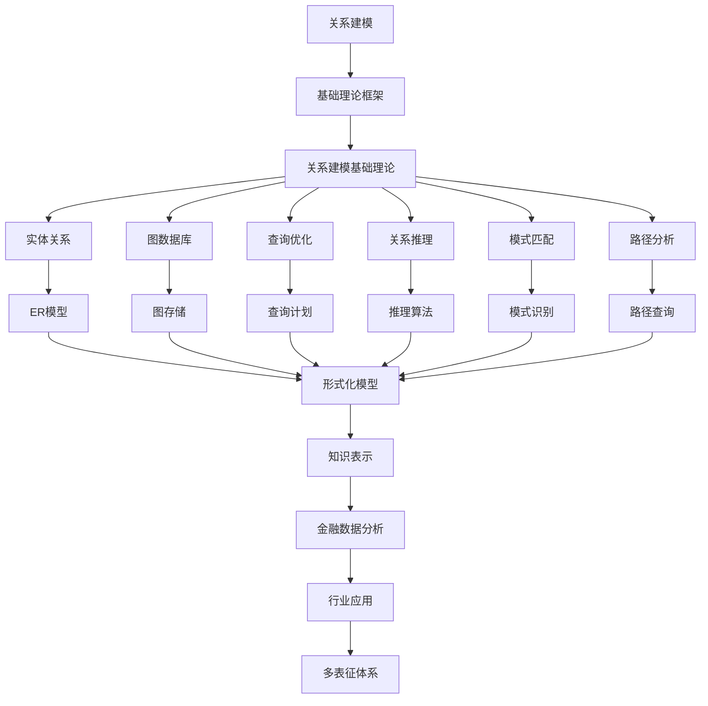

# 6.2-关系建模 分支导航

## 目录结构与本地跳转

- [6.2.1-关系建模基础理论](6.2.1-关系建模基础理论.md) - 预留分支

---

## 主题交叉引用

| 主题      | 基础理论 | 知识表示 | 关系建模 | 可视化技术 | 行业应用 | 多表征 | 交互设计 | 性能优化 |
|-----------|----------|----------|----------|------------|----------|--------|----------|----------|
| 关系建模基础理论| 预留 | 预留     | 预留     | 预留       | 预留     | 预留   | 预留     | 预留     |

- 交叉引用：[3.2-形式化模型](../../../3-数据模型与算法/3.2-形式化模型/README.md)、[6.1-知识表示](../6.1-知识表示/README.md)、[5.1-金融数据分析](../../../5-行业应用与场景/5.1-金融数据分析/README.md)

---

## 全链路知识流（Mermaid流程图）

---

[返回知识图谱与可视化总导航](../README.md)

## 多表征

关系建模分支支持多种表征方式，包括：

- 符号表征（关系代数、谓词逻辑）
- 表格/矩阵（关系表、邻接矩阵）
- 图结构（ER图、关系图）
- 向量/张量（特征向量、嵌入）
- 自然语言与可视化
这些表征可互映，增强理论的表达力。

## 形式化语义

- 语义域：$D$，如关系集合、属性集合、实例集合
- 解释函数：$I: S \to D$，将符号/结构映射到具体关系对象
- 语义一致性：每个关系/属性/实例在$D$中有明确定义

## 形式化语法与证明

- 语法规则：如关系产生式、约束规则、推理规则
- **定理**：关系建模分支的语法系统具一致性与可判定性。
- **证明**：由关系代数/逻辑的形式化定义与有限规则集可得。

---

## 核心概念详解

### 关系建模概述

关系建模是知识图谱和数据库设计的核心，涉及如何表示和管理实体间的关系。

**建模方法**：

- **ER模型**：实体关系模型
- **图模型**：图数据模型
- **关系模型**：关系数据模型

### 实体关系模型

**ER模型元素**：

- **实体**：现实世界对象
- **属性**：实体特征
- **关系**：实体间联系

**ER图表示**：

- **矩形**：实体
- **椭圆**：属性
- **菱形**：关系

### 图数据模型

**图结构**：

- **节点**：实体、对象
- **边**：关系、连接
- **属性**：节点和边的属性

**图类型**：

- **有向图**：有方向的关系
- **无向图**：无方向的关系
- **加权图**：带权重的关系
- **多重图**：多条边的关系

### 关系类型

**关系分类**：

- **一对一**：1:1关系
- **一对多**：1:N关系
- **多对多**：M:N关系

**关系性质**：

- **对称性**：对称关系、非对称关系
- **传递性**：传递关系、非传递关系
- **反身性**：自反关系、非自反关系

---

## 理论基础

### 关系代数

**基本操作**：

- **选择**：$\sigma_{condition}(R)$
- **投影**：$\pi_{attributes}(R)$
- **连接**：$R \bowtie S$
- **并集**：$R \cup S$
- **差集**：$R - S$

### 图论基础

**图论概念**：

- **路径**：节点序列
- **环**：闭合路径
- **连通性**：连通图、强连通图
- **度**：节点度数

---

## 应用场景

### 社交网络

- 用户关系建模
- 社交网络分析
- 社区发现

### 推荐系统

- 用户-物品关系
- 协同过滤
- 图推荐算法

### 知识图谱

- 实体关系抽取
- 关系推理
- 知识补全

---

## 工具与框架

### 图数据库

- **Neo4j**：原生图数据库
- **ArangoDB**：多模型数据库
- **Amazon Neptune**：云图数据库

### 图算法库

- **NetworkX**：Python图库
- **JGraphT**：Java图库
- **igraph**：R图库

---

## 最佳实践

### 关系设计

- 明确关系语义
- 选择合适关系类型
- 定义关系约束
- 优化关系结构

### 图建模

- 节点设计
- 边设计
- 属性设计
- 索引设计

---

## 多表征

本分支支持多种表征方式，包括：符号表征（关系代数、谓词逻辑）、表格/矩阵（关系表、邻接矩阵）、图结构（ER图、关系图）、向量/张量（特征向量、嵌入）、自然语言与可视化。这些表征可互映，增强理论的表达力。

---

## 形式化语义

- 语义域：$D$，如关系集合、属性集合、实例集合
- 解释函数：$I: S \to D$，将符号/结构映射到具体关系对象
- 语义一致性：每个关系/属性/实例在$D$中有明确定义

---

## 形式化语法与证明

- 语法规则：如关系产生式、约束规则、推理规则
- **定理**：关系建模分支的语法系统具一致性与可判定性。
- **证明**：由关系代数/逻辑的形式化定义与有限规则集可得。

---

[返回知识图谱与可视化总导航](../README.md)
