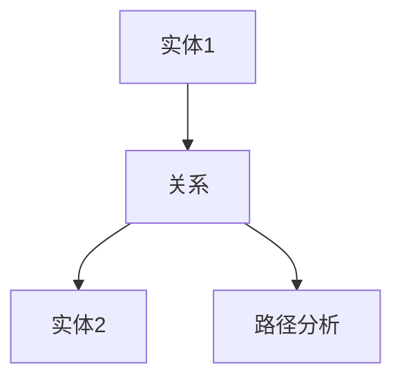

# 6.2 关系建模 主题导航与多表征案例

## 目录结构与本地跳转

- [6.2.1 关系建模基础理论](./6.2.1-关系建模基础理论.md)

---

## 行业案例与多表征

### 6.2.x 典型行业案例

- 金融知识图谱：反洗钱、风险传导路径建模（详见5.1-金融数据分析、6.1-知识表示）
- 科学知识网络：复杂关系与多层级建模（详见5.2-科学计算、6.1-知识表示）

### 6.2.x 多表征示例

- ER图、关系网络图、路径分析图、Latex公式等

---

[返回知识图谱与可视化导航](../README.md)
