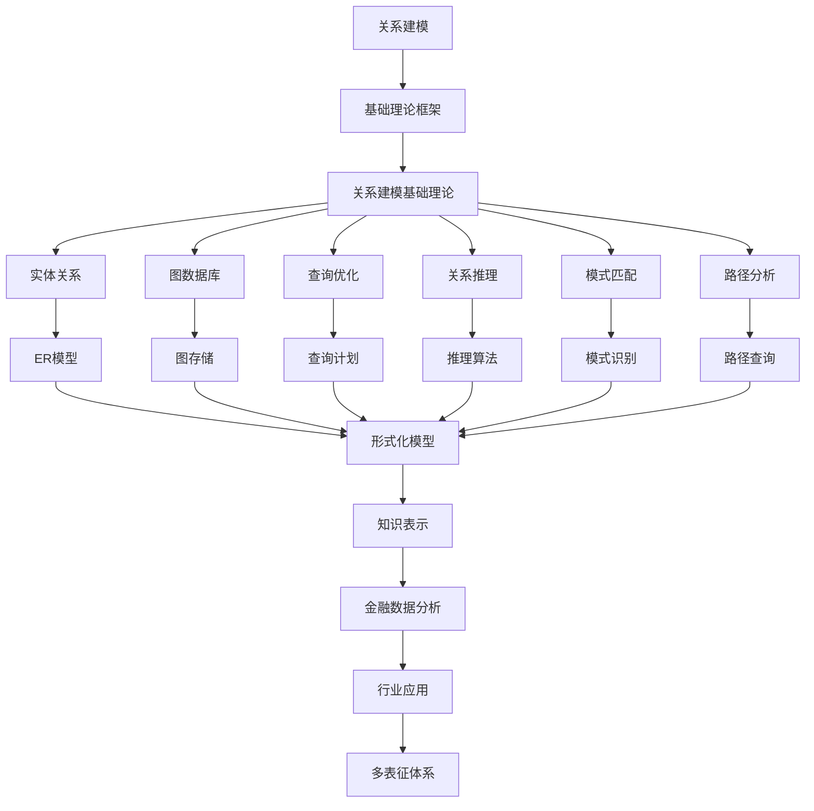

# 6.2-关系建模 分支导航

## 目录结构与本地跳转

- [6.2.1-关系建模基础理论](6.2.1-关系建模基础理论.md) - 预留分支

---

## 主题交叉引用

| 主题      | 基础理论 | 知识表示 | 关系建模 | 可视化技术 | 行业应用 | 多表征 | 交互设计 | 性能优化 |
|-----------|----------|----------|----------|------------|----------|--------|----------|----------|
| 关系建模基础理论| 预留 | 预留     | 预留     | 预留       | 预留     | 预留   | 预留     | 预留     |

- 交叉引用：[3.2-形式化模型](../../../3-数据模型与算法/3.2-形式化模型/README.md)、[6.1-知识表示](../6.1-知识表示/README.md)、[5.1-金融数据分析](../../../5-行业应用与场景/5.1-金融数据分析/README.md)

---

## 全链路知识流（Mermaid流程图）

---

[返回知识图谱与可视化总导航](../README.md)

## 多表征

关系建模分支支持多种表征方式，包括：

- 符号表征（关系代数、谓词逻辑）
- 表格/矩阵（关系表、邻接矩阵）
- 图结构（ER图、关系图）
- 向量/张量（特征向量、嵌入）
- 自然语言与可视化
这些表征可互映，增强理论的表达力。

## 形式化语义

- 语义域：$D$，如关系集合、属性集合、实例集合
- 解释函数：$I: S \to D$，将符号/结构映射到具体关系对象
- 语义一致性：每个关系/属性/实例在$D$中有明确定义

## 形式化语法与证明

- 语法规则：如关系产生式、约束规则、推理规则
- **定理**：关系建模分支的语法系统具一致性与可判定性。
- **证明**：由关系代数/逻辑的形式化定义与有限规则集可得。

---

## 核心概念详解

### 关系建模概述

关系建模是知识图谱和数据库设计的核心，涉及如何表示和管理实体间的关系。

**建模方法**：

- **ER模型**：实体关系模型
- **图模型**：图数据模型
- **关系模型**：关系数据模型

### 实体关系模型

**ER模型元素**：

- **实体**：现实世界对象
- **属性**：实体特征
- **关系**：实体间联系

**ER图表示**：

- **矩形**：实体
- **椭圆**：属性
- **菱形**：关系

### 图数据模型

**图结构**：

- **节点**：实体、对象
- **边**：关系、连接
- **属性**：节点和边的属性

**图类型**：

- **有向图**：有方向的关系
- **无向图**：无方向的关系
- **加权图**：带权重的关系
- **多重图**：多条边的关系

### 关系类型

**关系分类**：

- **一对一**：1:1关系
- **一对多**：1:N关系
- **多对多**：M:N关系

**关系性质**：

- **对称性**：对称关系、非对称关系
- **传递性**：传递关系、非传递关系
- **反身性**：自反关系、非自反关系

---

## 理论基础

### 关系代数

**基本操作**：

- **选择**：$\sigma_{condition}(R)$
- **投影**：$\pi_{attributes}(R)$
- **连接**：$R \bowtie S$
- **并集**：$R \cup S$
- **差集**：$R - S$

### 图论基础

**图论概念**：

- **路径**：节点序列
- **环**：闭合路径
- **连通性**：连通图、强连通图
- **度**：节点度数

---

## 应用场景

### 社交网络

- 用户关系建模
- 社交网络分析
- 社区发现

### 推荐系统

- 用户-物品关系
- 协同过滤
- 图推荐算法

### 知识图谱

- 实体关系抽取
- 关系推理
- 知识补全

---

## 工具与框架

### 图数据库

- **Neo4j**：原生图数据库
- **ArangoDB**：多模型数据库
- **Amazon Neptune**：云图数据库

### 图算法库

- **NetworkX**：Python图库
- **JGraphT**：Java图库
- **igraph**：R图库

---

## 最佳实践

### 关系设计

- 明确关系语义
- 选择合适关系类型
- 定义关系约束
- 优化关系结构

### 图建模

- 节点设计
- 边设计
- 属性设计
- 索引设计

---

## 多表征

本分支支持多种表征方式，包括：符号表征（关系代数、谓词逻辑）、表格/矩阵（关系表、邻接矩阵）、图结构（ER图、关系图）、向量/张量（特征向量、嵌入）、自然语言与可视化。这些表征可互映，增强理论的表达力。

---

## 形式化语义

- 语义域：$D$，如关系集合、属性集合、实例集合
- 解释函数：$I: S \to D$，将符号/结构映射到具体关系对象
- 语义一致性：每个关系/属性/实例在$D$中有明确定义

---

## 形式化语法与证明

- 语法规则：如关系产生式、约束规则、推理规则
- **定理**：关系建模分支的语法系统具一致性与可判定性。
- **证明**：由关系代数/逻辑的形式化定义与有限规则集可得。

---

## 深入学习建议

### 理论基础强化

**数学基础**：

- **图论**：图的基本概念、图算法、网络分析
- **线性代数**：矩阵运算、特征值、谱图理论
- **离散数学**：集合论、关系、函数
- **概率论**：概率分布、随机图

**计算机科学基础**：

- **数据结构**：图、树、哈希表
- **算法设计**：图算法、最短路径、社区发现
- **数据库理论**：关系数据库、图数据库
- **网络理论**：复杂网络、社交网络

### 实践能力提升

**编程能力**：

- **Python**：NetworkX、igraph、Neo4j
- **Java**：JGraphT、Neo4j Java API
- **JavaScript**：Cytoscape.js、D3.js
- **Rust**：petgraph、neo4rs

**工具使用**：

- **Neo4j**：图数据库
- **ArangoDB**：多模型数据库
- **Gephi**：网络分析工具
- **Cytoscape**：网络可视化

### 研究能力培养

**文献阅读**：

- **经典论文**：关系建模经典论文
- **前沿研究**：最新研究进展
- **应用论文**：实际应用案例
- **会议论文**：顶级会议论文

---

## 学习资源汇总

### 在线课程

- **Coursera**：图数据库课程
- **edX**：网络分析课程
- **Udemy**：Neo4j课程
- **YouTube**：关系建模教程

### 书籍推荐

- **入门书籍**：《Graph Databases》
- **进阶书籍**：《Network Science》
- **应用书籍**：《Graph Algorithms》
- **工具书籍**：《Neo4j in Action》

### 学术资源

- **期刊**：ACM TKDD、IEEE TKDE
- **会议**：KDD、ICDM、WWW
- **数据库**：IEEE Xplore、ACM Digital Library
- **预印本**：arXiv、ResearchGate

---

## 实践项目建议

### 基础项目

- **ER建模**：实体关系建模
- **图数据库**：图数据库实现
- **图查询**：图查询语言实现
- **图可视化**：图可视化工具

### 进阶项目

- **关系抽取**：从文本抽取关系
- **关系推理**：关系推理算法
- **图算法**：图算法实现
- **网络分析**：复杂网络分析

### 高级项目

- **大规模图处理**：分布式图处理
- **动态图建模**：动态关系建模
- **图神经网络**：图神经网络应用
- **图应用系统**：实际应用系统

---

## 职业发展路径

### 学术研究

- **研究方向**：图论、网络分析、图数据库
- **职业路径**：博士研究、博士后、教职、研究机构

### 工业应用

- **应用领域**：社交网络、推荐系统、知识图谱
- **职业路径**：图数据库工程师、数据科学家、算法工程师

---

## 常见问题与解决方案

### 关系建模挑战

**挑战1：关系复杂性**

- **问题**：实体间关系复杂多样
- **解决方案**：
  - 关系分类体系
  - 关系层次结构
  - 关系约束定义
  - 关系推理机制

**挑战2：关系演化**

- **问题**：关系随时间变化
- **解决方案**：
  - 时间戳管理
  - 版本控制
  - 历史记录
  - 关系演化分析

**挑战3：关系查询性能**

- **问题**：复杂关系查询性能差
- **解决方案**：
  - 查询优化
  - 索引设计
  - 缓存机制
  - 并行处理

### 性能优化建议

**图数据库优化**：

- **索引策略**：节点和边的索引
- **分区策略**：图分区和分片
- **缓存策略**：热点数据缓存
- **查询优化**：Cypher/SPARQL优化

**关系查询优化**：

- **路径查询**：最短路径算法优化
- **模式匹配**：子图匹配优化
- **聚合查询**：聚合操作优化
- **并行查询**：并行查询执行

---

## 行业应用案例

### 社交网络分析

**应用场景**：

- **用户关系分析**：分析用户间的关系
- **社区发现**：发现社交网络中的社区
- **影响力分析**：分析用户影响力
- **推荐系统**：基于关系的推荐

**技术要点**：

- 图数据建模
- 图算法应用
- 关系挖掘
- 可视化展示

### 推荐系统

**应用场景**：

- **协同过滤**：基于用户-物品关系
- **内容推荐**：基于内容关系
- **社交推荐**：基于社交关系
- **知识图谱推荐**：基于知识图谱

**技术要点**：

- 关系建模
- 相似度计算
- 推荐算法
- 效果评估

### 知识图谱

**应用场景**：

- **实体关系抽取**：从文本抽取关系
- **关系推理**：基于已有关系推理新关系
- **知识补全**：补全缺失的关系
- **知识问答**：基于关系的问答

**技术要点**：

- 关系抽取
- 关系验证
- 关系推理
- 关系查询

---

## 最佳实践

### ER建模最佳实践

1. **实体识别**：准确识别实体
2. **关系定义**：清晰定义关系语义
3. **属性设计**：合理设计属性
4. **约束定义**：定义完整性约束
5. **规范化**：遵循数据库规范化原则

### 图建模最佳实践

1. **节点设计**：合理设计节点类型
2. **边设计**：清晰定义边类型和属性
3. **索引设计**：为常用查询建立索引
4. **分区策略**：采用合适的分区策略
5. **性能监控**：监控查询性能

### 关系查询最佳实践

1. **查询优化**：优化查询语句
2. **索引使用**：充分利用索引
3. **批量操作**：使用批量操作提高效率
4. **缓存策略**：合理使用缓存
5. **性能测试**：定期进行性能测试

---

## 总结

关系建模是知识图谱和数据库设计的核心，通过ER模型、图模型和关系模型，可以有效地表示和管理实体间的关系，为复杂系统提供数据建模基础。

**核心价值**：

1. **数据组织**：结构化数据组织
2. **关系表达**：清晰表达实体关系
3. **查询支持**：支持复杂查询
4. **知识管理**：支持知识图谱构建

**未来展望**：

随着大数据、知识图谱、图数据库等技术的发展，关系建模将继续演进，特别是在多模态建模、自动化建模、大规模图谱等领域，关系建模将提供更强大的功能和更好的性能。

**技术发展趋势**：

1. **自动化关系抽取**：自动从文本中抽取关系
2. **动态关系建模**：支持时间维度的关系建模
3. **大规模图处理**：支持超大规模图的高效处理
4. **图神经网络**：结合深度学习的图建模
5. **多模态关系**：支持文本、图像等多种模态的关系

**应用前景**：

- **知识图谱**：构建更完整的知识图谱
- **推荐系统**：基于关系的精准推荐
- **社交网络**：社交网络分析和挖掘
- **系统架构**：系统架构关系可视化

---

[返回知识图谱与可视化总导航](../README.md)
