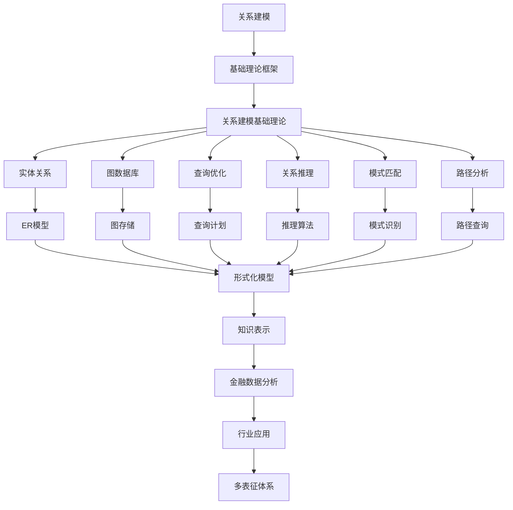

# 6.2-关系建模 分支导航

## 目录结构与本地跳转
- [6.2.1-关系建模基础理论](6.2.1-关系建模基础理论.md) - 预留分支

---

## 主题交叉引用
| 主题      | 基础理论 | 知识表示 | 关系建模 | 可视化技术 | 行业应用 | 多表征 | 交互设计 | 性能优化 |
|-----------|----------|----------|----------|------------|----------|--------|----------|----------|
| 关系建模基础理论| 预留 | 预留     | 预留     | 预留       | 预留     | 预留   | 预留     | 预留     |

- 交叉引用：[3.2-形式化模型](../../../3-数据模型与算法/3.2-形式化模型/README.md)、[6.1-知识表示](../6.1-知识表示/README.md)、[5.1-金融数据分析](../../../5-行业应用与场景/5.1-金融数据分析/README.md)

---

## 全链路知识流（Mermaid流程图）

---

[返回知识图谱与可视化总导航](../README.md)
