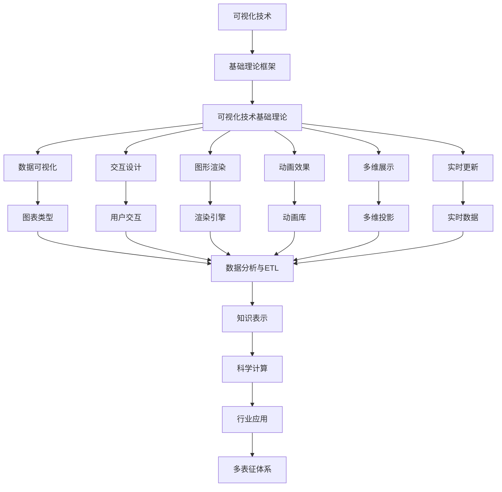

# 6.3-可视化技术 分支导航

## 目录结构与本地跳转

- [6.3.1-可视化技术基础理论](6.3.1-可视化技术基础理论.md) - 预留分支

---

## 主题交叉引用

| 主题      | 基础理论 | 知识表示 | 关系建模 | 可视化技术 | 行业应用 | 多表征 | 交互设计 | 性能优化 |
|-----------|----------|----------|----------|------------|----------|--------|----------|----------|
| 可视化技术基础理论| 预留 | 预留     | 预留     | 预留       | 预留     | 预留   | 预留     | 预留     |

- 交叉引用：[3.5-数据分析与ETL](../../../3-数据模型与算法/3.5-数据分析与ETL/README.md)、[6.1-知识表示](../6.1-知识表示/README.md)、[5.2-科学计算](../../../5-行业应用与场景/5.2-科学计算/README.md)

---

## 全链路知识流（Mermaid流程图）

---

[返回知识图谱与可视化总导航](../README.md)

## 多表征

可视化技术分支支持多种表征方式，包括：

- 图形/图像（节点-边图、流程图、热力图等）
- 符号/逻辑（可视化语法、图形语言）
- 向量/矩阵（布局、嵌入）
- 自然语言（注释、描述）
这些表征可互映，提升可视化表达力。

## 形式化语义

- 语义域：$D$，如图形对象集、布局空间、属性集
- 解释函数：$I: S \to D$，将可视化结构/符号映射到具体图形对象
- 语义一致性：每个可视化元素在$D$中有明确定义

## 形式化语法与证明

- 语法规则：如可视化元素产生式、布局规则、交互规则
- **定理**：可视化技术分支的语法系统具一致性与可扩展性。
- **证明**：由可视化语法与规则递归定义，保证系统一致与可扩展。

---

## 核心概念详解

### 可视化技术概述

可视化技术是将数据转换为图形表示，帮助用户理解和分析数据的技术。

**可视化目标**：

- **信息传达**：有效传达信息
- **数据探索**：支持数据探索
- **决策支持**：辅助决策制定

### 可视化类型

**数据可视化**：

- **统计图表**：柱状图、折线图、散点图、饼图
- **关系图**：网络图、树状图、力导向图
- **地理可视化**：地图、热力图、流向图

**信息可视化**：

- **层次可视化**：树状图、旭日图、树图
- **网络可视化**：节点链接图、邻接矩阵
- **多维可视化**：平行坐标、雷达图、散点图矩阵

### 视觉编码

**视觉通道**：

- **位置**：x、y坐标
- **颜色**：色相、饱和度、亮度
- **大小**：长度、面积、体积
- **形状**：几何形状、图标
- **纹理**：纹理模式

**编码原则**：

- **准确性**：准确表示数据
- **可区分性**：易于区分
- **可分离性**：通道独立
- **可组合性**：通道组合

### 交互设计

**交互方式**：

- **缩放平移**：视图缩放、平移
- **筛选过滤**：数据筛选、条件过滤
- **钻取**：数据钻取、下钻上卷
- **联动**：多视图联动
- **动画**：过渡动画、状态动画

**交互原则**：

- **反馈**：及时反馈
- **一致性**：交互一致
- **可逆性**：操作可逆
- **效率**：操作高效

---

## 理论基础

### 认知科学

**视觉感知**：

- **格式塔原理**：接近性、相似性、连续性
- **视觉层次**：视觉重要性
- **注意力**：注意力引导

### 设计理论

**设计原则**：

- **简洁性**：简洁明了
- **一致性**：设计一致
- **可用性**：易于使用
- **美观性**：视觉美观

---

## 应用场景

### 数据分析

- 数据探索
- 模式发现
- 异常检测

### 商业智能

- 仪表盘
- 报表
- 决策支持

### 科学可视化

- 科学数据可视化
- 仿真可视化
- 医学影像

---

## 工具与框架

### 可视化库

- **D3.js**：数据驱动文档
- **Plotly**：交互式图表
- **Matplotlib**：Python绘图库
- **ggplot2**：R绘图库

### 可视化工具

- **Tableau**：商业智能工具
- **Power BI**：Microsoft BI工具
- **Gephi**：网络分析工具

---

## 最佳实践

### 可视化设计

- 选择合适的图表类型
- 合理使用颜色
- 保持简洁
- 注重用户体验

### 交互设计

- 提供清晰的交互提示
- 支持多种交互方式
- 优化交互性能
- 测试用户体验

---

## 多表征

本分支支持多种表征方式，包括：图形/图像（节点-边图、流程图、热力图等）、符号/逻辑（可视化语法、图形语言）、向量/矩阵（布局、嵌入）、自然语言（注释、描述）。这些表征可互映，提升可视化表达力。

---

## 形式化语义

- 语义域：$D$，如图形对象集、布局空间、属性集
- 解释函数：$I: S \to D$，将可视化结构/符号映射到具体图形对象
- 语义一致性：每个可视化元素在$D$中有明确定义

---

## 形式化语法与证明

- 语法规则：如可视化元素产生式、布局规则、交互规则
- **定理**：可视化技术分支的语法系统具一致性与可扩展性。
- **证明**：由可视化语法与规则递归定义，保证系统一致与可扩展。

---

[返回知识图谱与可视化总导航](../README.md)
