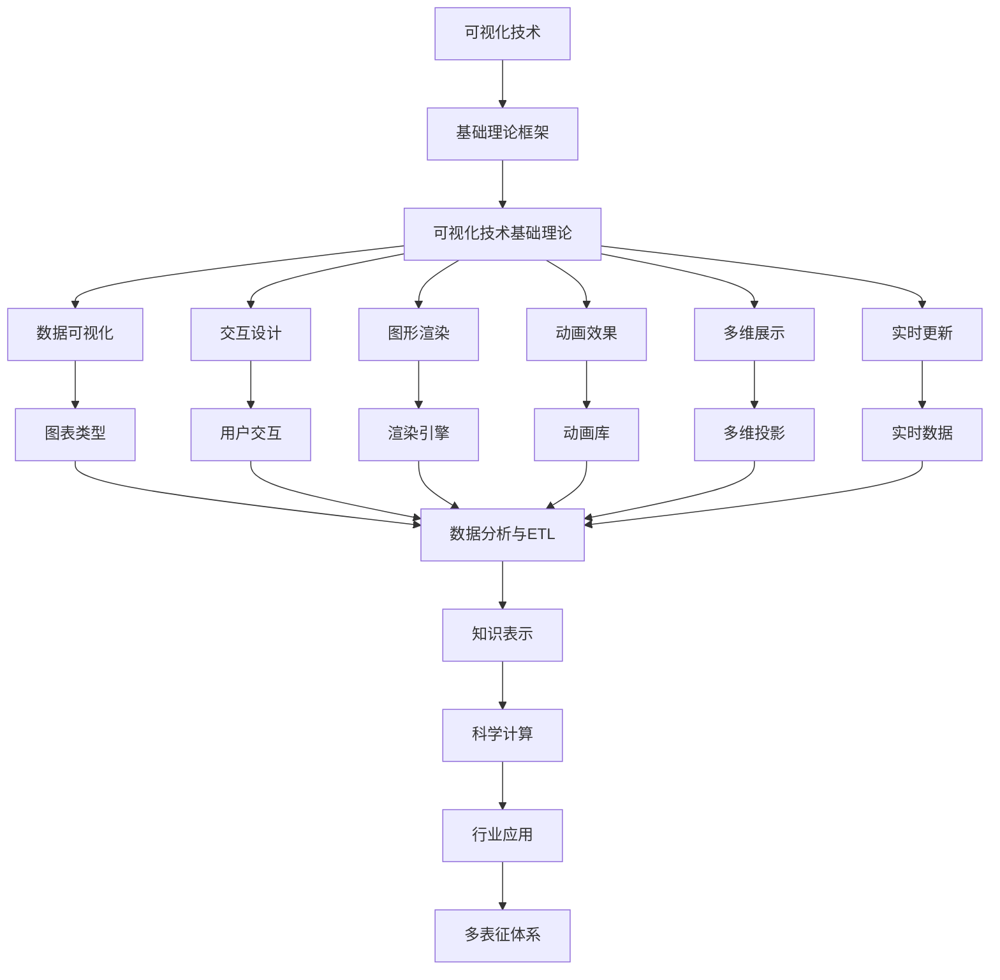

# 6.3-可视化技术 分支导航

## 目录结构与本地跳转

- [6.3.1-可视化技术基础理论](6.3.1-可视化技术基础理论.md) - 预留分支

---

## 主题交叉引用

| 主题      | 基础理论 | 知识表示 | 关系建模 | 可视化技术 | 行业应用 | 多表征 | 交互设计 | 性能优化 |
|-----------|----------|----------|----------|------------|----------|--------|----------|----------|
| 可视化技术基础理论| 预留 | 预留     | 预留     | 预留       | 预留     | 预留   | 预留     | 预留     |

- 交叉引用：[3.5-数据分析与ETL](../../../3-数据模型与算法/3.5-数据分析与ETL/README.md)、[6.1-知识表示](../6.1-知识表示/README.md)、[5.2-科学计算](../../../5-行业应用与场景/5.2-科学计算/README.md)

---

## 全链路知识流（Mermaid流程图）

---

[返回知识图谱与可视化总导航](../README.md)

## 多表征

可视化技术分支支持多种表征方式，包括：

- 图形/图像（节点-边图、流程图、热力图等）
- 符号/逻辑（可视化语法、图形语言）
- 向量/矩阵（布局、嵌入）
- 自然语言（注释、描述）
这些表征可互映，提升可视化表达力。

## 形式化语义

- 语义域：$D$，如图形对象集、布局空间、属性集
- 解释函数：$I: S \to D$，将可视化结构/符号映射到具体图形对象
- 语义一致性：每个可视化元素在$D$中有明确定义

## 形式化语法与证明

- 语法规则：如可视化元素产生式、布局规则、交互规则
- **定理**：可视化技术分支的语法系统具一致性与可扩展性。
- **证明**：由可视化语法与规则递归定义，保证系统一致与可扩展。
