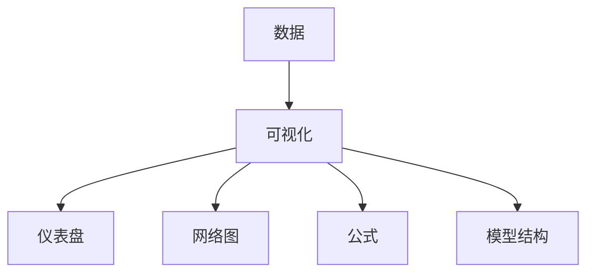

# 6.3 可视化技术 主题导航与多表征案例（增强版）

## 目录结构与本地跳转

- [6.3.1 可视化技术基础理论](./6.3.1-可视化技术基础理论.md)

---

## 行业案例与多表征

### 6.3.x 典型行业案例

- 金融可视化：风险热力图、交易网络图（详见5.1-金融数据分析、6.1-知识表示）
- 科学知识可视化：大规模数据流与知识网络（详见5.2-科学计算、6.2-关系建模）
- AI可视化：模型结构与推理过程可视化（详见3.4-AI与机器学习算法）
- 实时监控与仪表盘：多维数据交互展示（详见3.5-数据分析与ETL、6.1-知识表示）

### 6.3.x 多表征示例

- 可视化仪表盘、交互式数据流图、网络结构图、模型可视化、Latex公式等

---

[返回知识图谱与可视化导航](../README.md)
