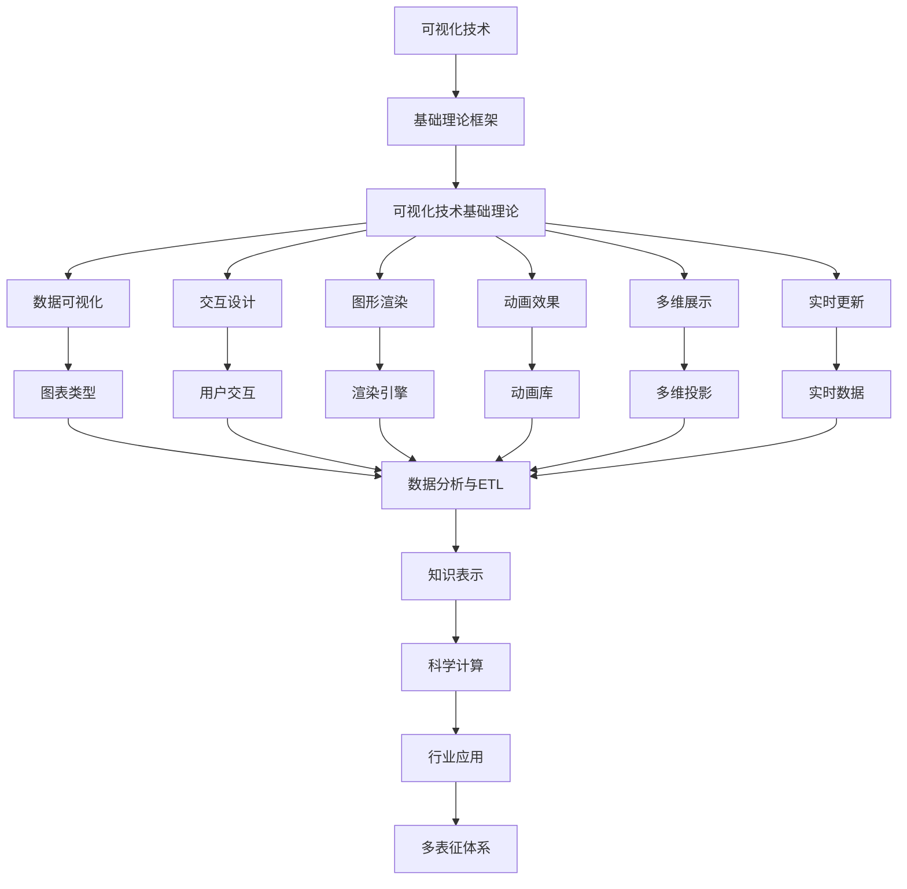

# 6.3-可视化技术 分支导航

## 目录结构与本地跳转

- [6.3.1-可视化技术基础理论](6.3.1-可视化技术基础理论.md) - 预留分支

---

## 主题交叉引用

| 主题      | 基础理论 | 知识表示 | 关系建模 | 可视化技术 | 行业应用 | 多表征 | 交互设计 | 性能优化 |
|-----------|----------|----------|----------|------------|----------|--------|----------|----------|
| 可视化技术基础理论| 预留 | 预留     | 预留     | 预留       | 预留     | 预留   | 预留     | 预留     |

- 交叉引用：[3.5-数据分析与ETL](../../../3-数据模型与算法/3.5-数据分析与ETL/README.md)、[6.1-知识表示](../6.1-知识表示/README.md)、[5.2-科学计算](../../../5-行业应用与场景/5.2-科学计算/README.md)

---

## 全链路知识流（Mermaid流程图）

---

[返回知识图谱与可视化总导航](../README.md)

## 多表征

可视化技术分支支持多种表征方式，包括：

- 图形/图像（节点-边图、流程图、热力图等）
- 符号/逻辑（可视化语法、图形语言）
- 向量/矩阵（布局、嵌入）
- 自然语言（注释、描述）
这些表征可互映，提升可视化表达力。

## 形式化语义

- 语义域：$D$，如图形对象集、布局空间、属性集
- 解释函数：$I: S \to D$，将可视化结构/符号映射到具体图形对象
- 语义一致性：每个可视化元素在$D$中有明确定义

## 形式化语法与证明

- 语法规则：如可视化元素产生式、布局规则、交互规则
- **定理**：可视化技术分支的语法系统具一致性与可扩展性。
- **证明**：由可视化语法与规则递归定义，保证系统一致与可扩展。

---

## 核心概念详解

### 可视化技术概述

可视化技术是将数据转换为图形表示，帮助用户理解和分析数据的技术。

**可视化目标**：

- **信息传达**：有效传达信息
- **数据探索**：支持数据探索
- **决策支持**：辅助决策制定

### 可视化类型

**数据可视化**：

- **统计图表**：柱状图、折线图、散点图、饼图
- **关系图**：网络图、树状图、力导向图
- **地理可视化**：地图、热力图、流向图

**信息可视化**：

- **层次可视化**：树状图、旭日图、树图
- **网络可视化**：节点链接图、邻接矩阵
- **多维可视化**：平行坐标、雷达图、散点图矩阵

### 视觉编码

**视觉通道**：

- **位置**：x、y坐标
- **颜色**：色相、饱和度、亮度
- **大小**：长度、面积、体积
- **形状**：几何形状、图标
- **纹理**：纹理模式

**编码原则**：

- **准确性**：准确表示数据
- **可区分性**：易于区分
- **可分离性**：通道独立
- **可组合性**：通道组合

### 交互设计

**交互方式**：

- **缩放平移**：视图缩放、平移
- **筛选过滤**：数据筛选、条件过滤
- **钻取**：数据钻取、下钻上卷
- **联动**：多视图联动
- **动画**：过渡动画、状态动画

**交互原则**：

- **反馈**：及时反馈
- **一致性**：交互一致
- **可逆性**：操作可逆
- **效率**：操作高效

---

## 理论基础

### 认知科学

**视觉感知**：

- **格式塔原理**：接近性、相似性、连续性
- **视觉层次**：视觉重要性
- **注意力**：注意力引导

### 设计理论

**设计原则**：

- **简洁性**：简洁明了
- **一致性**：设计一致
- **可用性**：易于使用
- **美观性**：视觉美观

---

## 应用场景

### 数据分析

- 数据探索
- 模式发现
- 异常检测

### 商业智能

- 仪表盘
- 报表
- 决策支持

### 科学可视化

- 科学数据可视化
- 仿真可视化
- 医学影像

---

## 工具与框架

### 可视化库

- **D3.js**：数据驱动文档
- **Plotly**：交互式图表
- **Matplotlib**：Python绘图库
- **ggplot2**：R绘图库

### 可视化工具

- **Tableau**：商业智能工具
- **Power BI**：Microsoft BI工具
- **Gephi**：网络分析工具

---

## 最佳实践

### 可视化设计

- 选择合适的图表类型
- 合理使用颜色
- 保持简洁
- 注重用户体验

### 交互设计

- 提供清晰的交互提示
- 支持多种交互方式
- 优化交互性能
- 测试用户体验

---

## 多表征

本分支支持多种表征方式，包括：图形/图像（节点-边图、流程图、热力图等）、符号/逻辑（可视化语法、图形语言）、向量/矩阵（布局、嵌入）、自然语言（注释、描述）。这些表征可互映，提升可视化表达力。

---

## 形式化语义

- 语义域：$D$，如图形对象集、布局空间、属性集
- 解释函数：$I: S \to D$，将可视化结构/符号映射到具体图形对象
- 语义一致性：每个可视化元素在$D$中有明确定义

---

## 形式化语法与证明

- 语法规则：如可视化元素产生式、布局规则、交互规则
- **定理**：可视化技术分支的语法系统具一致性与可扩展性。
- **证明**：由可视化语法与规则递归定义，保证系统一致与可扩展。

---

## 深入学习建议

### 理论基础强化

**数学基础**：

- **线性代数**：矩阵运算、向量空间
- **几何学**：几何变换、投影
- **统计学**：统计分布、假设检验
- **信息论**：信息熵、信息量

**认知科学基础**：

- **视觉感知**：视觉系统、感知原理
- **认知心理学**：认知过程、注意力
- **人机交互**：交互设计、用户体验
- **设计理论**：设计原则、美学

### 实践能力提升

**编程能力**：

- **JavaScript**：D3.js、Three.js、WebGL
- **Python**：Matplotlib、Plotly、Bokeh
- **R**：ggplot2、plotly、shiny
- **Rust**：plotters、egui

**工具使用**：

- **D3.js**：数据驱动文档
- **Tableau**：商业智能工具
- **Power BI**：Microsoft BI工具
- **Gephi**：网络分析工具

### 研究能力培养

**文献阅读**：

- **经典论文**：可视化经典论文
- **前沿研究**：最新研究进展
- **应用论文**：实际应用案例
- **会议论文**：顶级会议论文

---

## 学习资源汇总

### 在线课程

- **Coursera**：数据可视化课程
- **edX**：信息可视化课程
- **Udemy**：D3.js课程
- **YouTube**：可视化教程

### 书籍推荐

- **入门书籍**：《Visualization Analysis and Design》
- **进阶书籍**：《Information Visualization》
- **应用书籍**：《Interactive Data Visualization》
- **工具书籍**：《D3.js in Action》

### 学术资源

- **期刊**：IEEE TVCG、ACM TOG
- **会议**：IEEE VIS、EuroVis、CHI
- **数据库**：IEEE Xplore、ACM Digital Library
- **预印本**：arXiv、ResearchGate

---

## 实践项目建议

### 基础项目

- **图表库**：实现图表库
- **可视化工具**：开发可视化工具
- **交互设计**：交互式可视化
- **数据故事**：数据驱动的故事

### 进阶项目

- **多维可视化**：多维数据可视化
- **实时可视化**：实时数据可视化
- **3D可视化**：3D数据可视化
- **可视化分析**：可视化分析系统

### 高级项目

- **AI辅助可视化**：AI辅助可视化设计
- **沉浸式可视化**：AR/VR可视化
- **大规模可视化**：大规模数据可视化
- **可视化应用**：实际应用系统

---

## 职业发展路径

### 学术研究

- **研究方向**：可视化理论、交互设计、认知科学
- **职业路径**：博士研究、博士后、教职、研究机构

### 工业应用

- **应用领域**：商业智能、数据分析、科学可视化
- **职业路径**：可视化工程师、数据可视化专家、UX设计师

---

## 常见问题与解决方案

### 可视化挑战

**挑战1：数据规模**

- **问题**：大规模数据可视化性能问题
- **解决方案**：
  - 数据采样
  - 层次化展示
  - 渐进式加载
  - 数据聚合

**挑战2：视觉混乱**

- **问题**：复杂数据导致视觉混乱
- **解决方案**：
  - 信息层次化
  - 交互式过滤
  - 多视图展示
  - 视觉简化

**挑战3：用户理解**

- **问题**：用户难以理解可视化结果
- **解决方案**：
  - 清晰的图例
  - 交互式说明
  - 数据故事化
  - 用户培训

### 性能优化建议

**渲染优化**：

- **Canvas vs SVG**：选择合适的渲染方式
- **虚拟化**：虚拟滚动和虚拟缩放
- **WebGL**：使用WebGL加速渲染
- **缓存策略**：缓存渲染结果

**数据处理优化**：

- **数据预处理**：预处理数据减少计算
- **增量更新**：增量更新可视化
- **并行处理**：并行数据处理
- **流式处理**：流式数据处理

---

## 行业应用案例

### 商业智能

**应用场景**：

- **数据仪表盘**：实时数据监控
- **报表系统**：自动生成报表
- **数据分析**：交互式数据分析
- **决策支持**：数据驱动的决策

**技术要点**：

- 多维度数据展示
- 交互式探索
- 实时数据更新
- 移动端适配

### 科学可视化

**应用场景**：

- **医学影像**：医学影像可视化
- **科学仿真**：科学仿真结果可视化
- **地理信息**：地理信息系统
- **气象数据**：气象数据可视化

**技术要点**：

- 3D可视化
- 体渲染
- 流场可视化
- 多维数据展示

### 网络可视化

**应用场景**：

- **社交网络**：社交网络可视化
- **知识图谱**：知识图谱可视化
- **系统架构**：系统架构可视化
- **依赖关系**：依赖关系可视化

**技术要点**：

- 力导向布局
- 层次布局
- 交互式探索
- 动态更新

---

## 最佳实践

### 可视化设计最佳实践

1. **选择合适的图表类型**：根据数据特点选择
2. **保持简洁**：避免过度设计
3. **使用颜色**：合理使用颜色编码
4. **提供交互**：提供丰富的交互功能
5. **响应式设计**：适配不同设备

### 性能优化最佳实践

1. **数据预处理**：预处理数据减少计算
2. **虚拟化**：使用虚拟化技术
3. **缓存策略**：合理使用缓存
4. **异步加载**：异步加载数据
5. **性能监控**：监控渲染性能

### 用户体验最佳实践

1. **加载提示**：提供加载状态提示
2. **错误处理**：友好的错误提示
3. **帮助文档**：提供使用帮助
4. **用户反馈**：收集用户反馈
5. **持续改进**：根据反馈持续改进

---

## 总结

可视化技术是将数据转换为图形表示的重要技术，通过视觉编码、感知原理和设计原则，可以帮助用户理解和分析数据，为决策提供支持。

**核心价值**：

1. **信息传达**：有效传达信息
2. **数据探索**：支持数据探索
3. **决策支持**：辅助决策制定
4. **用户体验**：改善用户体验

**未来展望**：

随着大数据、AI、AR/VR等技术的发展，可视化技术将继续演进，特别是在AI辅助可视化、沉浸式可视化、大规模可视化等领域，可视化将提供更强大的功能和更好的体验。

**技术发展趋势**：

1. **AI辅助可视化**：AI自动生成可视化
2. **沉浸式可视化**：AR/VR沉浸式体验
3. **实时可视化**：实时数据流可视化
4. **交互式可视化**：更丰富的交互方式
5. **个性化可视化**：根据用户偏好定制

**应用前景**：

- **数据探索**：更直观的数据探索工具
- **决策支持**：更有效的决策支持系统
- **科学可视化**：更精确的科学数据可视化
- **教育可视化**：更生动的教育可视化内容

---

[返回知识图谱与可视化总导航](../README.md)
