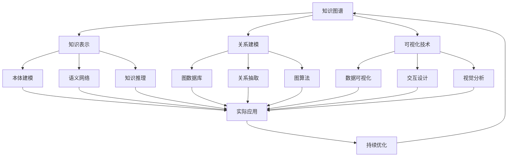

# 6-知识图谱与可视化

## 1. 📁 目录结构

```text
6-知识图谱与可视化/
├── 6.1-知识表示/
│   ├── 6.1.1-知识表示基础理论.md
│   └── README.md
├── 6.2-关系建模/
│   ├── 6.2.1-关系建模基础理论.md
│   └── README.md
├── 6.3-可视化技术/
│   ├── 6.3.1-可视化技术基础理论.md
│   └── README.md
└── README.md
```

## 2. 🔗 主题交叉引用表

| 技术分支 | 关联理论 | 技术应用 | 实践场景 |
|---------|---------|---------|---------|
| **知识表示** | 语义理论、逻辑学 | 本体建模、语义网络 | 智能问答、知识推理 |
| **关系建模** | 图论、数据库理论 | 图数据库、关系抽取 | 社交网络、推荐系统 |
| **可视化技术** | 认知科学、设计理论 | 数据可视化、交互设计 | 数据分析、决策支持 |

## 3. 🔄 全链路知识流图



## 4. 知识体系特色

### 4.1. 理论严谨性

- **语义基础**：基于严格的语义理论体系
- **逻辑推理**：形式化的知识推理机制
- **认知科学**：基于人类认知的可视化设计

### 4.2. 技术创新性

- **图数据库**：新兴的图数据存储技术
- **语义技术**：基于语义的知识表示和推理
- **交互设计**：先进的用户交互和体验设计

### 4.3. 实践导向

- **实际应用**：解决真实世界的知识管理问题
- **用户友好**：注重用户体验和易用性
- **可扩展性**：支持大规模知识图谱构建

### 4.4. 持续演进

- **技术更新**：跟随语义技术和可视化技术发展
- **应用拓展**：向更多领域扩展应用
- **标准演进**：跟随相关技术标准发展

## 5. 学习路径建议

### 5.1. 入门路径

1. **知识表示基础** → 理解知识表示原理
2. **关系建模** → 掌握图数据建模方法
3. **可视化技术** → 学习数据可视化基础
4. **实际应用** → 了解知识图谱应用场景

### 5.2. 🔄 进阶路径

1. **语义技术** → 深入语义表示和推理
2. **图算法** → 掌握图数据算法
3. **交互设计** → 学习高级可视化交互
4. **系统集成** → 构建完整知识图谱系统

### 5.3. 专家路径

1. **知识推理** → 开发高级推理算法
2. **大规模图谱** → 设计分布式知识图谱
3. **多模态融合** → 整合文本、图像、视频知识
4. **智能应用** → 开发基于知识的智能应用

## 6. 快速导航

### 6.1. 核心技术

- [知识表示基础理论](6.1-知识表示/6.1.1-知识表示基础理论.md)
- [关系建模基础理论](6.2-关系建模/6.2.1-关系建模基础理论.md)
- [可视化技术基础理论](6.3-可视化技术/6.3.1-可视化技术基础理论.md)

## 7. 🛠️ 技术栈映射

### 7.1. 知识表示

- **本体语言**：RDF、OWL、SPARQL
- **语义技术**：WordNet、DBpedia、YAGO
- **知识图谱**：Neo4j、ArangoDB、Amazon Neptune
- **推理引擎**：Pellet、HermiT、RDFox

### 7.2. 关系建模

- **图数据库**：Neo4j、ArangoDB、OrientDB
- **图算法**：PageRank、社区发现、最短路径
- **关系抽取**：OpenIE、Stanford NLP、SpaCy
- **图可视化**：Gephi、Cytoscape、D3.js

### 7.3. 可视化技术

- **数据可视化**：D3.js、Tableau、PowerBI
- **科学可视化**：VTK、ParaView、VisIt
- **信息可视化**：Processing、P5.js、Three.js
- **交互设计**：React、Vue.js、Angular

### 7.4. 编程语言

- **Python**：NetworkX、Matplotlib、Plotly
- **JavaScript**：D3.js、Three.js、WebGL
- **Java**：JGraphT、Gephi Toolkit
- **R**：igraph、ggplot2、plotly

## 8. 应用场景体系

### 8.1. 智能问答

- **搜索引擎**：Google Knowledge Graph
- **虚拟助手**：Siri、Alexa、小爱同学
- **智能客服**：自动问答、知识推荐
- **专家系统**：医疗诊断、法律咨询

### 8.2. 推荐系统

- **内容推荐**：基于知识图谱的推荐
- **社交推荐**：社交网络分析
- **产品推荐**：电商产品推荐
- **服务推荐**：基于用户画像的推荐

### 8.3. 数据分析

- **商业智能**：企业知识管理
- **科研分析**：学术知识图谱
- **金融分析**：风险关系分析
- **医疗分析**：疾病知识图谱

### 8.4. 可视化应用

- **数据故事**：数据驱动的故事讲述
- **决策支持**：可视化决策分析
- **科学可视化**：科研数据可视化
- **艺术可视化**：数据艺术创作

### 8.5. 新兴应用

- **多模态图谱**：文本、图像、视频融合
- **实时图谱**：流式知识图谱
- **联邦图谱**：分布式知识图谱
- **认知计算**：基于知识的AI系统

---

-**📖 相关导航**

- [返回总导航](../README.md)
- [3-数据模型与算法](../3-数据模型与算法/README.md)
- [5-行业应用与场景](../5-行业应用与场景/README.md)
- [Matter/FormalModel](../Matter/FormalModel/)

## 9. 多表征

本分支支持多种表征方式，包括：

- 符号表征（逻辑、集合、代数结构）
- 图结构（知识图谱、语义网络、ER图等）
- 向量/张量（嵌入、特征）
- 自然语言（定义、注释、描述）
- 图像/可视化（结构图、流程图、热力图等）
这些表征可互映，提升理论表达力。

## 10. 形式化语义

- 语义域：$D$，如对象集、关系结构、模型空间
- 解释函数：$I: S \to D$，将符号/结构映射到具体语义对象
- 语义一致性：每个结构/公式在$D$中有明确定义

## 11. 形式化语法与证明

- 语法规则：如产生式、推理规则、约束条件
- **定理**：本分支的语法系统具一致性与可扩展性。
- **证明**：由产生式与推理规则递归定义，保证系统一致与可扩展。

---

## 12. 核心概念详解

### 12.1. 知识图谱定义

**定义 12.1.1** (知识图谱)：

知识图谱是一个结构化的语义知识库，用于描述现实世界中的实体、概念及其关系，通常表示为有向图 $KG = (E, R, F)$，其中 $E$ 是实体集合，$R$ 是关系集合，$F \subseteq E \times R \times E$ 是事实集合。

### 12.2. 知识表示方法

**符号表示**：一阶逻辑、描述逻辑、规则系统

**向量表示**：词向量、知识嵌入、图神经网络

### 12.3. 关系建模方法

**关系类型**：对称关系、传递关系、反身关系、函数关系

**关系抽取**：监督学习、远程监督、无监督学习

---

## 13. 知识图谱构建

### 13.1. 知识抽取

**抽取方法**：实体抽取、关系抽取、属性抽取

**抽取工具**：Stanford NLP、SpaCy、OpenIE

### 13.2. 知识融合

**融合内容**：实体对齐、关系对齐、冲突解决

**融合方法**：基于相似度、基于规则、基于学习

### 13.3. 知识存储

**存储方式**：图数据库、RDF存储、关系数据库、NoSQL数据库

---

## 14. 知识推理

### 14.1. 推理方法

**逻辑推理**：演绎推理、归纳推理、类比推理

**统计推理**：概率推理、图推理、嵌入推理

### 14.2. 推理应用

**应用场景**：知识补全、知识验证、知识发现

---

## 15. 可视化技术

### 15.1. 可视化类型

**数据可视化**：统计图表、关系图、地理可视化

**信息可视化**：层次可视化、网络可视化、多维可视化

### 15.2. 交互设计

**交互方式**：缩放平移、筛选过滤、钻取、联动

---

## 16. 实际应用案例

### 16.1. Google Knowledge Graph

**应用特点**：大规模知识图谱、实时更新、多语言支持、语义搜索

### 16.2. 医疗知识图谱

**应用特点**：疾病知识图谱、药物知识图谱、诊断辅助、药物推荐

### 16.3. 金融知识图谱

**应用特点**：企业关系图谱、风险关系分析、反欺诈、信用评估

---

## 17. 工具与框架

### 17.1. 图数据库

**Neo4j**：原生图数据库、Cypher查询语言、图算法库

**ArangoDB**：多模型数据库、AQL查询语言、图遍历

### 17.2. 可视化工具

**D3.js**：数据驱动文档、强大的可视化能力、丰富的图表类型

**Gephi**：网络分析和可视化、布局算法、统计分析

### 17.3. 知识图谱框架

**Apache Jena**：RDF框架、SPARQL查询、推理引擎

**RDFLib**：Python RDF库、SPARQL支持、图操作

---

## 18. 最佳实践

### 18.1. 知识图谱构建

**构建原则**：数据质量优先、标准化建模、持续更新、质量保证

### 18.2. 可视化设计

**设计原则**：清晰简洁、用户友好、交互流畅、性能优化

### 18.3. 系统集成

**集成策略**：标准化接口、模块化设计、可扩展架构、性能优化

---

## 19. 挑战与解决方案

### 19.1. 数据质量

**挑战**：数据不完整、不准确、不一致

**解决方案**：数据清洗、质量评估、冲突解决

### 19.2. 规模扩展

**挑战**：大规模数据、查询性能、存储成本

**解决方案**：分布式存储、查询优化、数据压缩

### 19.3. 实时更新

**挑战**：知识更新、版本管理、一致性

**解决方案**：增量更新、版本控制、事务管理

---

## 20. 总结

知识图谱与可视化是现代数据科学和人工智能的重要技术，通过结构化的知识表示、关系建模和可视化技术，可以构建强大的知识系统和可视化应用。

**核心价值**：

1. **知识管理**：结构化知识管理
2. **智能应用**：支持智能应用开发
3. **数据洞察**：提供数据洞察能力
4. **用户体验**：改善用户体验

**未来展望**：

随着AI、大数据、可视化等技术的发展，知识图谱与可视化将继续演进，特别是在多模态图谱、实时图谱、联邦图谱等领域，知识图谱将提供更强大的功能和更好的体验。

---

[返回上级目录](../README.md)
---

## 12. 核心概念详解

### 12.1. 知识图谱定义

**定义 12.1.1** (知识图谱)：

知识图谱是一个结构化的语义知识库，用于描述现实世界中的实体、概念及其关系，通常表示为有向图，其中节点表示实体或概念，边表示它们之间的关系。

**形式化表示**：

$$KG = (E, R, F)$$

其中：

- $E$ 是实体集合
- $R$ 是关系集合
- $F$ 是事实集合，$F \subseteq E \times R \times E$

### 12.2. 知识表示方法

**符号表示**：

- **一阶逻辑**：谓词逻辑、量词
- **描述逻辑**：概念、角色、个体
- **规则系统**：产生式规则、推理规则

**向量表示**：

- **词向量**：Word2Vec、GloVe
- **知识嵌入**：TransE、TransR、ComplEx
- **图神经网络**：GCN、GAT、GraphSAGE

### 12.3. 关系建模方法

**关系类型**：

- **对称关系**：朋友关系、相似关系
- **传递关系**：包含关系、继承关系
- **反身关系**：自反关系
- **函数关系**：一对一、一对多、多对多

**关系抽取**：

- **监督学习**：基于标注数据的关系抽取
- **远程监督**：基于知识库的远程监督
- **无监督学习**：基于模式的关系抽取

---

## 13. 知识图谱构建

### 13.1. 知识抽取

**抽取方法**：

- **实体抽取**：命名实体识别、实体链接
- **关系抽取**：关系识别、关系分类
- **属性抽取**：属性识别、属性值抽取

**抽取工具**：

- **Stanford NLP**：自然语言处理工具
- **SpaCy**：Python NLP库
- **OpenIE**：开放信息抽取

### 13.2. 知识融合

**融合内容**：

- **实体对齐**：识别相同实体
- **关系对齐**：识别相同关系
- **冲突解决**：解决知识冲突

**融合方法**：

- **基于相似度**：实体相似度计算
- **基于规则**：规则匹配
- **基于学习**：机器学习方法

### 13.3. 知识存储

**存储方式**：

- **图数据库**：Neo4j、ArangoDB
- **RDF存储**：Virtuoso、Apache Jena
- **关系数据库**：MySQL、PostgreSQL
- **NoSQL数据库**：MongoDB、Cassandra

---

## 14. 知识推理

### 14.1. 推理方法

**逻辑推理**：

- **演绎推理**：从一般到特殊
- **归纳推理**：从特殊到一般
- **类比推理**：基于相似性推理

**统计推理**：

- **概率推理**：贝叶斯网络
- **图推理**：图神经网络
- **嵌入推理**：知识嵌入推理

### 14.2. 推理应用

**应用场景**：

- **知识补全**：补全缺失知识
- **知识验证**：验证知识正确性
- **知识发现**：发现新知识

---

## 15. 可视化技术

### 15.1. 可视化类型

**数据可视化**：

- **统计图表**：柱状图、折线图、散点图
- **关系图**：网络图、树状图、力导向图
- **地理可视化**：地图、热力图

**信息可视化**：

- **层次可视化**：树状图、旭日图
- **网络可视化**：节点链接图、邻接矩阵
- **多维可视化**：平行坐标、雷达图

### 15.2. 交互设计

**交互方式**：

- **缩放平移**：视图缩放、平移
- **筛选过滤**：数据筛选、条件过滤
- **钻取**：数据钻取、下钻上卷
- **联动**：多视图联动

---

## 16. 实际应用案例

### 16.1. Google Knowledge Graph

**应用特点**：

- 大规模知识图谱
- 实时更新
- 多语言支持
- 语义搜索

### 16.2. 医疗知识图谱

**应用特点**：

- 疾病知识图谱
- 药物知识图谱
- 诊断辅助
- 药物推荐

### 16.3. 金融知识图谱

**应用特点**：

- 企业关系图谱
- 风险关系分析
- 反欺诈
- 信用评估

---

## 17. 工具与框架

### 17.1. 图数据库

**Neo4j**：

- 原生图数据库
- Cypher查询语言
- 图算法库
- 可视化工具

**ArangoDB**：

- 多模型数据库
- AQL查询语言
- 图遍历
- 分布式支持

### 17.2. 可视化工具

**D3.js**：

- 数据驱动文档
- 强大的可视化能力
- 丰富的图表类型
- 高度可定制

**Gephi**：

- 网络分析和可视化
- 布局算法
- 统计分析
- 交互式探索

### 17.3. 知识图谱框架

**Apache Jena**：

- RDF框架
- SPARQL查询
- 推理引擎
- 工具集

**RDFLib**：

- Python RDF库
- SPARQL支持
- 序列化格式
- 图操作

---

## 18. 最佳实践

### 18.1. 知识图谱构建

**构建原则**：

- 数据质量优先
- 标准化建模
- 持续更新
- 质量保证

### 18.2. 可视化设计

**设计原则**：

- 清晰简洁
- 用户友好
- 交互流畅
- 性能优化

### 18.3. 系统集成

**集成策略**：

- 标准化接口
- 模块化设计
- 可扩展架构
- 性能优化

---

## 19. 挑战与解决方案

### 19.1. 数据质量

**挑战**：数据不完整、不准确、不一致

**解决方案**：数据清洗、质量评估、冲突解决

### 19.2. 规模扩展

**挑战**：大规模数据、查询性能、存储成本

**解决方案**：分布式存储、查询优化、数据压缩

### 19.3. 实时更新

**挑战**：知识更新、版本管理、一致性

**解决方案**：增量更新、版本控制、事务管理

---

## 20. 总结

知识图谱与可视化是现代数据科学和人工智能的重要技术，通过结构化的知识表示、关系建模和可视化技术，可以构建强大的知识系统和可视化应用。

**核心价值**：

1. **知识管理**：结构化知识管理
2. **智能应用**：支持智能应用开发
3. **数据洞察**：提供数据洞察能力
4. **用户体验**：改善用户体验

**未来展望**：

随着AI、大数据、可视化等技术的发展，知识图谱与可视化将继续演进，特别是在多模态图谱、实时图谱、联邦图谱等领域，知识图谱将提供更强大的功能和更好的体验。

---

[返回上级目录](../README.md)
