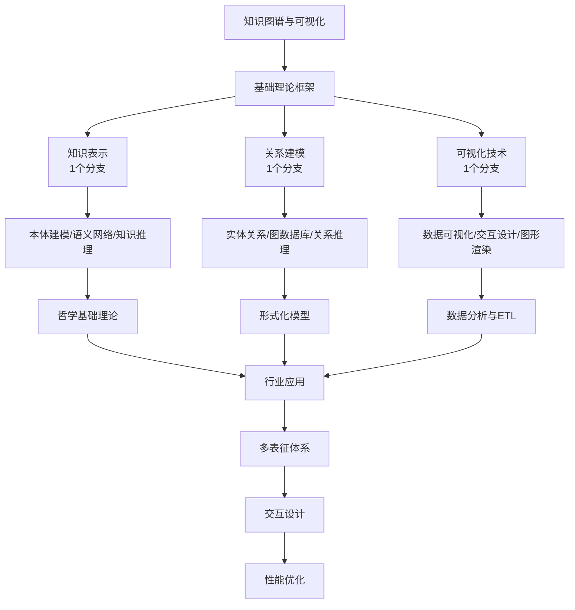

# 6-知识图谱与可视化 总导航

## 目录结构与完成情况

- [6.1-知识表示](6.1-知识表示/README.md) - **1个分支，预留框架**
- [6.2-关系建模](6.2-关系建模/README.md) - **1个分支，预留框架**
- [6.3-可视化技术](6.3-可视化技术/README.md) - **1个分支，预留框架**

---

## 主题交叉引用

| 分支      | 基础理论 | 知识表示 | 关系建模 | 可视化技术 | 行业应用 | 多表征 | 交互设计 | 性能优化 |
|-----------|----------|----------|----------|------------|----------|--------|----------|----------|
| 知识表示  | 预留     | 预留     | 预留     | 预留       | 预留     | 预留   | 预留     | 预留     |
| 关系建模  | 预留     | 预留     | 预留     | 预留       | 预留     | 预留   | 预留     | 预留     |
| 可视化技术| 预留     | 预留     | 预留     | 预留       | 预留     | 预留   | 预留     | 预留     |

- 交叉引用：[2.9-哲学基础理论](../2-形式科学理论/2.9-哲学基础理论/README.md)、[3.2-形式化模型](../3-数据模型与算法/3.2-形式化模型/README.md)、[3.5-数据分析与ETL](../3-数据模型与算法/3.5-数据分析与ETL/README.md)、[5-行业应用与场景](../5-行业应用与场景/README.md)

---

## 全链路知识流（Mermaid流程图）

---

## 知识体系特色

- **知识驱动**: 从知识表示到关系建模的完整知识体系
- **可视化导向**: 多维度数据可视化与交互设计
- **行业融合**: 与金融、科学计算、机器学习深度结合
- **技术集成**: 哲学理论、形式化模型、数据分析技术融合

---

[返回Analysis总导航](../README.md)
