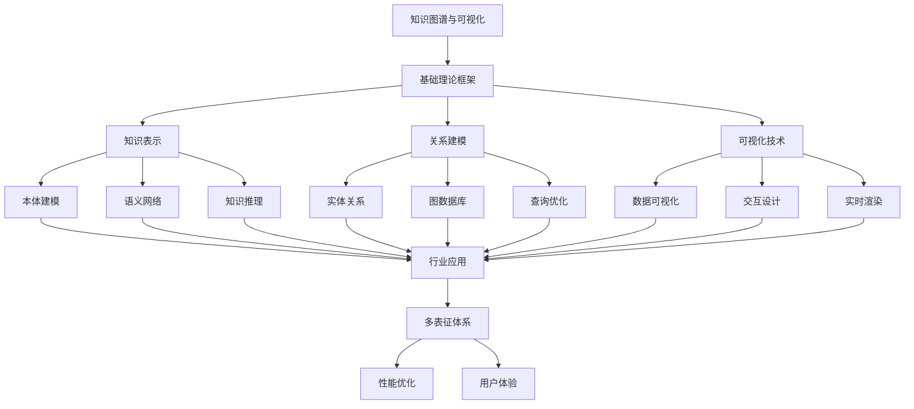

# 6-知识图谱与可视化 总导航

## 目录结构与本地跳转

- [6.1-知识表示](6.1-知识表示/README.md) - 预留分支
- [6.2-关系建模](6.2-关系建模/README.md) - 预留分支
- [6.3-可视化技术](6.3-可视化技术/README.md) - 预留分支

---

## 主题交叉引用

| 分支      | 基础理论 | 知识表示 | 关系建模 | 可视化技术 | 行业应用 | 多表征 | 交互设计 | 性能优化 |
|-----------|----------|----------|----------|------------|----------|--------|----------|----------|
| 知识表示  | 预留     | 预留     | 预留     | 预留       | 预留     | 预留   | 预留     | 预留     |
| 关系建模  | 预留     | 预留     | 预留     | 预留       | 预留     | 预留   | 预留     | 预留     |
| 可视化技术| 预留     | 预留     | 预留     | 预留       | 预留     | 预留   | 预留     | 预留     |

- 交叉引用：[1-数据库系统](../1-数据库系统/README.md)、[2-形式科学理论](../2-形式科学理论/README.md)、[3-数据模型与算法](../3-数据模型与算法/README.md)、[4-软件架构与工程](../4-软件架构与工程/README.md)、[5-行业应用与场景](../5-行业应用与场景/README.md)

---

## 全链路知识流（Mermaid流程图）

---

[返回Analysis总导航](../README.md)
