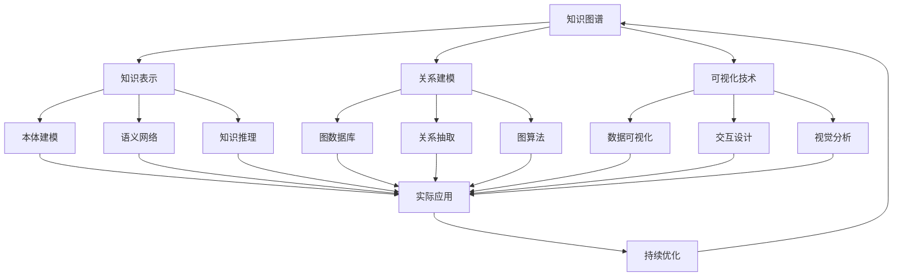

# 6-知识图谱与可视化

## 📁 目录结构

```
6-知识图谱与可视化/
├── 6.1-知识表示/
│   ├── 6.1.1-知识表示基础理论.md
│   └── README.md
├── 6.2-关系建模/
│   ├── 6.2.1-关系建模基础理论.md
│   └── README.md
├── 6.3-可视化技术/
│   ├── 6.3.1-可视化技术基础理论.md
│   └── README.md
└── README.md
```

## 🔗 主题交叉引用表

| 技术分支 | 关联理论 | 技术应用 | 实践场景 |
|---------|---------|---------|---------|
| **知识表示** | 语义理论、逻辑学 | 本体建模、语义网络 | 智能问答、知识推理 |
| **关系建模** | 图论、数据库理论 | 图数据库、关系抽取 | 社交网络、推荐系统 |
| **可视化技术** | 认知科学、设计理论 | 数据可视化、交互设计 | 数据分析、决策支持 |

## 🔄 全链路知识流图



## 🎯 知识体系特色

### 理论严谨性
- **语义基础**：基于严格的语义理论体系
- **逻辑推理**：形式化的知识推理机制
- **认知科学**：基于人类认知的可视化设计

### 技术创新性
- **图数据库**：新兴的图数据存储技术
- **语义技术**：基于语义的知识表示和推理
- **交互设计**：先进的用户交互和体验设计

### 实践导向
- **实际应用**：解决真实世界的知识管理问题
- **用户友好**：注重用户体验和易用性
- **可扩展性**：支持大规模知识图谱构建

### 持续演进
- **技术更新**：跟随语义技术和可视化技术发展
- **应用拓展**：向更多领域扩展应用
- **标准演进**：跟随相关技术标准发展

## 📚 学习路径建议

### 🚀 入门路径
1. **知识表示基础** → 理解知识表示原理
2. **关系建模** → 掌握图数据建模方法
3. **可视化技术** → 学习数据可视化基础
4. **实际应用** → 了解知识图谱应用场景

### 🔄 进阶路径
1. **语义技术** → 深入语义表示和推理
2. **图算法** → 掌握图数据算法
3. **交互设计** → 学习高级可视化交互
4. **系统集成** → 构建完整知识图谱系统

### 🎯 专家路径
1. **知识推理** → 开发高级推理算法
2. **大规模图谱** → 设计分布式知识图谱
3. **多模态融合** → 整合文本、图像、视频知识
4. **智能应用** → 开发基于知识的智能应用

## 🚀 快速导航

### 核心技术
- [知识表示基础理论](6.1-知识表示/6.1.1-知识表示基础理论.md)
- [关系建模基础理论](6.2-关系建模/6.2.1-关系建模基础理论.md)
- [可视化技术基础理论](6.3-可视化技术/6.3.1-可视化技术基础理论.md)

## 🛠️ 技术栈映射

### 知识表示
- **本体语言**：RDF、OWL、SPARQL
- **语义技术**：WordNet、DBpedia、YAGO
- **知识图谱**：Neo4j、ArangoDB、Amazon Neptune
- **推理引擎**：Pellet、HermiT、RDFox

### 关系建模
- **图数据库**：Neo4j、ArangoDB、OrientDB
- **图算法**：PageRank、社区发现、最短路径
- **关系抽取**：OpenIE、Stanford NLP、SpaCy
- **图可视化**：Gephi、Cytoscape、D3.js

### 可视化技术
- **数据可视化**：D3.js、Tableau、PowerBI
- **科学可视化**：VTK、ParaView、VisIt
- **信息可视化**：Processing、P5.js、Three.js
- **交互设计**：React、Vue.js、Angular

### 编程语言
- **Python**：NetworkX、Matplotlib、Plotly
- **JavaScript**：D3.js、Three.js、WebGL
- **Java**：JGraphT、Gephi Toolkit
- **R**：igraph、ggplot2、plotly

## 🎯 应用场景体系

### 智能问答
- **搜索引擎**：Google Knowledge Graph
- **虚拟助手**：Siri、Alexa、小爱同学
- **智能客服**：自动问答、知识推荐
- **专家系统**：医疗诊断、法律咨询

### 推荐系统
- **内容推荐**：基于知识图谱的推荐
- **社交推荐**：社交网络分析
- **产品推荐**：电商产品推荐
- **服务推荐**：基于用户画像的推荐

### 数据分析
- **商业智能**：企业知识管理
- **科研分析**：学术知识图谱
- **金融分析**：风险关系分析
- **医疗分析**：疾病知识图谱

### 可视化应用
- **数据故事**：数据驱动的故事讲述
- **决策支持**：可视化决策分析
- **科学可视化**：科研数据可视化
- **艺术可视化**：数据艺术创作

### 新兴应用
- **多模态图谱**：文本、图像、视频融合
- **实时图谱**：流式知识图谱
- **联邦图谱**：分布式知识图谱
- **认知计算**：基于知识的AI系统

---

**📖 相关导航**
- [返回总导航](../README.md)
- [3-数据模型与算法](../3-数据模型与算法/README.md)
- [5-行业应用与场景](../5-行业应用与场景/README.md)
- [Matter/FormalModel](../Matter/FormalModel/)
