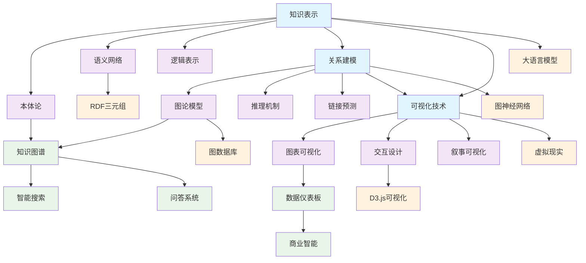

# 6-知识图谱与可视化 - 知识导航索引

## 📚 目录结构

```
6-知识图谱与可视化/
├── README.md                           # 本导航文件
├── 6.1-知识表示/                       # 知识表示基础理论
│   ├── 6.1.1-知识表示基础理论.md
│   └── README.md
├── 6.2-关系建模/                       # 关系建模与推理
│   ├── 6.2.1-关系建模基础理论.md
│   └── README.md
└── 6.3-可视化技术/                     # 数据可视化技术
    ├── 6.3.1-可视化技术基础理论.md
    └── README.md
```

## 🔗 主题交叉引用表

| 技术分支 | 核心概念 | 关联理论 | 应用领域 |
|---------|---------|---------|---------|
| **知识表示** | 本体论、语义网络 | 形式科学理论、数学基础 | 人工智能、语义Web |
| **关系建模** | 图论、推理机制 | 图算法、逻辑理论 | 知识图谱、推荐系统 |
| **可视化技术** | 数据可视化、交互设计 | 认知科学、设计理论 | 数据分析、信息展示 |

## 🌊 全链路知识流图



## 🎯 知识体系特色

### 🧠 **知识表示创新**

- 本体论与语义网络
- 逻辑表示与推理
- 知识图谱构建技术

### 🔗 **关系建模深度**

- 图论与网络分析
- 推理机制与链接预测
- 图神经网络应用

### 📊 **可视化艺术**

- 数据故事化呈现
- 交互式可视化设计
- 多维度数据展示

### 🌐 **跨领域融合**

- 知识图谱与AI结合
- 可视化与认知科学
- 多模态信息展示

## 📖 学习路径建议

### 🥇 **入门路径**

1. **知识表示基础** → 理解知识结构
2. **关系建模** → 掌握图论应用
3. **可视化技术** → 学习数据展示

### 🥈 **进阶路径**

1. **知识图谱构建** → 实际应用开发
2. **图神经网络** → 深度学习应用
3. **交互式可视化** → 用户体验设计

### 🥉 **专家路径**

1. **大语言模型集成** → 智能知识系统
2. **虚拟现实可视化** → 沉浸式体验
3. **多模态知识图谱** → 综合信息处理

## 🔍 快速导航

- **[知识表示](./6.1-知识表示/)** - 知识表示基础理论
- **[关系建模](./6.2-关系建模/)** - 关系建模与推理
- **[可视化技术](./6.3-可视化技术/)** - 数据可视化技术

## 🚀 技术栈映射

### 🧠 **知识表示技术**

- 本体语言：OWL、RDF、SPARQL
- 语义网络：WordNet、ConceptNet
- 逻辑表示：一阶逻辑、描述逻辑
- 知识图谱：Neo4j、GraphDB、ArangoDB

### 🔗 **关系建模技术**

- 图算法：PageRank、社区发现
- 推理引擎：Prolog、Jena
- 链接预测：TransE、ComplEx
- 图神经网络：GCN、GAT、GraphSAGE

### 📊 **可视化技术**

- 图表库：D3.js、ECharts、Plotly
- 交互框架：React、Vue、Angular
- 3D可视化：Three.js、WebGL
- 叙事工具：Tableau、PowerBI

## 📈 应用场景体系

### 🔍 **智能搜索**

- **语义搜索**：基于知识图谱的查询理解
- **实体链接**：文本到知识图谱的映射
- **关系抽取**：从文本中提取实体关系
- **知识问答**：基于知识图谱的问答系统

### 🏢 **商业智能**

- **数据仪表板**：实时数据监控与展示
- **趋势分析**：时间序列数据可视化
- **地理信息**：空间数据可视化
- **网络分析**：社交网络与关系分析

### 🎨 **创意设计**

- **信息图表**：复杂信息的图形化表达
- **数据故事**：数据驱动的叙事设计
- **交互体验**：用户友好的数据探索
- **艺术可视化**：数据艺术与美学表达

### 🔬 **科学研究**

- **科学可视化**：复杂科学数据的展示
- **网络分析**：复杂系统的关系分析
- **知识发现**：从数据中发现新知识
- **协作平台**：多用户知识共享

---

*本导航为知识图谱与可视化体系提供系统化的知识组织框架，支持从基础理论到实际应用的完整学习路径。*
