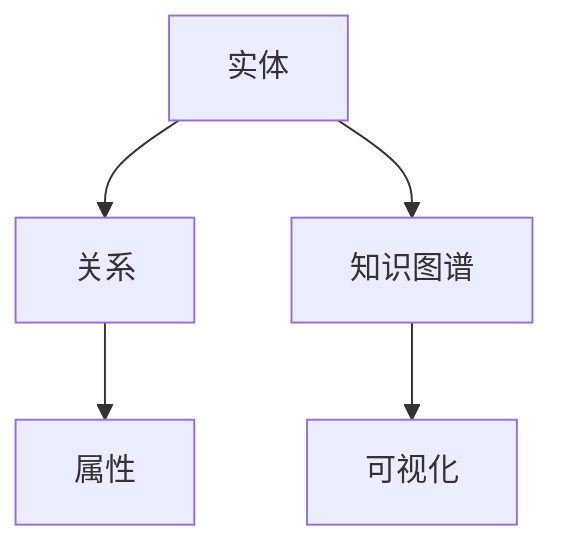

# 6 知识图谱与可视化 主题导航与多表征案例

## 目录结构与本地跳转

- [6.1 知识表示](./6.1-知识表示/6.1.1-知识表示基础理论.md)
- [6.2 关系建模](./6.2-关系建模/6.2.1-关系建模基础理论.md)
- [6.3 可视化技术](./6.3-可视化技术/6.3.1-可视化技术基础理论.md)

---

## 行业案例与多表征

### 6.x 典型行业案例

- 金融知识图谱：风险关联、反洗钱、智能风控（详见5.1-金融数据分析、3.5-数据分析与ETL）
- 医疗知识图谱：疾病关系、辅助诊断、药物发现（详见5.3-机器学习、3.4-AI与机器学习算法）
- 科学知识可视化：大规模数据流与知识网络（详见5.2-科学计算、6.3-可视化技术）

### 6.x 多表征示例

- 知识图谱结构图、关系建模ER图、可视化仪表盘、交互式数据流图、Latex公式等

---

[返回数据分析与ETL](../3-数据模型与算法/3.5-数据分析与ETL/README.md)
