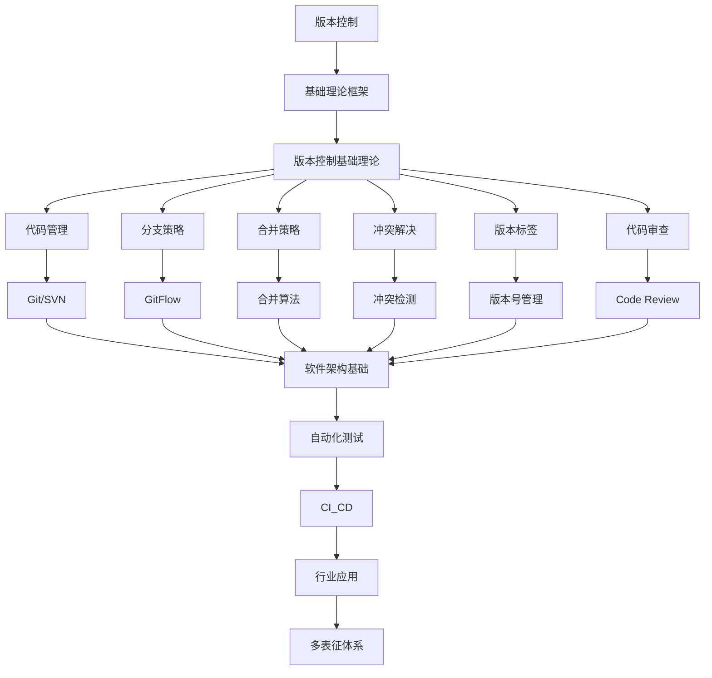

# 7.1-版本控制 分支导航

## 目录结构与本地跳转
- [7.1.1-版本控制基础理论](7.1.1-版本控制基础理论.md) - 预留分支

---

## 主题交叉引用
| 主题      | 基础理论 | 版本控制 | 自动化测试 | 部署流程 | CI_CD | 行业案例 | 多表征 | 质量保证 |
|-----------|----------|----------|------------|----------|-------|----------|--------|----------|
| 版本控制基础理论| 预留 | 预留     | 预留       | 预留     | 预留  | 预留     | 预留   | 预留     |

- 交叉引用：[4.1-基础理论](../../../4-软件架构与工程/4.1-基础理论/README.md)、[7.2-自动化测试](../7.2-自动化测试/README.md)、[7.4-CI_CD](../7.4-CI_CD/README.md)

---

## 全链路知识流（Mermaid流程图）

---

[返回持续集成与演进总导航](../README.md)
