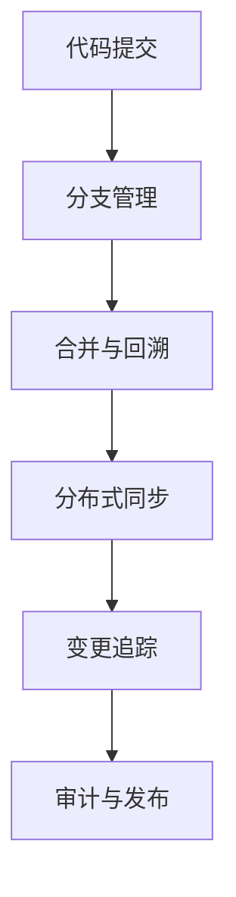

# 7.1 版本控制 主题导航与多表征案例（增强版）

## 目录结构与本地跳转

- [7.1.1 版本控制基础理论](./7.1.1-版本控制基础理论.md)
- [7.1.2 分支管理与合并](./7.1.2-分支管理与合并.md)
- [7.1.3 权限审计与合规](./7.1.3-权限审计与合规.md)
- [7.1.4 分布式版本控制](./7.1.4-分布式版本控制.md)
- [7.1.5 变更追踪与回溯](./7.1.5-变更追踪与回溯.md)

---

## 行业案例与多表征

### 7.1.x 典型行业案例

- 金融行业：合规审计与多分支协作（详见5.1-金融数据分析、4.3-微服务架构）
- AI平台：模型版本管理与回溯（详见3.4-AI与机器学习算法、7.4-CI_CD）
- 科学计算：大规模协作与分布式版本控制（详见5.2-科学计算、7.1.4-分布式版本控制）

### 7.1.x 多表征示例

- 版本树、分支合并流程图、权限审计表、分布式协作结构、变更追踪流程、Latex公式等

---

[返回持续集成与演进导航](../README.md)
