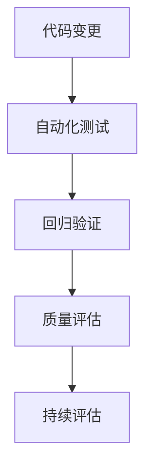

# 7.2 自动化测试 主题导航与多表征案例（增强版）

## 目录结构与本地跳转

- [7.2.1 自动化测试基础理论](./7.2.1-自动化测试基础理论.md)
- [7.2.2 测试类型与覆盖率](./7.2.2-测试类型与覆盖率.md)
- [7.2.3 持续评估与回归验证](./7.2.3-持续评估与回归验证.md)

---

## 行业案例与多表征

### 7.2.x 典型行业案例

- 金融行业：高可靠性自动化测试与回归验证（详见5.1-金融数据分析、7.4-CI_CD）
- AI平台：模型测试与持续评估（详见3.4-AI与机器学习算法、7.4-CI_CD）

### 7.2.x 多表征示例

- 测试覆盖率图、回归测试流程图、自动化脚本结构、持续评估流程、Latex公式等

---

[返回持续集成与演进导航](../README.md)
