# 7.2-自动化测试 分支导航

## 目录结构与本地跳转
- [7.2.1-自动化测试基础理论](7.2.1-自动化测试基础理论.md) - 预留分支

---

## 主题交叉引用
| 主题      | 基础理论 | 版本控制 | 自动化测试 | 部署流程 | CI_CD | 行业案例 | 多表征 | 质量保证 |
|-----------|----------|----------|------------|----------|-------|----------|--------|----------|
| 自动化测试基础理论| 预留 | 预留     | 预留       | 预留     | 预留  | 预留     | 预留   | 预留     |

- 交叉引用：[3.4-AI与机器学习算法](../../../3-数据模型与算法/3.4-AI与机器学习算法/README.md)、[7.1-版本控制](../7.1-版本控制/README.md)、[7.4-CI_CD](../7.4-CI_CD/README.md)

---

## 全链路知识流（Mermaid流程图）

```mermaid
flowchart TD
  A[自动化测试] --> B[基础理论框架]
  B --> C[自动化测试基础理论]
  C --> D[单元测试]
  C --> E[集成测试]
  C --> F[端到端测试]
  C --> G[性能测试]
  C --> H[安全测试]
  C --> I[AI测试]
  D --> J[测试框架]
  E --> K[API测试]
  F --> L[UI测试]
  G --> M[负载测试]
  H --> N[渗透测试]
  I --> O[模型测试]
  J & K & L & M & N & O --> P[AI/ML算法]
  P --> Q[版本控制]
  Q --> R[CI_CD]
  R --> S[行业应用]
  S --> T[多表征体系]
```

---

[返回持续集成与演进总导航](../README.md)
