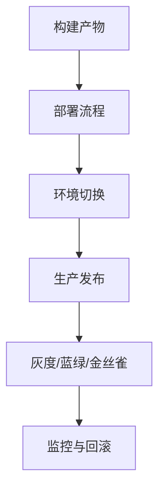

# 7.3 部署流程 主题导航与多表征案例（增强版）

## 目录结构与本地跳转

- [7.3.1 部署流程基础理论](./7.3.1-部署流程基础理论.md)
- [7.3.2 多环境部署与灰度发布](./7.3.2-多环境部署与灰度发布.md)
- [7.3.3 自动回滚与监控](./7.3.3-自动回滚与监控.md)
- [7.3.4 蓝绿部署与金丝雀发布](./7.3.4-蓝绿部署与金丝雀发布.md)

---

## 行业案例与多表征

### 7.3.x 典型行业案例

- 金融行业：多环境部署、灰度发布、蓝绿部署（详见5.1-金融数据分析、7.4-CI_CD）
- 科学计算：大规模仿真任务自动部署（详见5.2-科学计算、4.3-微服务架构）
- AI平台：模型自动部署与回滚、金丝雀发布（详见3.4-AI与机器学习算法、7.4-CI_CD）

### 7.3.x 多表征示例

- 部署流程图、灰度发布结构图、蓝绿部署流程、金丝雀发布流程、自动回滚流程、监控架构、Latex公式等

---

[返回持续集成与演进导航](../README.md)
