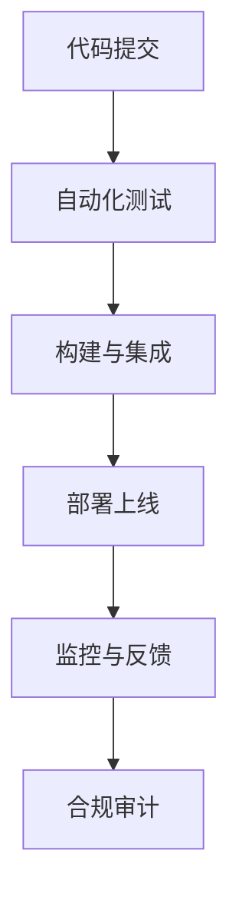

# 7.4 CI_CD 主题导航与多表征案例（增强版）

## 目录结构与本地跳转

- [7.4.1 CI_CD最佳实践](./7.4.1-CI_CD最佳实践.md)
- [7.4.2 流水线分层与自动化合规](./7.4.2-流水线分层与自动化合规.md)

---

## 行业案例与多表征

### 7.4.x 典型行业案例

- 金融行业：高可用CI/CD流水线与合规自动化（详见5.1-金融数据分析、4.3-微服务架构）
- AI平台：模型持续集成与自动部署（详见3.4-AI与机器学习算法、7.2-自动化测试）
- 科学计算：大规模仿真任务的自动化集成与部署（详见5.2-科学计算、7.3-部署流程）

### 7.4.x 多表征示例

- CI/CD流程图、流水线分层结构、自动化合规流程、自动化测试覆盖图、部署架构图、进度跟踪表、Latex公式等

---

[返回持续集成与演进导航](../README.md)
