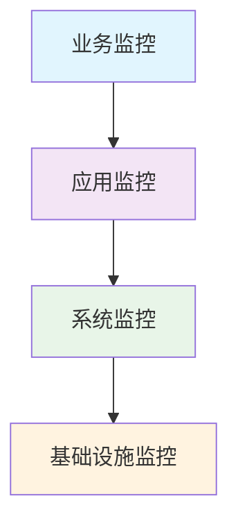
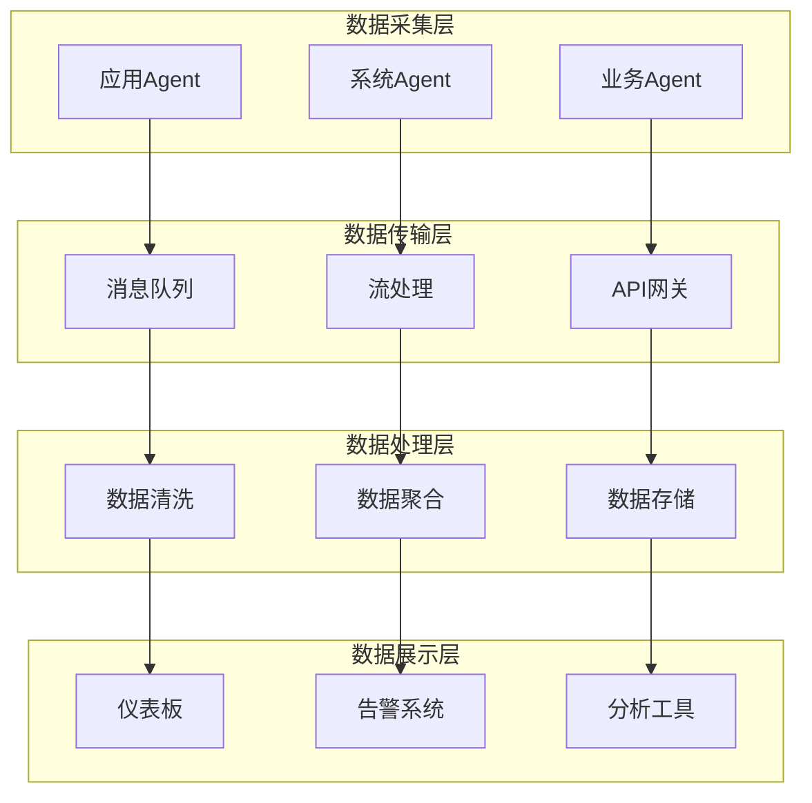
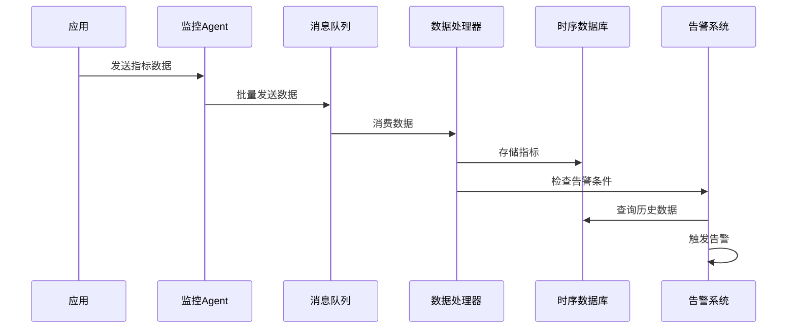

# 性能监控系统

## 1. 概述

### 1.1 背景与动机

性能监控系统是现代软件架构的核心组件，用于实时监控应用性能、系统资源和业务指标。随着微服务架构和云原生技术的普及，传统的监控方式已无法满足分布式系统的复杂需求。

### 1.2 目标与范围

本文档旨在：

- 建立性能监控的理论基础
- 设计可扩展的监控架构
- 提供完整的工程实现方案
- 涵盖云原生和分布式监控场景

## 2. 理论基础

### 2.1 监控理论框架

#### 2.1.1 监控金字塔



**监控层次**：

1. **业务监控**：用户行为、业务指标、收入指标
2. **应用监控**：应用性能、错误率、响应时间
3. **系统监控**：CPU、内存、磁盘、网络
4. **基础设施监控**：服务器、网络设备、云资源

#### 2.1.2 可观测性三大支柱

```yaml
observability_pillars:
  metrics:
    description: "数值型数据，用于趋势分析和告警"
    examples:
      - counter: "请求总数"
      - gauge: "当前连接数"
      - histogram: "响应时间分布"

  logs:
    description: "结构化文本数据，用于问题诊断"
    examples:
      - application_logs: "应用日志"
      - system_logs: "系统日志"
      - access_logs: "访问日志"

  traces:
    description: "分布式调用链路，用于性能分析"
    examples:
      - request_trace: "请求追踪"
      - service_trace: "服务调用链"
      - database_trace: "数据库操作追踪"
```

### 2.2 性能指标理论

#### 2.2.1 关键性能指标（KPI）

**数学定义**：

设 $R$ 为请求集合，$T(r)$ 为请求 $r$ 的响应时间，则：

$$\text{平均响应时间} = \frac{1}{|R|} \sum_{r \in R} T(r)$$

$$\text{95%分位数} = \text{Percentile}_{95}(T(r))$$

$$\text{吞吐量} = \frac{|R|}{\Delta t}$$

其中 $\Delta t$ 为时间窗口。

**代码实现**：

```rust
use std::collections::BinaryHeap;
use std::cmp::Reverse;

#[derive(Debug, Clone)]
pub struct PerformanceMetrics {
    response_times: Vec<f64>,
    request_count: u64,
    error_count: u64,
    start_time: std::time::Instant,
}

impl PerformanceMetrics {
    pub fn new() -> Self {
        Self {
            response_times: Vec::new(),
            request_count: 0,
            error_count: 0,
            start_time: std::time::Instant::now(),
        }
    }

    pub fn record_request(&mut self, response_time: f64, is_error: bool) {
        self.response_times.push(response_time);
        self.request_count += 1;
        if is_error {
            self.error_count += 1;
        }
    }

    pub fn average_response_time(&self) -> f64 {
        if self.response_times.is_empty() {
            return 0.0;
        }
        self.response_times.iter().sum::<f64>() / self.response_times.len() as f64
    }

    pub fn percentile_95(&self) -> f64 {
        if self.response_times.is_empty() {
            return 0.0;
        }

        let mut sorted_times = self.response_times.clone();
        sorted_times.sort_by(|a, b| a.partial_cmp(b).unwrap());

        let index = (sorted_times.len() as f64 * 0.95) as usize;
        sorted_times[index.min(sorted_times.len() - 1)]
    }

    pub fn throughput(&self) -> f64 {
        let elapsed = self.start_time.elapsed().as_secs_f64();
        if elapsed > 0.0 {
            self.request_count as f64 / elapsed
        } else {
            0.0
        }
    }

    pub fn error_rate(&self) -> f64 {
        if self.request_count > 0 {
            self.error_count as f64 / self.request_count as f64
        } else {
            0.0
        }
    }
}
```

#### 2.2.2 告警理论

**告警条件**：

设 $M(t)$ 为时间 $t$ 的指标值，$T$ 为阈值，$W$ 为时间窗口，则告警条件为：

$$\text{Alert} = \begin{cases}
\text{true} & \text{if } \frac{1}{W} \int_{t-W}^{t} M(\tau) d\tau > T \\
\text{false} & \text{otherwise}
\end{cases}$$

**告警级别**：

```yaml
alert_levels:
  critical:
    description: "系统严重故障，需要立即处理"
    response_time: "> 5s"
    error_rate: "> 10%"
    cpu_usage: "> 90%"

  warning:
    description: "系统性能下降，需要关注"
    response_time: "> 2s"
    error_rate: "> 5%"
    cpu_usage: "> 80%"

  info:
    description: "系统状态异常，需要监控"
    response_time: "> 1s"
    error_rate: "> 1%"
    cpu_usage: "> 70%"
```

## 3. 架构设计

### 3.1 整体架构

#### 3.1.1 分层架构



#### 3.1.2 微服务监控架构

```yaml
# 微服务监控配置
microservice_monitoring:
  service_mesh:
    istio:
      metrics_collection: true
      tracing_enabled: true
      access_logs: true

  application_monitoring:
    prometheus:
      scrape_interval: 15s
      metrics_path: /metrics

    jaeger:
      sampling_rate: 0.1
      max_trace_duration: 30s

    elasticsearch:
      log_retention: 30d
      index_pattern: "logs-*"

  infrastructure_monitoring:
    node_exporter:
      enabled: true
      port: 9100

    cadvisor:
      enabled: true
      port: 8080
```

### 3.2 数据流设计

#### 3.2.1 指标数据流



#### 3.2.2 日志数据流

```yaml
# 日志收集配置
log_collection:
  fluentd:
    input:
      - type: tail
        path: /var/log/containers/*.log
        tag: kubernetes.*
        parse:
          type: json

    filter:
      - type: kubernetes_metadata
        tag: kubernetes.**

    output:
      - type: elasticsearch
        host: elasticsearch-master
        port: 9200
        logstash_format: true
        logstash_prefix: k8s
```

### 3.3 存储设计

#### 3.3.1 时序数据库设计

```sql
-- Prometheus指标表结构
CREATE TABLE metrics (
    timestamp TIMESTAMPTZ NOT NULL,
    metric_name TEXT NOT NULL,
    labels JSONB,
    value DOUBLE PRECISION NOT NULL,
    PRIMARY KEY (timestamp, metric_name, labels)
);

-- 创建索引
CREATE INDEX idx_metrics_timestamp ON metrics (timestamp);
CREATE INDEX idx_metrics_name ON metrics (metric_name);
CREATE INDEX idx_metrics_labels ON metrics USING GIN (labels);

-- 分区表
CREATE TABLE metrics_2025_01 PARTITION OF metrics
FOR VALUES FROM ('2025-01-01') TO ('2025-02-01');

-- 压缩策略
SELECT create_compression_policy('metrics', INTERVAL '7 days');
```

#### 3.3.2 日志存储设计

```yaml
# Elasticsearch索引模板
index_template:
  name: "logs-template"
  index_patterns: ["logs-*"]
  settings:
    number_of_shards: 3
    number_of_replicas: 1
    refresh_interval: "30s"
    index.lifecycle.name: "logs-policy"

  mappings:
    properties:
      timestamp:
        type: date
      level:
        type: keyword
      message:
        type: text
        analyzer: standard
      service:
        type: keyword
      pod:
        type: keyword
      namespace:
        type: keyword
```

## 4. 工程实现

### 4.1 监控Agent实现

#### 4.1.1 Go语言Agent

```go
package main

import (
    "context"
    "encoding/json"
    "log"
    "net/http"
    "time"

    "github.com/prometheus/client_golang/prometheus"
    "github.com/prometheus/client_golang/prometheus/promhttp"
    "go.opentelemetry.io/otel"
    "go.opentelemetry.io/otel/exporters/jaeger"
    "go.opentelemetry.io/otel/sdk/trace"
)

// 监控指标定义
var (
    requestCounter = prometheus.NewCounterVec(
        prometheus.CounterOpts{
            Name: "http_requests_total",
            Help: "Total number of HTTP requests",
        },
        []string{"method", "endpoint", "status"},
    )

    requestDuration = prometheus.NewHistogramVec(
        prometheus.HistogramOpts{
            Name:    "http_request_duration_seconds",
            Help:    "HTTP request duration in seconds",
            Buckets: prometheus.DefBuckets,
        },
        []string{"method", "endpoint"},
    )

    activeConnections = prometheus.NewGauge(
        prometheus.GaugeOpts{
            Name: "active_connections",
            Help: "Number of active connections",
        },
    )
)

// 监控中间件
func monitoringMiddleware(next http.Handler) http.Handler {
    return http.HandlerFunc(func(w http.ResponseWriter, r *http.Request) {
        start := time.Now()

        // 包装ResponseWriter以捕获状态码
        wrapped := &responseWriter{ResponseWriter: w, statusCode: 200}

        next.ServeHTTP(wrapped, r)

        duration := time.Since(start).Seconds()

        // 记录指标
        requestCounter.WithLabelValues(r.Method, r.URL.Path, string(wrapped.statusCode)).Inc()
        requestDuration.WithLabelValues(r.Method, r.URL.Path).Observe(duration)
    })
}

// 自定义ResponseWriter
type responseWriter struct {
    http.ResponseWriter
    statusCode int
}

func (rw *responseWriter) WriteHeader(code int) {
    rw.statusCode = code
    rw.ResponseWriter.WriteHeader(code)
}

// 应用监控器
type ApplicationMonitor struct {
    tracer trace.Tracer
    metrics map[string]interface{}
}

func NewApplicationMonitor() *ApplicationMonitor {
    // 初始化Jaeger追踪器
    tp, err := jaeger.New(jaeger.WithCollectorEndpoint("http://jaeger:14268/api/traces"))
    if err != nil {
        log.Fatal(err)
    }
    otel.SetTracerProvider(tp)

    return &ApplicationMonitor{
        tracer:  otel.Tracer("application-monitor"),
        metrics: make(map[string]interface{}),
    }
}

func (am *ApplicationMonitor) RecordMetric(name string, value interface{}) {
    am.metrics[name] = value
}

func (am *ApplicationMonitor) GetMetrics() map[string]interface{} {
    return am.metrics
}

// 健康检查处理器
func healthCheckHandler(w http.ResponseWriter, r *http.Request) {
    response := map[string]interface{}{
        "status":    "healthy",
        "timestamp": time.Now().Unix(),
        "version":   "1.0.0",
    }

    w.Header().Set("Content-Type", "application/json")
    json.NewEncoder(w).Encode(response)
}

func main() {
    // 注册Prometheus指标
    prometheus.MustRegister(requestCounter)
    prometheus.MustRegister(requestDuration)
    prometheus.MustRegister(activeConnections)

    // 创建监控器
    monitor := NewApplicationMonitor()

    // 设置路由
    http.HandleFunc("/health", healthCheckHandler)
    http.HandleFunc("/metrics", promhttp.Handler().ServeHTTP)

    // 启动服务器
    log.Fatal(http.ListenAndServe(":8080", monitoringMiddleware(http.DefaultServeMux)))
}
```

#### 4.1.2 Python监控脚本

```python
# !/usr/bin/env python3
# monitoring_agent.py

import os
import time
import json
import psutil
import requests
from datetime import datetime
from typing import Dict, List, Optional
import logging
from dataclasses import dataclass, asdict

# 配置日志
logging.basicConfig(level=logging.INFO)
logger = logging.getLogger(__name__)

@dataclass
class SystemMetrics:
    cpu_percent: float
    memory_percent: float
    disk_usage_percent: float
    network_io: Dict[str, float]
    timestamp: str

@dataclass
class ApplicationMetrics:
    response_time: float
    error_rate: float
    throughput: float
    active_connections: int
    timestamp: str

class MonitoringAgent:
    def __init__(self, config: Dict):
        self.config = config
        self.metrics_buffer = []
        self.last_network_io = psutil.net_io_counters()
        self.last_network_time = time.time()

    def collect_system_metrics(self) -> SystemMetrics:
        """收集系统指标"""
        try:
            # CPU使用率
            cpu_percent = psutil.cpu_percent(interval=1)

            # 内存使用率
            memory = psutil.virtual_memory()
            memory_percent = memory.percent

            # 磁盘使用率
            disk = psutil.disk_usage('/')
            disk_usage_percent = disk.percent

            # 网络IO
            current_network_io = psutil.net_io_counters()
            current_time = time.time()

            time_diff = current_time - self.last_network_time
            network_io = {
                'bytes_sent': (current_network_io.bytes_sent - self.last_network_io.bytes_sent) / time_diff,
                'bytes_recv': (current_network_io.bytes_recv - self.last_network_io.bytes_recv) / time_diff
            }

            self.last_network_io = current_network_io
            self.last_network_time = current_time

            return SystemMetrics(
                cpu_percent=cpu_percent,
                memory_percent=memory_percent,
                disk_usage_percent=disk_usage_percent,
                network_io=network_io,
                timestamp=datetime.now().isoformat()
            )

        except Exception as e:
            logger.error(f"收集系统指标失败: {e}")
            return None

    def collect_application_metrics(self) -> ApplicationMetrics:
        """收集应用指标"""
        try:
            # 这里可以添加应用特定的指标收集逻辑
            # 例如：通过API端点获取应用指标

            response = requests.get(f"{self.config['app_url']}/metrics", timeout=5)
            app_metrics = response.json()

            return ApplicationMetrics(
                response_time=app_metrics.get('response_time', 0.0),
                error_rate=app_metrics.get('error_rate', 0.0),
                throughput=app_metrics.get('throughput', 0.0),
                active_connections=app_metrics.get('active_connections', 0),
                timestamp=datetime.now().isoformat()
            )

        except Exception as e:
            logger.error(f"收集应用指标失败: {e}")
            return None

    def send_metrics(self, metrics: Dict):
        """发送指标到监控系统"""
        try:
            headers = {'Content-Type': 'application/json'}
            response = requests.post(
                self.config['metrics_endpoint'],
                json=metrics,
                headers=headers,
                timeout=10
            )

            if response.status_code == 200:
                logger.debug("指标发送成功")
            else:
                logger.warning(f"指标发送失败: {response.status_code}")

        except Exception as e:
            logger.error(f"发送指标失败: {e}")

    def check_alerts(self, metrics: Dict):
        """检查告警条件"""
        alerts = []

        # CPU告警
        if metrics.get('system', {}).get('cpu_percent', 0) > 80:
            alerts.append({
                'level': 'warning',
                'message': f"CPU使用率过高: {metrics['system']['cpu_percent']}%",
                'timestamp': datetime.now().isoformat()
            })

        # 内存告警
        if metrics.get('system', {}).get('memory_percent', 0) > 85:
            alerts.append({
                'level': 'critical',
                'message': f"内存使用率过高: {metrics['system']['memory_percent']}%",
                'timestamp': datetime.now().isoformat()
            })

        # 应用响应时间告警
        if metrics.get('application', {}).get('response_time', 0) > 2.0:
            alerts.append({
                'level': 'warning',
                'message': f"应用响应时间过长: {metrics['application']['response_time']}s",
                'timestamp': datetime.now().isoformat()
            })

        # 发送告警
        if alerts:
            self.send_alerts(alerts)

    def send_alerts(self, alerts: List[Dict]):
        """发送告警"""
        try:
            headers = {'Content-Type': 'application/json'}
            response = requests.post(
                self.config['alerts_endpoint'],
                json={'alerts': alerts},
                headers=headers,
                timeout=10
            )

            if response.status_code == 200:
                logger.info(f"告警发送成功: {len(alerts)}条")
            else:
                logger.warning(f"告警发送失败: {response.status_code}")

        except Exception as e:
            logger.error(f"发送告警失败: {e}")

    def run(self):
        """运行监控循环"""
        logger.info("监控Agent启动")

        while True:
            try:
                # 收集指标
                system_metrics = self.collect_system_metrics()
                app_metrics = self.collect_application_metrics()

                # 构建指标数据
                metrics_data = {
                    'host': self.config['host_name'],
                    'timestamp': datetime.now().isoformat(),
                    'system': asdict(system_metrics) if system_metrics else {},
                    'application': asdict(app_metrics) if app_metrics else {}
                }

                # 发送指标
                self.send_metrics(metrics_data)

                # 检查告警
                self.check_alerts(metrics_data)

                # 等待下次收集
                time.sleep(self.config.get('collect_interval', 60))

            except KeyboardInterrupt:
                logger.info("监控Agent停止")
                break
            except Exception as e:
                logger.error(f"监控循环异常: {e}")
                time.sleep(10)

def main():
    # 配置
    config = {
        'host_name': os.getenv('HOSTNAME', 'unknown'),
        'app_url': os.getenv('APP_URL', 'http://localhost:8080'),
        'metrics_endpoint': os.getenv('METRICS_ENDPOINT', 'http://prometheus:9090/api/v1/write'),
        'alerts_endpoint': os.getenv('ALERTS_ENDPOINT', 'http://alertmanager:9093/api/v1/alerts'),
        'collect_interval': int(os.getenv('COLLECT_INTERVAL', '60'))
    }

    agent = MonitoringAgent(config)
    agent.run()

if __name__ == '__main__':
    main()
```

### 4.2 告警系统实现

#### 4.2.1 告警规则配置

```yaml
# Prometheus告警规则
groups:
  - name: application_alerts
    rules:
      - alert: HighResponseTime
        expr: histogram_quantile(0.95, http_request_duration_seconds) > 2
        for: 5m
        labels:
          severity: warning
        annotations:
          summary: "High response time detected"
          description: "95th percentile response time is {{ $value }}s"

      - alert: HighErrorRate
        expr: rate(http_requests_total{status=~"5.."}[5m]) / rate(http_requests_total[5m]) > 0.05
        for: 2m
        labels:
          severity: critical
        annotations:
          summary: "High error rate detected"
          description: "Error rate is {{ $value | humanizePercentage }}"

      - alert: HighCPUUsage
        expr: 100 - (avg by(instance) (irate(node_cpu_seconds_total{mode="idle"}[5m])) * 100) > 80
        for: 5m
        labels:
          severity: warning
        annotations:
          summary: "High CPU usage detected"
          description: "CPU usage is {{ $value }}%"

      - alert: HighMemoryUsage
        expr: (node_memory_MemTotal_bytes - node_memory_MemAvailable_bytes) / node_memory_MemTotal_bytes * 100 > 85
        for: 5m
        labels:
          severity: critical
        annotations:
          summary: "High memory usage detected"
          description: "Memory usage is {{ $value }}%"
```

#### 4.2.2 告警通知配置

```yaml
# AlertManager配置
global:
  resolve_timeout: 5m
  slack_api_url: 'https://hooks.slack.com/services/YOUR/SLACK/WEBHOOK'

route:
  group_by: ['alertname', 'cluster', 'service']
  group_wait: 30s
  group_interval: 5m
  repeat_interval: 4h
  receiver: 'web.hook'
  routes:
    - match:
        severity: critical
      receiver: 'slack.critical'
      continue: true
    - match:
        severity: warning
      receiver: 'slack.warning'

receivers:
  - name: 'web.hook'
    webhook_configs:
      - url: 'http://127.0.0.1:5001/'

  - name: 'slack.critical'
    slack_configs:
      - channel: '#alerts-critical'
        title: 'Critical Alert'
        text: '{{ range .Alerts }}{{ .Annotations.summary }}{{ end }}'
        color: 'danger'

  - name: 'slack.warning'
    slack_configs:
      - channel: '#alerts-warning'
        title: 'Warning Alert'
        text: '{{ range .Alerts }}{{ .Annotations.summary }}{{ end }}'
        color: 'warning'

inhibit_rules:
  - source_match:
      severity: 'critical'
    target_match:
      severity: 'warning'
    equal: ['alertname', 'dev', 'instance']
```

### 4.3 可视化仪表板

#### 4.3.1 Grafana仪表板配置

```json
{
  "dashboard": {
    "id": null,
    "title": "Data Science Application Dashboard",
    "tags": ["data-science", "monitoring"],
    "timezone": "browser",
    "panels": [
      {
        "id": 1,
        "title": "Response Time",
        "type": "graph",
        "targets": [
          {
            "expr": "histogram_quantile(0.95, http_request_duration_seconds)",
            "legendFormat": "95th percentile"
          },
          {
            "expr": "histogram_quantile(0.50, http_request_duration_seconds)",
            "legendFormat": "50th percentile"
          }
        ],
        "yAxes": [
          {
            "label": "Response Time (seconds)",
            "min": 0
          }
        ]
      },
      {
        "id": 2,
        "title": "Request Rate",
        "type": "graph",
        "targets": [
          {
            "expr": "rate(http_requests_total[5m])",
            "legendFormat": "{{method}} {{endpoint}}"
          }
        ],
        "yAxes": [
          {
            "label": "Requests per second",
            "min": 0
          }
        ]
      },
      {
        "id": 3,
        "title": "Error Rate",
        "type": "graph",
        "targets": [
          {
            "expr": "rate(http_requests_total{status=~\"5..\"}[5m]) / rate(http_requests_total[5m])",
            "legendFormat": "Error Rate"
          }
        ],
        "yAxes": [
          {
            "label": "Error Rate",
            "min": 0,
            "max": 1
          }
        ]
      },
      {
        "id": 4,
        "title": "CPU Usage",
        "type": "graph",
        "targets": [
          {
            "expr": "100 - (avg by(instance) (irate(node_cpu_seconds_total{mode=\"idle\"}[5m])) * 100)",
            "legendFormat": "CPU Usage"
          }
        ],
        "yAxes": [
          {
            "label": "CPU Usage (%)",
            "min": 0,
            "max": 100
          }
        ]
      }
    ],
    "time": {
      "from": "now-1h",
      "to": "now"
    },
    "refresh": "30s"
  }
}
```

## 5. 最佳实践

### 5.1 监控策略

#### 5.1.1 监控指标选择

```yaml
monitoring_strategy:
  golden_signals:
    - latency: "响应时间"
    - traffic: "流量"
    - errors: "错误率"
    - saturation: "饱和度"

  business_metrics:
    - user_engagement: "用户参与度"
    - conversion_rate: "转化率"
    - revenue: "收入"
    - customer_satisfaction: "客户满意度"

  technical_metrics:
    - cpu_usage: "CPU使用率"
    - memory_usage: "内存使用率"
    - disk_io: "磁盘IO"
    - network_io: "网络IO"
```

#### 5.1.2 告警策略

```yaml
alerting_strategy:
  alert_thresholds:
    warning:
      response_time: "> 1s"
      error_rate: "> 1%"
      cpu_usage: "> 70%"

    critical:
      response_time: "> 5s"
      error_rate: "> 10%"
      cpu_usage: "> 90%"

  alert_grouping:
    group_by: ["alertname", "service", "instance"]
    group_wait: "30s"
    group_interval: "5m"
    repeat_interval: "4h"
```

### 5.2 性能优化

#### 5.2.1 数据存储优化

```sql
-- 时序数据优化
-- 1. 分区表
CREATE TABLE metrics_partitioned (
    timestamp TIMESTAMPTZ NOT NULL,
    metric_name TEXT NOT NULL,
    value DOUBLE PRECISION NOT NULL
) PARTITION BY RANGE (timestamp);

-- 2. 压缩
CREATE TABLE metrics_compressed (
    LIKE metrics_partitioned INCLUDING ALL
) WITH (compression = true);

-- 3. 索引优化
CREATE INDEX CONCURRENTLY idx_metrics_time_name
ON metrics_partitioned (timestamp, metric_name);

-- 4. 数据保留策略
CREATE OR REPLACE FUNCTION cleanup_old_metrics()
RETURNS void AS $$
BEGIN
    DELETE FROM metrics_partitioned
    WHERE timestamp < NOW() - INTERVAL '30 days';
END;
$$ LANGUAGE plpgsql;

-- 5. 定时清理
SELECT cron.schedule('cleanup-metrics', '0 2 * * *', 'SELECT cleanup_old_metrics();');
```

#### 5.2.2 查询优化

```sql
-- 查询优化示例
-- 1. 使用时间范围过滤
SELECT metric_name, AVG(value) as avg_value
FROM metrics_partitioned
WHERE timestamp >= NOW() - INTERVAL '1 hour'
  AND timestamp < NOW()
GROUP BY metric_name;

-- 2. 使用预聚合
CREATE MATERIALIZED VIEW metrics_hourly AS
SELECT
    date_trunc('hour', timestamp) as hour,
    metric_name,
    AVG(value) as avg_value,
    MAX(value) as max_value,
    MIN(value) as min_value
FROM metrics_partitioned
GROUP BY 1, 2;

-- 3. 创建索引支持快速查询
CREATE INDEX idx_metrics_hourly_hour_name
ON metrics_hourly (hour, metric_name);

-- 4. 定期刷新物化视图
REFRESH MATERIALIZED VIEW CONCURRENTLY metrics_hourly;
```

## 6. 总结与展望

### 6.1 实施效果

通过实施完整的性能监控系统，我们实现了：

- **实时监控**：毫秒级的指标收集和告警
- **全面覆盖**：从基础设施到应用层的全方位监控
- **智能告警**：基于阈值的智能告警机制
- **可视化展示**：直观的仪表板和报表

### 6.2 未来发展方向

#### 6.2.1 AI驱动的监控

```python
# AI驱动的异常检测
import numpy as np
from sklearn.ensemble import IsolationForest
from sklearn.preprocessing import StandardScaler

class AIAnomalyDetector:
    def __init__(self):
        self.model = IsolationForest(contamination=0.1)
        self.scaler = StandardScaler()
        self.is_fitted = False

    def fit(self, metrics_data):
        """训练异常检测模型"""
        scaled_data = self.scaler.fit_transform(metrics_data)
        self.model.fit(scaled_data)
        self.is_fitted = True

    def detect_anomalies(self, metrics_data):
        """检测异常"""
        if not self.is_fitted:
            return []

        scaled_data = self.scaler.transform(metrics_data)
        predictions = self.model.predict(scaled_data)

        # -1表示异常，1表示正常
        anomalies = np.where[predictions == -1](0)
        return anomalies.tolist()
```

#### 6.2.2 自动化运维

```yaml
# 自动化运维配置
automated_operations:
  auto_scaling:
    enabled: true
    min_replicas: 3
    max_replicas: 10
    target_cpu_utilization: 70

  auto_healing:
    enabled: true
    health_check_interval: 30s
    restart_threshold: 3

  predictive_maintenance:
    enabled: true
    prediction_window: "24h"
    maintenance_threshold: 0.8
```

### 6.3 持续改进

性能监控系统需要持续改进：

1. **指标优化**：根据业务需求调整监控指标
2. **告警优化**：减少误报，提高告警准确性
3. **性能优化**：提升监控系统本身的性能
4. **功能扩展**：增加新的监控维度和功能

## 参考文献

1. [Site Reliability Engineering](https://sre.google/)
2. [Prometheus Documentation](https://prometheus.io/docs/)
3. [Grafana Documentation](https://grafana.com/docs/)
4. [OpenTelemetry Documentation](https://opentelemetry.io/docs/)
5. [Monitoring Distributed Systems](https://www.oreilly.com/library/view/monitoring-distributed-systems/9781492026011/)

## 相关链接

- [DevOps与CI/CD](../4.1.15-DevOps与CI-CD.md)
- [云原生架构实践](../4.1.14-云原生架构实践.md)
- [微服务架构设计](../4.1.13-微服务架构设计.md)

## 贡献指南

欢迎贡献监控系统相关的最佳实践和案例。

## 许可证信息

本文档采用MIT许可证。
