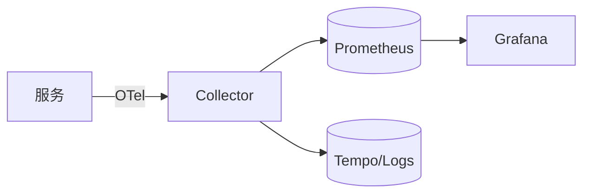

# 7.5.1 性能监控系统

## 范围
以OpenTelemetry为埋点标准，Prometheus为时序数据存储，Grafana为可视化，构建覆盖后端/数据库/AI推理链路的监控体系。

## 参考架构


## Go 服务埋点示例
```go
import (
  "go.opentelemetry.io/otel"
  "go.opentelemetry.io/otel/metric"
)
var meter = otel.Meter("svc")
var inferLatency, _ = meter.Float64Histogram("ai_infer_latency_ms")
func HandleInfer() {
  // ...
  inferLatency.Record(context.Background(), 12.3)
}
```

## 数据库指标
- PostgreSQL Exporter：qps、延迟、缓冲命中、WAL速率
- 自定义向量检索延迟：`SELECT percentile_disc(0.95) WITHIN GROUP (ORDER BY elapsed_ms) FROM query_log;`

## 告警
- P95 > 200ms 持续5分钟
- GPU 利用率 < 30% 持续10分钟 