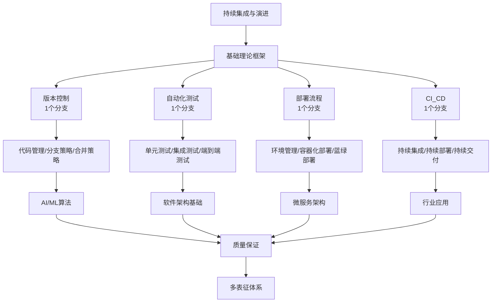

# 7-持续集成与演进 总导航

## 目录结构与完成情况
- [7.1-版本控制](7.1-版本控制/README.md) - **1个分支，预留框架**
- [7.2-自动化测试](7.2-自动化测试/README.md) - **1个分支，预留框架**
- [7.3-部署流程](7.3-部署流程/README.md) - **1个分支，预留框架**
- [7.4-CI_CD](7.4-CI_CD/README.md) - **1个分支，预留框架**

---

## 主题交叉引用
| 分支      | 基础理论 | 版本控制 | 自动化测试 | 部署流程 | CI_CD | 行业案例 | 多表征 | 质量保证 |
|-----------|----------|----------|------------|----------|-------|----------|--------|----------|
| 版本控制  | 预留     | 预留     | 预留       | 预留     | 预留  | 预留     | 预留   | 预留     |
| 自动化测试| 预留     | 预留     | 预留       | 预留     | 预留  | 预留     | 预留   | 预留     |
| 部署流程  | 预留     | 预留     | 预留       | 预留     | 预留  | 预留     | 预留   | 预留     |
| CI_CD     | 预留     | 预留     | 预留       | 预留     | 预留  | 预留     | 预留   | 预留     |

- 交叉引用：[3.4-AI与机器学习算法](../3-数据模型与算法/3.4-AI与机器学习算法/README.md)、[4.1-基础理论](../4-软件架构与工程/4.1-基础理论/README.md)、[4.3-微服务架构](../4-软件架构与工程/4.3-微服务架构/README.md)、[5-行业应用与场景](../5-行业应用与场景/README.md)

---

## 全链路知识流（Mermaid流程图）

---

## 知识体系特色
- **流程驱动**: 从版本控制到CI/CD的完整开发流程
- **质量导向**: 自动化测试与质量保证体系
- **技术融合**: 与AI/ML、微服务、行业应用深度结合
- **持续演进**: 支持持续改进和自动化演进

---

[返回Analysis总导航](../README.md)
