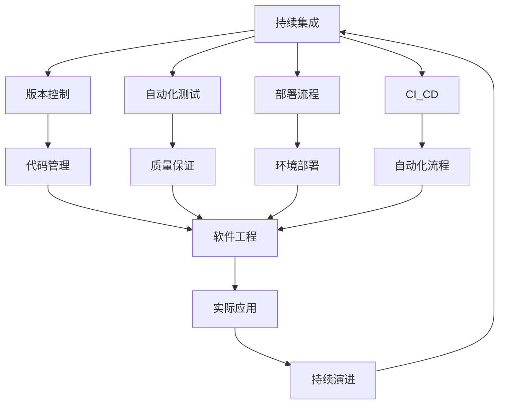

# 7-持续集成与演进

## 📁 目录结构

```
7-持续集成与演进/
├── 7.1-版本控制/
│   ├── 7.1.1-版本控制基础理论.md
│   └── README.md
├── 7.2-自动化测试/
│   ├── 7.2.1-自动化测试基础理论.md
│   └── README.md
├── 7.3-部署流程/
│   ├── 7.3.1-部署流程基础理论.md
│   └── README.md
├── 7.4-CI_CD/
│   ├── 7.4.1-CI_CD最佳实践.md
│   └── README.md
├── 质量保证体系.md
├── 项目进度跟踪.md
└── README.md
```

## 🔗 主题交叉引用表

| 流程分支 | 关联理论 | 技术应用 | 实践场景 |
|---------|---------|---------|---------|
| **版本控制** | 分布式系统理论、协作理论 | Git、SVN、Mercurial | 团队协作、代码管理 |
| **自动化测试** | 软件测试理论、质量保证 | 单元测试、集成测试 | 质量保证、回归测试 |
| **部署流程** | 系统部署理论、运维理论 | 容器化、自动化部署 | 生产环境、运维管理 |
| **CI_CD** | 持续集成理论、DevOps理论 | 流水线、自动化流程 | 快速交付、持续部署 |

## 🔄 全链路知识流图



## 🎯 知识体系特色

### 理论严谨性
- **流程规范**：基于成熟的软件工程理论
- **质量标准**：严格的质量保证体系
- **最佳实践**：行业标准的最佳实践指南

### 技术创新性
- **自动化技术**：高度自动化的流程设计
- **云原生部署**：适应云计算环境的部署策略
- **DevOps融合**：开发与运维的深度融合

### 实践导向
- **工程实现**：可直接应用于实际项目
- **团队协作**：支持多团队协作开发
- **快速交付**：实现快速、可靠的软件交付

### 持续演进
- **流程优化**：持续改进和优化流程
- **技术更新**：跟随技术发展趋势
- **最佳实践**：持续优化和改进

## 📚 学习路径建议

### 🚀 入门路径
1. **版本控制** → 掌握代码管理基础
2. **自动化测试** → 理解质量保证方法
3. **部署流程** → 学习环境部署技术
4. **CI_CD基础** → 了解持续集成概念

### 🔄 进阶路径
1. **高级版本控制** → 深入分支管理策略
2. **测试自动化** → 掌握自动化测试框架
3. **容器化部署** → 学习Docker和Kubernetes
4. **流水线设计** → 设计完整的CI_CD流水线

### 🎯 专家路径
1. **DevOps实践** → 建立完整的DevOps体系
2. **云原生架构** → 设计云原生部署方案
3. **质量治理** → 建立企业级质量治理体系
4. **流程优化** → 持续优化和改进流程

## 🚀 快速导航

### 基础流程
- [版本控制基础理论](7.1-版本控制/7.1.1-版本控制基础理论.md)
- [自动化测试基础理论](7.2-自动化测试/7.2.1-自动化测试基础理论.md)
- [部署流程基础理论](7.3-部署流程/7.3.1-部署流程基础理论.md)
- [CI_CD最佳实践](7.4-CI_CD/7.4.1-CI_CD最佳实践.md)

### 质量保证
- [质量保证体系](质量保证体系.md)
- [项目进度跟踪](项目进度跟踪.md)

## 🛠️ 技术栈映射

### 版本控制
- **Git**：分布式版本控制系统
- **GitHub/GitLab**：代码托管平台
- **SVN**：集中式版本控制系统
- **Mercurial**：分布式版本控制

### 自动化测试
- **单元测试**：JUnit、NUnit、PyTest
- **集成测试**：TestNG、Mocha、Jest
- **端到端测试**：Selenium、Cypress、Playwright
- **性能测试**：JMeter、LoadRunner、Gatling

### 部署技术
- **容器化**：Docker、Podman
- **编排工具**：Kubernetes、Docker Swarm
- **配置管理**：Ansible、Chef、Puppet
- **基础设施即代码**：Terraform、CloudFormation

### CI_CD工具
- **持续集成**：Jenkins、GitLab CI、GitHub Actions
- **持续部署**：ArgoCD、Spinnaker、Tekton
- **制品管理**：Nexus、Artifactory、Harbor
- **监控告警**：Prometheus、Grafana、ELK Stack

### 云平台
- **公有云**：AWS、Azure、Google Cloud
- **私有云**：OpenStack、VMware vSphere
- **混合云**：多云管理、边缘计算
- **无服务器**：AWS Lambda、Azure Functions

## 🎯 应用场景体系

### 企业级应用
- **大型项目**：多团队协作开发
- **微服务架构**：分布式系统部署
- **云原生应用**：容器化部署和管理
- **遗留系统**：传统系统的现代化改造

### 互联网应用
- **Web应用**：快速迭代和部署
- **移动应用**：多平台应用开发
- **API服务**：微服务API管理
- **数据平台**：大数据平台部署

### 开源项目
- **社区协作**：开源项目协作开发
- **版本发布**：自动化版本发布流程
- **文档管理**：自动化文档生成和部署
- **质量保证**：开源项目质量保证

### 新兴技术
- **AI/ML项目**：机器学习模型部署
- **区块链应用**：去中心化应用部署
- **IoT应用**：物联网设备管理
- **边缘计算**：边缘节点部署和管理

### 行业应用
- **金融科技**：高可用、高安全性的部署
- **医疗健康**：符合监管要求的部署
- **制造业**：工业4.0的智能化部署
- **教育科技**：在线教育平台部署

---

**📖 相关导航**
- [返回总导航](../README.md)
- [4-软件架构与工程](../4-软件架构与工程/README.md)
- [8-形式理论深化](../8-形式理论深化/README.md)
- [Matter/Software](../Matter/Software/)

## 多表征
本分支支持多种表征方式，包括：
- 符号表征（流程、任务、配置、规则等）
- 图结构（CI/CD流程图、测试流程图、版本控制图等）
- 向量/张量（流程特征向量、指标矩阵）
- 自然语言（定义、注释、描述）
- 图像/可视化（流程图、进度图、质量分析图等）
这些表征可互映，提升持续集成与演进理论与实践表达力。

## 形式化语义
- 语义域：$D$，如流程对象集、任务空间、配置模型、指标空间
- 解释函数：$I: S \to D$，将符号/结构映射到具体流程语义对象
- 语义一致性：每个流程/任务/规则在$D$中有明确定义

## 形式化语法与证明
- 语法规则：如流程定义、任务伪代码、配置规则、约束条件
- **定理**：本分支的语法系统具一致性与可扩展性。
- **证明**：由流程定义、任务规则与配置规则递归定义，保证系统一致与可扩展。
