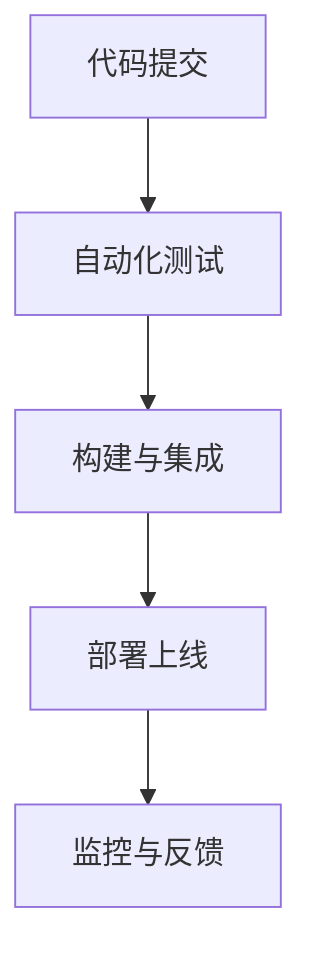

# 7 持续集成与演进 主题导航与多表征案例

## 目录结构与本地跳转

- [7.1 版本控制](./7.1-版本控制/7.1.1-版本控制基础理论.md)
- [7.2 自动化测试](./7.2-自动化测试/7.2.1-自动化测试基础理论.md)
- [7.3 部署流程](./7.3-部署流程/7.3.1-部署流程基础理论.md)
- [7.4 CI_CD](./7.4-CI_CD/7.4.1-CI_CD最佳实践.md)
- [质量保证体系](./质量保证体系.md)
- [项目进度跟踪](./项目进度跟踪.md)

---

## 行业案例与多表征

### 7.x 典型行业案例

- 金融行业：高可用CI/CD流水线与合规自动化（详见5.1-金融数据分析、4.3-微服务架构）
- AI平台：自动化测试与模型持续部署（详见3.4-AI与机器学习算法、7.2-自动化测试）
- 科学计算：大规模仿真任务的自动化集成与部署（详见5.2-科学计算、7.3-部署流程）

### 7.x 多表征示例

- CI/CD流程图、自动化测试覆盖图、部署架构图、进度跟踪表、Latex公式等

---

[返回数据分析与ETL](../3-数据模型与算法/3.5-数据分析与ETL/README.md)
