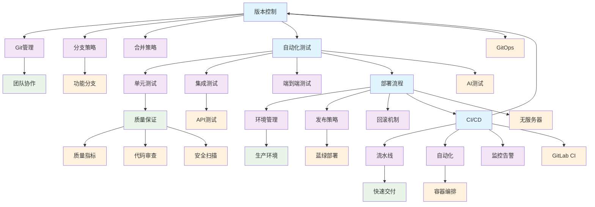

# 7-持续集成与演进 - 知识导航索引

## 📚 目录结构

```
7-持续集成与演进/
├── README.md                           # 本导航文件
├── 7.1-版本控制/                       # 版本控制系统
│   ├── 7.1.1-版本控制基础理论.md
│   └── README.md
├── 7.2-自动化测试/                     # 自动化测试体系
│   ├── 7.2.1-自动化测试基础理论.md
│   └── README.md
├── 7.3-部署流程/                       # 部署与运维流程
│   ├── 7.3.1-部署流程基础理论.md
│   └── README.md
├── 7.4-CI_CD/                         # 持续集成与部署
│   ├── 7.4.1-CI_CD最佳实践.md
│   └── README.md
├── 质量保证体系.md                     # 质量保证体系
└── 项目进度跟踪.md                     # 项目进度跟踪
```

## 🔗 主题交叉引用表

| 流程分支 | 核心概念 | 关联理论 | 应用领域 |
|---------|---------|---------|---------|
| **版本控制** | 代码管理、分支策略 | 软件工程、分布式系统 | 团队协作、代码审查 |
| **自动化测试** | 测试策略、质量保证 | 软件测试、形式验证 | 质量保证、回归测试 |
| **部署流程** | 环境管理、发布策略 | 运维工程、容器技术 | 生产环境、服务运维 |
| **CI/CD** | 持续集成、持续部署 | 敏捷开发、DevOps | 快速交付、自动化 |

## 🌊 全链路知识流图



## 🎯 知识体系特色

### 🔄 **持续集成驱动**

- 自动化构建与测试
- 快速反馈与质量保证
- 持续交付与部署

### 🛡️ **质量保证体系**

- 多层次测试策略
- 代码审查与安全扫描
- 质量指标与监控

### 🚀 **DevOps实践**

- 开发运维一体化
- 自动化部署流程
- 环境管理与配置

### 📊 **数据驱动改进**

- 项目进度跟踪
- 质量指标分析
- 持续优化改进

## 📖 学习路径建议

### 🥇 **入门路径**

1. **版本控制** → 掌握Git基础
2. **自动化测试** → 建立测试思维
3. **部署流程** → 理解运维基础

### 🥈 **进阶路径**

1. **CI/CD流水线** → 自动化实践
2. **容器化部署** → 现代化运维
3. **质量保证** → 全面质量管理

### 🥉 **专家路径**

1. **GitOps** → 声明式运维
2. **AI测试** → 智能化测试
3. **无服务器架构** → 云原生实践

## 🔍 快速导航

- **[版本控制](./7.1-版本控制/)** - 版本控制系统
- **[自动化测试](./7.2-自动化测试/)** - 自动化测试体系
- **[部署流程](./7.3-部署流程/)** - 部署与运维流程
- **[CI/CD](./7.4-CI_CD/)** - 持续集成与部署
- **[质量保证体系](./质量保证体系.md)** - 质量保证体系
- **[项目进度跟踪](./项目进度跟踪.md)** - 项目进度跟踪

## 🚀 技术栈映射

### 🔧 **版本控制**

- Git：分布式版本控制
- GitHub/GitLab：代码托管平台
- Git Flow：分支管理策略
- GitOps：声明式运维

### 🧪 **自动化测试**

- 单元测试：JUnit、pytest、Mocha
- 集成测试：TestContainers、WireMock
- 端到端测试：Selenium、Cypress
- 性能测试：JMeter、Gatling

### 🚀 **部署技术**

- 容器化：Docker、containerd
- 编排工具：Kubernetes、Docker Swarm
- 配置管理：Ansible、Terraform
- 服务网格：Istio、Linkerd

### 🔄 **CI/CD工具**

- 流水线：Jenkins、GitLab CI、GitHub Actions
- 制品管理：Nexus、Artifactory
- 监控告警：Prometheus、Grafana
- 日志管理：ELK Stack、Fluentd

## 📈 最佳实践体系

### 🏗️ **代码管理**

- **分支策略**：Git Flow、GitHub Flow
- **代码审查**：Pull Request、Code Review
- **代码质量**：SonarQube、ESLint
- **安全扫描**：SAST、DAST、SCA

### 🧪 **测试策略**

- **测试金字塔**：单元测试、集成测试、端到端测试
- **测试驱动开发**：TDD、BDD
- **自动化测试**：持续集成、回归测试
- **性能测试**：负载测试、压力测试

### 🚀 **部署策略**

- **蓝绿部署**：零停机发布
- **金丝雀发布**：渐进式发布
- **滚动更新**：Kubernetes原生支持
- **回滚机制**：快速故障恢复

### 📊 **监控运维**

- **应用监控**：APM、链路追踪
- **基础设施监控**：CPU、内存、网络
- **业务监控**：KPI、SLA
- **告警管理**：多级告警、自动恢复

---

*本导航为持续集成与演进体系提供系统化的知识组织框架，支持从基础理论到工程实践的完整学习路径。*
