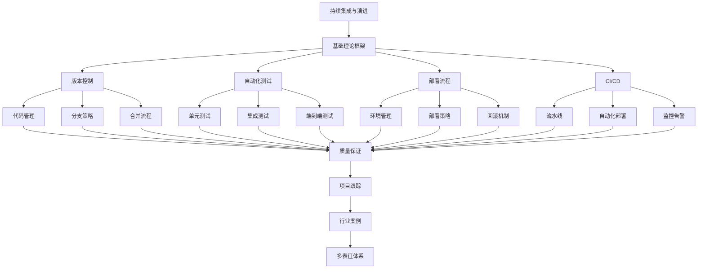

# 7-持续集成与演进 总导航

## 目录结构与本地跳转

- [7.1-版本控制](7.1-版本控制/README.md) - 预留分支
- [7.2-自动化测试](7.2-自动化测试/README.md) - 预留分支
- [7.3-部署流程](7.3-部署流程/README.md) - 预留分支
- [7.4-CI_CD](7.4-CI_CD/README.md) - 预留分支

---

## 主题交叉引用

| 分支      | 基础理论 | 版本控制 | 自动化测试 | 部署流程 | CI/CD | 质量保证 | 项目跟踪 | 行业案例 | 多表征 |
|-----------|----------|----------|------------|----------|-------|----------|----------|----------|--------|
| 版本控制  | 预留     | 预留     | 预留       | 预留     | 预留  | 预留     | 预留     | 预留     | 预留   |
| 自动化测试| 预留     | 预留     | 预留       | 预留     | 预留  | 预留     | 预留     | 预留     | 预留   |
| 部署流程  | 预留     | 预留     | 预留       | 预留     | 预留  | 预留     | 预留     | 预留     | 预留   |
| CI/CD     | 预留     | 预留     | 预留       | 预留     | 预留  | 预留     | 预留     | 预留     | 预留   |

- 交叉引用：[1-数据库系统](../1-数据库系统/README.md)、[3-数据模型与算法](../3-数据模型与算法/README.md)、[4-软件架构与工程](../4-软件架构与工程/README.md)、[5-行业应用与场景](../5-行业应用与场景/README.md)

---

## 全链路知识流（Mermaid流程图）

---

[返回Analysis总导航](../README.md)
