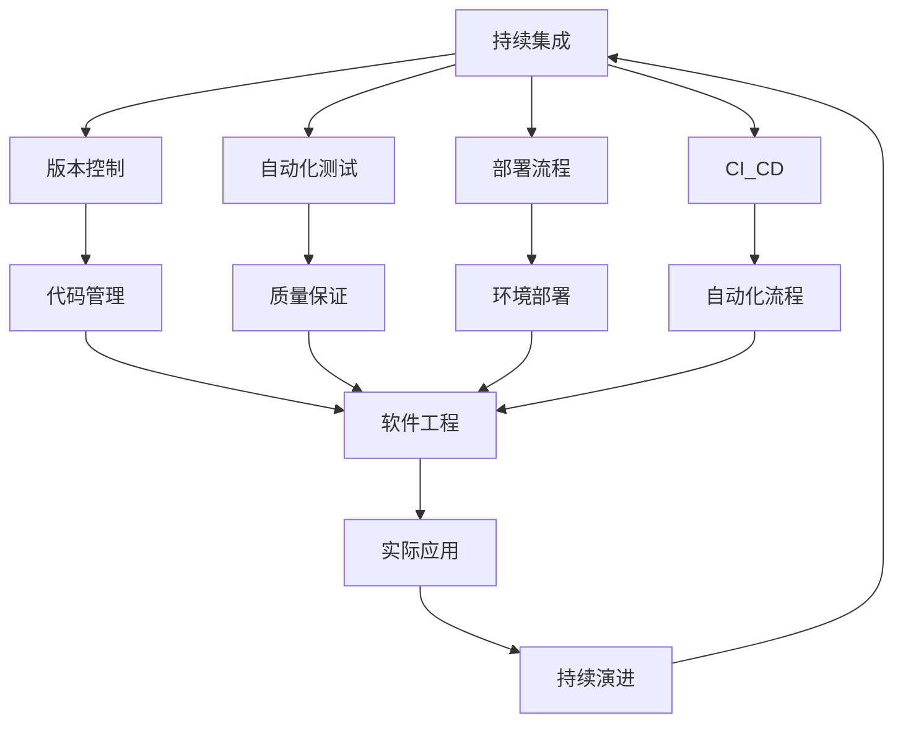

# 7-持续集成与演进

## 1. 📁 目录结构

```text
7-持续集成与演进/
├── 7.1-版本控制/
│   ├── 7.1.1-版本控制基础理论.md
│   └── README.md
├── 7.2-自动化测试/
│   ├── 7.2.1-自动化测试基础理论.md
│   └── README.md
├── 7.3-部署流程/
│   ├── 7.3.1-部署流程基础理论.md
│   └── README.md
├── 7.4-CI_CD/
│   ├── 7.4.1-CI_CD最佳实践.md
│   └── README.md
├── 质量保证体系.md
├── 项目进度跟踪.md
└── README.md
```

## 2. 🔗 主题交叉引用表

| 流程分支 | 关联理论 | 技术应用 | 实践场景 |
|---------|---------|---------|---------|
| **版本控制** | 分布式系统理论、协作理论 | Git、SVN、Mercurial | 团队协作、代码管理 |
| **自动化测试** | 软件测试理论、质量保证 | 单元测试、集成测试 | 质量保证、回归测试 |
| **部署流程** | 系统部署理论、运维理论 | 容器化、自动化部署 | 生产环境、运维管理 |
| **CI_CD** | 持续集成理论、DevOps理论 | 流水线、自动化流程 | 快速交付、持续部署 |

## 3. 🔄 全链路知识流图



## 4. 知识体系特色

### 4.1. 理论严谨性

- **流程规范**：基于成熟的软件工程理论
- **质量标准**：严格的质量保证体系
- **最佳实践**：行业标准的最佳实践指南

### 4.2. 技术创新性

- **自动化技术**：高度自动化的流程设计
- **云原生部署**：适应云计算环境的部署策略
- **DevOps融合**：开发与运维的深度融合

### 4.3. 实践导向

- **工程实现**：可直接应用于实际项目
- **团队协作**：支持多团队协作开发
- **快速交付**：实现快速、可靠的软件交付

### 4.4. 持续演进

- **流程优化**：持续改进和优化流程
- **技术更新**：跟随技术发展趋势
- **最佳实践**：持续优化和改进

## 5. 学习路径建议

### 5.1. 入门路径

1. **版本控制** → 掌握代码管理基础
2. **自动化测试** → 理解质量保证方法
3. **部署流程** → 学习环境部署技术
4. **CI_CD基础** → 了解持续集成概念

### 5.2. 🔄 进阶路径

1. **高级版本控制** → 深入分支管理策略
2. **测试自动化** → 掌握自动化测试框架
3. **容器化部署** → 学习Docker和Kubernetes
4. **流水线设计** → 设计完整的CI_CD流水线

### 5.3. 专家路径

1. **DevOps实践** → 建立完整的DevOps体系
2. **云原生架构** → 设计云原生部署方案
3. **质量治理** → 建立企业级质量治理体系
4. **流程优化** → 持续优化和改进流程

## 6. 快速导航

### 6.1. 基础流程

- [版本控制基础理论](7.1-版本控制/7.1.1-版本控制基础理论.md)
- [自动化测试基础理论](7.2-自动化测试/7.2.1-自动化测试基础理论.md)
- [部署流程基础理论](7.3-部署流程/7.3.1-部署流程基础理论.md)
- [CI_CD最佳实践](7.4-CI_CD/7.4.1-CI_CD最佳实践.md)

### 6.2. 质量保证

- [质量保证体系](质量保证体系.md)
- [项目进度跟踪](项目进度跟踪.md)

## 7. 🛠️ 技术栈映射

### 7.1. 版本控制

- **Git**：分布式版本控制系统
- **GitHub/GitLab**：代码托管平台
- **SVN**：集中式版本控制系统
- **Mercurial**：分布式版本控制

### 7.2. 自动化测试

- **单元测试**：JUnit、NUnit、PyTest
- **集成测试**：TestNG、Mocha、Jest
- **端到端测试**：Selenium、Cypress、Playwright
- **性能测试**：JMeter、LoadRunner、Gatling

### 7.3. 部署技术

- **容器化**：Docker、Podman
- **编排工具**：Kubernetes、Docker Swarm
- **配置管理**：Ansible、Chef、Puppet
- **基础设施即代码**：Terraform、CloudFormation

### 7.4. CI_CD工具

- **持续集成**：Jenkins、GitLab CI、GitHub Actions
- **持续部署**：ArgoCD、Spinnaker、Tekton
- **制品管理**：Nexus、Artifactory、Harbor
- **监控告警**：Prometheus、Grafana、ELK Stack

### 7.5. 云平台

- **公有云**：AWS、Azure、Google Cloud
- **私有云**：OpenStack、VMware vSphere
- **混合云**：多云管理、边缘计算
- **无服务器**：AWS Lambda、Azure Functions

## 8. 应用场景体系

### 8.1. 企业级应用

- **大型项目**：多团队协作开发
- **微服务架构**：分布式系统部署
- **云原生应用**：容器化部署和管理
- **遗留系统**：传统系统的现代化改造

### 8.2. 互联网应用

- **Web应用**：快速迭代和部署
- **移动应用**：多平台应用开发
- **API服务**：微服务API管理
- **数据平台**：大数据平台部署

### 8.3. 开源项目

- **社区协作**：开源项目协作开发
- **版本发布**：自动化版本发布流程
- **文档管理**：自动化文档生成和部署
- **质量保证**：开源项目质量保证

### 8.4. 新兴技术

- **AI/ML项目**：机器学习模型部署
- **区块链应用**：去中心化应用部署
- **IoT应用**：物联网设备管理
- **边缘计算**：边缘节点部署和管理

### 8.5. 行业应用

- **金融科技**：高可用、高安全性的部署
- **医疗健康**：符合监管要求的部署
- **制造业**：工业4.0的智能化部署
- **教育科技**：在线教育平台部署

---

-**📖 相关导航**

- [返回总导航](../README.md)
- [4-软件架构与工程](../4-软件架构与工程/README.md)
- [8-形式理论深化](../8-形式理论深化/README.md)
- [Matter/Software](../Matter/Software/)

## 9. 多表征

本分支支持多种表征方式，包括：

- 符号表征（流程、任务、配置、规则等）
- 图结构（CI/CD流程图、测试流程图、版本控制图等）
- 向量/张量（流程特征向量、指标矩阵）
- 自然语言（定义、注释、描述）
- 图像/可视化（流程图、进度图、质量分析图等）
这些表征可互映，提升持续集成与演进理论与实践表达力。

## 10. 形式化语义

- 语义域：$D$，如流程对象集、任务空间、配置模型、指标空间
- 解释函数：$I: S \to D$，将符号/结构映射到具体流程语义对象
- 语义一致性：每个流程/任务/规则在$D$中有明确定义

## 11. 形式化语法与证明

- 语法规则：如流程定义、任务伪代码、配置规则、约束条件
- **定理**：本分支的语法系统具一致性与可扩展性。
- **证明**：由流程定义、任务规则与配置规则递归定义，保证系统一致与可扩展。

---

## 12. 核心概念详解

### 12.1. 持续集成 (CI)

**定义 12.1.1** (持续集成)：

持续集成是一种软件开发实践，团队成员频繁地将代码集成到共享仓库中，每次集成都通过自动化构建和测试来验证，以便尽早发现集成错误。

**核心原则**：

- **频繁集成**：每天至少集成一次
- **自动化构建**：构建过程完全自动化
- **快速反馈**：快速发现和修复问题
- **质量门禁**：通过测试才能合并

### 12.2. 持续交付 (CD)

**定义 12.2.1** (持续交付)：

持续交付是持续集成的延伸，确保代码可以随时安全地部署到生产环境。

**核心原则**：

- **自动化部署**：部署过程自动化
- **环境一致性**：开发、测试、生产环境一致
- **快速回滚**：支持快速回滚
- **灰度发布**：支持灰度发布策略

### 12.3. DevOps

**定义 12.3.1** (DevOps)：

DevOps是开发(Development)和运维(Operations)的结合，强调开发和运维团队的协作和沟通。

**核心价值**：

- **文化变革**：打破开发和运维的壁垒
- **自动化**：自动化开发和运维流程
- **持续改进**：持续优化和改进
- **快速交付**：快速、可靠的软件交付

---

## 13. CI/CD流水线详解

### 13.1. 流水线阶段

**构建阶段**：

- 代码检出
- 依赖安装
- 代码编译
- 构建制品

**测试阶段**：

- 单元测试
- 集成测试
- 代码质量检查
- 安全扫描

**部署阶段**：

- 环境准备
- 应用部署
- 健康检查
- 回滚准备

### 13.2. 流水线设计原则

**原则**：

- **快速反馈**：快速发现和反馈问题
- **并行执行**：尽可能并行执行任务
- **失败快速**：快速失败，快速修复
- **可重复性**：流水线可重复执行

### 13.3. 流水线优化

**优化策略**：

- **缓存机制**：缓存依赖和构建产物
- **并行执行**：并行执行独立任务
- **增量构建**：只构建变更部分
- **资源优化**：优化资源使用

---

## 14. 版本控制策略

### 14.1. Git Flow

**分支策略**：

- **master**：生产环境代码
- **develop**：开发环境代码
- **feature**：功能开发分支
- **release**：发布准备分支
- **hotfix**：紧急修复分支

### 14.2. GitHub Flow

**分支策略**：

- **main**：主分支
- **feature**：功能分支
- 通过Pull Request合并

### 14.3. GitLab Flow

**分支策略**：

- **production**：生产环境
- **pre-production**：预生产环境
- **master**：主开发分支
- **environment branches**：环境分支

---

## 15. 测试策略

### 15.1. 测试金字塔

**结构**：

- **单元测试**：底层，数量最多
- **集成测试**：中层，数量中等
- **端到端测试**：顶层，数量最少

### 15.2. 测试自动化

**自动化策略**：

- **单元测试**：开发时编写
- **集成测试**：CI中执行
- **端到端测试**：关键路径测试
- **性能测试**：定期执行

### 15.3. 测试覆盖率

**覆盖率指标**：

- **代码覆盖率**：代码执行覆盖率
- **分支覆盖率**：分支执行覆盖率
- **功能覆盖率**：功能测试覆盖率

---

## 16. 部署策略

### 16.1. 蓝绿部署

**特点**：

- 两套环境并行运行
- 零停机部署
- 快速回滚

### 16.2. 金丝雀发布

**特点**：

- 逐步扩大发布范围
- 降低发布风险
- 实时监控

### 16.3. 滚动更新

**特点**：

- 逐步替换实例
- 资源利用率高
- 支持大规模部署

---

## 17. 监控与告警

### 17.1. 监控指标

**应用指标**：

- 响应时间
- 错误率
- 吞吐量
- 资源使用

**基础设施指标**：

- CPU使用率
- 内存使用率
- 磁盘使用率
- 网络流量

### 17.2. 日志管理

**日志收集**：

- 集中式日志收集
- 日志聚合和分析
- 日志搜索和查询

### 17.3. 告警机制

**告警策略**：

- 阈值告警
- 异常检测
- 告警聚合
- 告警升级

---

## 18. 实际应用案例

### 18.1. 互联网公司CI/CD实践

**案例特点**：

- 高频发布
- 自动化程度高
- 快速反馈
- 质量保证

### 18.2. 企业级CI/CD实践

**案例特点**：

- 合规要求
- 安全控制
- 审计追踪
- 多环境管理

### 18.3. 开源项目CI/CD实践

**案例特点**：

- 社区协作
- 自动化测试
- 文档生成
- 版本发布

---

## 19. 工具与框架

### 19.1. CI/CD平台

**Jenkins**：

- 开源CI/CD平台
- 丰富的插件生态
- 灵活配置
- 社区支持

**GitLab CI**：

- 集成在GitLab中
- YAML配置
- 容器化执行
- 易于使用

**GitHub Actions**：

- 集成在GitHub中
- 工作流定义
- 丰富的市场
- 免费额度

### 19.2. 容器化工具

**Docker**：

- 容器化应用
- 镜像管理
- 容器编排

**Kubernetes**：

- 容器编排
- 自动扩缩容
- 服务发现
- 负载均衡

### 19.3. 监控工具

**Prometheus**：

- 指标收集
- 时间序列数据库
- 告警管理

**Grafana**：

- 可视化
- 仪表盘
- 告警配置

---

## 20. 最佳实践

### 20.1. CI/CD最佳实践

**实践原则**：

- 保持流水线快速
- 自动化所有步骤
- 版本化所有配置
- 监控和告警

### 20.2. 版本控制最佳实践

**实践原则**：

- 频繁提交
- 清晰的提交信息
- 代码审查
- 分支保护

### 20.3. 测试最佳实践

**实践原则**：

- 测试驱动开发
- 高测试覆盖率
- 快速测试执行
- 测试隔离

---

## 21. 挑战与解决方案

### 21.1. 流水线性能

**挑战**：流水线执行时间长

**解决方案**：并行执行、缓存机制、增量构建

### 21.2. 环境一致性

**挑战**：不同环境配置不一致

**解决方案**：基础设施即代码、容器化、配置管理

### 21.3. 安全性

**挑战**：CI/CD流程安全风险

**解决方案**：密钥管理、访问控制、安全扫描

---

## 22. 总结

持续集成与演进是现代软件开发的核心实践，通过自动化流程、质量保证和持续改进，实现快速、可靠的软件交付。

**核心价值**：

1. **快速交付**：缩短交付周期
2. **质量保证**：提高软件质量
3. **风险降低**：降低发布风险
4. **团队协作**：改善团队协作

**未来展望**：

随着云原生、AI、边缘计算等技术的发展，CI/CD将继续演进，特别是在智能化、自动化、安全性等方面，CI/CD将提供更强大的功能和更好的体验。

---

[返回上级目录](../README.md)
