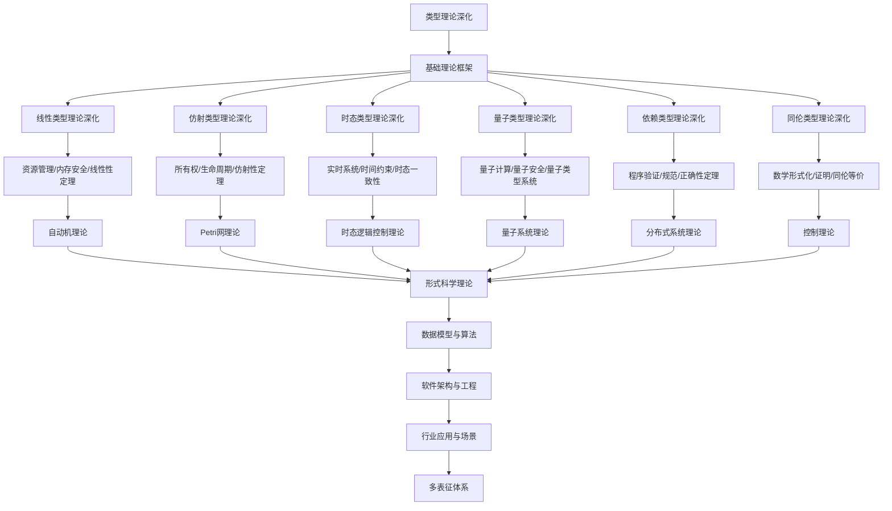

# 8.1-类型理论深化 分支导航

## 目录结构与本地跳转

- [8.1.1-线性类型理论深化](8.1.1-线性类型理论深化.md) - 预留分支
- [8.1.2-仿射类型理论深化](8.1.2-仿射类型理论深化.md) - 预留分支
- [8.1.3-时态类型理论深化](8.1.3-时态类型理论深化.md) - 预留分支
- [8.1.4-量子类型理论深化](8.1.4-量子类型理论深化.md) - 预留分支
- [8.1.5-依赖类型理论深化](8.1.5-依赖类型理论深化.md) - 预留分支
- [8.1.6-同伦类型理论深化](8.1.6-同伦类型理论深化.md) - 预留分支

---

## 主题交叉引用

| 主题      | 基础理论 | 线性类型 | 仿射类型 | 时态类型 | 量子类型 | 依赖类型 | 同伦类型 | 多表征 |
|-----------|----------|----------|----------|----------|----------|----------|----------|--------|
| 线性类型理论深化| 预留     | 预留     | 预留     | 预留     | 预留     | 预留     | 预留     | 预留   |
| 仿射类型理论深化| 预留     | 预留     | 预留     | 预留     | 预留     | 预留     | 预留     | 预留   |
| 时态类型理论深化| 预留     | 预留     | 预留     | 预留     | 预留     | 预留     | 预留     | 预留   |
| 量子类型理论深化| 预留     | 预留     | 预留     | 预留     | 预留     | 预留     | 预留     | 预留   |
| 依赖类型理论深化| 预留     | 预留     | 预留     | 预留     | 预留     | 预留     | 预留     | 预留   |
| 同伦类型理论深化| 预留     | 预留     | 预留     | 预留     | 预留     | 预留     | 预留     | 预留   |

- 交叉引用：[2.1-类型理论](../2-形式科学理论/2.1-类型理论/README.md)、[8.2-自动机理论深化](../8.2-自动机理论深化/README.md)、[8.7-量子系统理论](../8.7-量子系统理论/README.md)

---

## 全链路知识流（Mermaid流程图）

---

## 知识体系特色

- **类型安全**: 严格的类型系统设计和安全性保证
- **资源管理**: 线性类型和仿射类型的资源安全机制
- **时间约束**: 时态类型对实时系统的支持
- **量子前沿**: 量子计算与类型理论的结合
- **程序验证**: 依赖类型和同伦类型的证明能力

---

## 多表征

类型理论深化分支支持多种表征方式，包括：

- 符号表征（类型、类型构造器、类型等式等）
- 图结构（类型依赖图、类型推导树）
- 向量/张量（类型嵌入、特征向量）
- 自然语言（定义、注释、描述）
- 图像/可视化（类型结构图、推导流程图等）
这些表征可互映，提升理论表达力。

## 形式化语义

- 语义域：$D$，如类型集合、类型关系、模型空间
- 解释函数：$I: S \to D$，将符号/结构映射到具体类型语义对象
- 语义一致性：每个类型结构/公式在$D$中有明确定义

## 形式化语法与证明

- 语法规则：如类型产生式、推理规则、约束条件
- **定理**：类型理论深化分支的语法系统具一致性与可扩展性。
- **证明**：由类型产生式与推理规则递归定义，保证系统一致与可扩展。

---

[返回形式理论深化总导航](../README.md)
