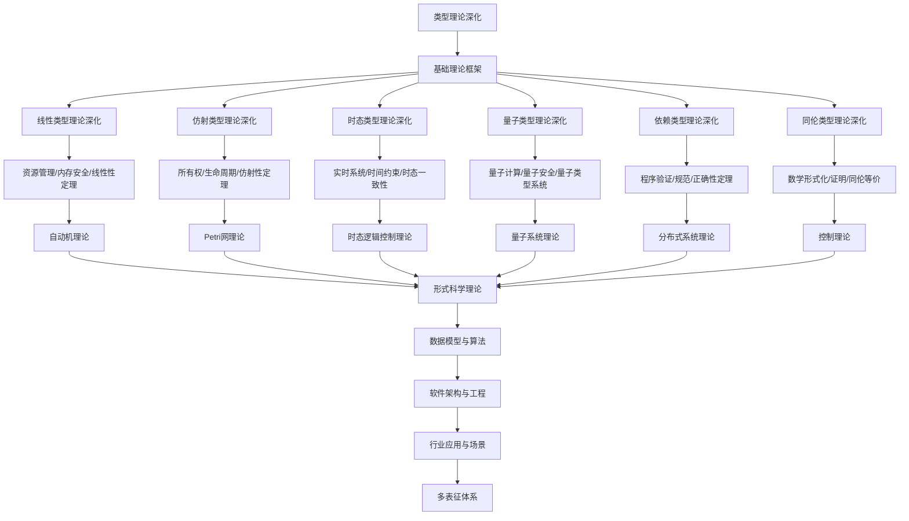

# 8.1-类型理论深化 分支导航

## 目录结构与本地跳转

- [8.1.1-线性类型理论深化](8.1.1-线性类型理论深化.md) - 线性逻辑、资源管理、内存安全
- [8.1.2-仿射类型理论深化](8.1.2-仿射类型理论深化.md) - 仿射逻辑、所有权系统、生命周期
- [8.1.3-时态类型理论深化](8.1.3-时态类型理论深化.md) - 时态类型、实时系统、时间约束
- [8.1.4-量子类型理论深化](8.1.4-量子类型理论深化.md) - 量子类型、量子安全、量子计算
- [8.1.5-依赖类型理论深化](8.1.5-依赖类型理论深化.md) - 依赖类型、程序验证、定理证明
- [8.1.6-同伦类型理论深化](8.1.6-同伦类型理论深化.md) - 同伦类型、数学形式化、证明助手
- [8.1.7-高阶类型理论深化](8.1.7-高阶类型理论深化.md) - 高阶类型、类型构造器、类型系统

---

## 主题交叉引用

| 主题      | 基础理论 | 线性类型 | 仿射类型 | 时态类型 | 量子类型 | 依赖类型 | 同伦类型 | 多表征 |
|-----------|----------|----------|----------|----------|----------|----------|----------|--------|
| 线性类型理论深化| 资源敏感逻辑、线性代数 | Rust内存安全、Haskell线性类型 | 资源回收、所有权转移 | 实时资源分配 | 量子比特资源管理 | 依赖资源类型 | 拓扑资源流 | 线性资源图、向量|
| 仿射类型理论深化| 约束逻辑、生命周期 | 线性/仿射对比 | Rust所有权系统 | 生命周期时序 | 量子态生命周期 | 依赖生命周期 | 拓扑生命周期 | 生命周期图谱|
| 时态类型理论深化| 时序逻辑、自动机 | 时序资源管理 | 时序生命周期 | 实时类型系统 | 量子时序类型 | 依赖时序类型 | 拓扑时序流 | 时序类型图|
| 量子类型理论深化| 量子逻辑、希尔伯特空间 | 量子资源类型 | 量子生命周期 | 量子时序类型 | 量子比特类型 | 量子依赖类型 | 量子拓扑类型 | 量子态图、张量|
| 依赖类型理论深化| 依赖逻辑、定理证明 | 依赖线性类型 | 依赖仿射类型 | 依赖时序类型 | 依赖量子类型 | Coq/Agda/Idris | 依赖拓扑类型 | 依赖类型树|
| 同伦类型理论深化| 同伦逻辑、拓扑学 | 同伦线性类型 | 同伦仿射类型 | 同伦时序类型 | 同伦量子类型 | HoTT | 同伦空间 | 同伦图、空间可视化|

- 交叉引用：[2.1-类型理论](../2-形式科学理论/2.1-类型理论/README.md)、[8.2-自动机理论深化](../8.2-自动机理论深化/README.md)、[8.7-量子系统理论](../8.7-量子系统理论/README.md)

---

## 全链路知识流（Mermaid流程图）

---

## 知识体系特色

- **类型安全**: 严格的类型系统设计和安全性保证
- **资源管理**: 线性类型和仿射类型的资源安全机制
- **时间约束**: 时态类型对实时系统的支持
- **量子前沿**: 量子计算与类型理论的结合
- **程序验证**: 依赖类型和同伦类型的证明能力

---

## 多表征

类型理论深化分支支持多种表征方式，包括：

- 符号表征（类型、类型构造器、类型等式等）
- 图结构（类型依赖图、类型推导树）
- 向量/张量（类型嵌入、特征向量）
- 自然语言（定义、注释、描述）
- 图像/可视化（类型结构图、推导流程图等）
这些表征可互映，提升理论表达力。

## 形式化语义

- 语义域：$D$，如类型集合、类型关系、模型空间
- 解释函数：$I: S \to D$，将符号/结构映射到具体类型语义对象
- 语义一致性：每个类型结构/公式在$D$中有明确定义

## 形式化语法与证明

- 语法规则：如类型产生式、推理规则、约束条件
- **定理**：类型理论深化分支的语法系统具一致性与可扩展性。
- **证明**：由类型产生式与推理规则递归定义，保证系统一致与可扩展。

---

## 核心概念详解

### 线性类型理论

**资源管理**：

- **线性性**：资源只能使用一次
- **所有权**：资源的所有权转移
- **内存安全**：无内存泄漏保证

**应用**：

- **Rust**：Rust的所有权系统
- **Haskell**：Haskell的线性类型扩展
- **系统编程**：系统级编程语言

### 依赖类型理论

**类型依赖**：

- **值依赖类型**：类型依赖于值
- **命题即类型**：Curry-Howard对应
- **程序即证明**：程序作为证明

**应用**：

- **Coq**：Coq证明助手
- **Agda**：Agda依赖类型语言
- **Idris**：Idris通用语言

### 同伦类型论

**同伦基础**：

- **类型即空间**：类型作为拓扑空间
- **路径类型**：类型间的路径
- **同伦等价**：类型的等价关系

**应用**：

- **数学形式化**：数学的形式化
- **证明助手**：HoTT证明助手
- **类型理论**：类型理论的发展

---

## 应用场景

### 编译器设计

- **类型检查**：静态类型检查
- **类型推断**：自动类型推断
- **优化**：基于类型的优化

### 形式化验证

- **程序验证**：程序正确性验证
- **定理证明**：数学定理证明
- **规范验证**：规范符合性验证

---

## 工具与框架

### 类型系统

- **Haskell**：函数式类型系统
- **Rust**：所有权类型系统
- **TypeScript**：渐进式类型系统

### 证明助手

- **Coq**：依赖类型证明器
- **Agda**：函数式证明器
- **Lean**：现代证明器

---

## 总结

类型理论深化是现代编程语言和形式化验证的基础，通过线性类型、依赖类型和同伦类型论，可以构建更安全、更可靠的系统。

**核心价值**：

1. **类型安全**：严格的类型安全保证
2. **资源管理**：安全的资源管理
3. **程序验证**：程序正确性验证
4. **数学形式化**：数学的形式化

**未来展望**：

随着编程语言和形式化验证的发展，类型理论将继续演进，特别是在量子类型、AI类型等领域，类型理论将提供更强大的理论支撑。

---

## 深入学习建议

### 理论基础强化

**数学基础**：

- **逻辑学**：命题逻辑、谓词逻辑、类型逻辑
- **范畴论**：范畴、函子、自然变换
- **拓扑学**：拓扑空间、同伦、同调
- **代数**：群、环、域、代数结构

**计算机科学基础**：

- **编程语言理论**：语法、语义、类型系统
- **编译器设计**：类型检查、类型推断
- **形式化方法**：形式化验证、定理证明
- **函数式编程**：λ演算、函数式语言

### 实践能力提升

**编程能力**：

- **Haskell**：函数式编程、类型系统
- **Rust**：所有权系统、类型安全
- **Coq**：依赖类型、定理证明
- **Agda**：依赖类型、证明助手

**工具使用**：

- **Coq**：依赖类型证明器
- **Agda**：函数式证明器
- **Lean**：现代证明器
- **Isabelle**：通用证明器

### 研究能力培养

**文献阅读**：

- **经典论文**：类型理论经典论文
- **前沿研究**：最新研究进展
- **应用论文**：实际应用案例
- **会议论文**：顶级会议论文

---

## 学习资源汇总

### 在线课程

- **Coursera**：类型理论课程
- **edX**：函数式编程课程
- **Udemy**：Haskell、Rust课程
- **YouTube**：类型理论教程

### 书籍推荐

- **入门书籍**：《Types and Programming Languages》
- **进阶书籍**：《Homotopy Type Theory》
- **应用书籍**：《Programming with Types》
- **工具书籍**：《Software Foundations》

### 学术资源

- **期刊**：ACM TOPLAS、Journal of Functional Programming
- **会议**：POPL、ICFP、PLDI
- **数据库**：IEEE Xplore、ACM Digital Library
- **预印本**：arXiv、ResearchGate

---

## 实践项目建议

### 基础项目

- **类型检查器**：实现类型检查器
- **类型推断**：实现类型推断算法
- **简单语言**：设计带类型系统的语言
- **类型系统**：实现类型系统

### 进阶项目

- **依赖类型系统**：实现依赖类型系统
- **线性类型系统**：实现线性类型系统
- **定理证明**：使用类型系统证明定理
- **编译器**：带类型系统的编译器

### 高级项目

- **同伦类型论**：同伦类型论实现
- **量子类型系统**：量子类型系统设计
- **形式化验证**：程序形式化验证
- **类型理论应用**：实际应用系统

---

## 职业发展路径

### 学术研究

- **研究方向**：类型理论、形式化验证、编程语言
- **职业路径**：博士研究、博士后、教职、研究机构

### 工业应用

- **应用领域**：编译器设计、形式化验证、系统编程
- **职业路径**：编译器工程师、验证工程师、系统程序员

---

## 常见问题与解决方案

### 类型系统挑战

**挑战1：类型推断复杂性**

- **问题**：复杂类型推断算法
- **解决方案**：
  - 约束求解
  - 类型注解
  - 局部类型推断
  - 增量类型检查

**挑战2：类型系统性能**

- **问题**：类型检查性能问题
- **解决方案**：
  - 增量类型检查
  - 并行类型检查
  - 类型缓存
  - 优化算法

**挑战3：类型系统可扩展性**

- **问题**：扩展类型系统困难
- **解决方案**：
  - 模块化设计
  - 类型系统组合
  - 插件机制
  - 元编程支持

### 性能优化建议

**类型检查优化**：

- **增量检查**：只检查修改的部分
- **并行检查**：并行类型检查
- **缓存机制**：缓存类型检查结果
- **算法优化**：优化类型推断算法

**编译优化**：

- **类型擦除**：运行时类型擦除
- **特化**：类型特化优化
- **内联**：基于类型的函数内联
- **死代码消除**：基于类型的死代码消除

---

## 行业应用案例

### 编译器设计

**应用场景**：

- **类型检查器**：静态类型检查
- **类型推断**：自动类型推断
- **代码生成**：基于类型的代码生成
- **优化**：基于类型的优化

**技术要点**：

- 类型系统设计
- 类型推断算法
- 类型检查实现
- 错误报告

### 形式化验证

**应用场景**：

- **程序验证**：程序正确性验证
- **定理证明**：数学定理证明
- **规范验证**：规范符合性验证
- **安全验证**：安全性质验证

**技术要点**：

- 依赖类型系统
- 证明助手
- 验证工具
- 规范语言

### 系统编程

**应用场景**：

- **内存安全**：内存安全保证
- **并发安全**：并发安全保证
- **资源管理**：资源安全管理
- **性能优化**：零成本抽象

**技术要点**：

- 所有权系统
- 生命周期管理
- 借用检查
- 零成本抽象

---

## 最佳实践

### 类型系统设计最佳实践

1. **简洁性**：保持类型系统简洁
2. **表达能力**：足够的表达能力
3. **可推断性**：支持类型推断
4. **错误信息**：友好的错误信息
5. **文档化**：详细文档化

### 类型使用最佳实践

1. **类型注解**：关键位置添加类型注解
2. **类型安全**：充分利用类型安全
3. **类型抽象**：合理使用类型抽象
4. **类型测试**：编写类型测试
5. **类型文档**：文档化类型设计

### 工具使用最佳实践

1. **IDE支持**：使用支持类型系统的IDE
2. **类型检查**：启用严格类型检查
3. **类型工具**：使用类型相关工具
4. **类型库**：使用类型库
5. **类型社区**：参与类型系统社区

---

## 总结

类型理论深化是现代编程语言和形式化验证的基础，通过线性类型、依赖类型和同伦类型论，可以构建更安全、更可靠的系统，为软件工程提供强大的理论支撑。

**核心价值**：

1. **类型安全**：严格的类型安全保证
2. **资源管理**：安全的资源管理
3. **程序验证**：程序正确性验证
4. **数学形式化**：数学的形式化

**未来展望**：

随着编程语言和形式化验证的发展，类型理论将继续演进，特别是在量子类型、AI类型、综合类型系统等领域，类型理论将提供更强大的理论支撑。

**技术发展趋势**：

1. **量子类型系统**：量子计算类型系统
2. **AI类型系统**：机器学习类型系统
3. **综合类型系统**：统一多种类型系统
4. **类型推断增强**：更强大的类型推断
5. **类型系统工具**：更好的类型系统工具

**应用前景**：

- **编程语言**：更安全的编程语言
- **形式化验证**：更强大的验证能力
- **系统编程**：更安全的系统编程
- **AI系统**：更可靠的AI系统

---

## 技术发展趋势

### 类型系统扩展

**高级类型特性**：

- **GADT**：广义代数数据类型
- **类型族**：类型族和关联类型
- **依赖类型**：依赖类型系统扩展
- **线性类型**：线性类型系统应用

**类型推断增强**：

- **全局推断**：全局类型推断
- **约束求解**：约束求解优化
- **增量推断**：增量类型推断
- **错误诊断**：类型错误诊断改进

### 类型系统工具

**IDE支持**：

- **实时类型检查**：实时类型检查
- **类型提示**：智能类型提示
- **重构支持**：类型安全重构
- **错误定位**：精确错误定位

**类型系统库**：

- **类型库**：丰富的类型库
- **类型工具**：类型相关工具
- **类型文档**：类型系统文档
- **类型社区**：类型系统社区

---

## 应用前景

### 编程语言发展

- **安全语言**：内存安全编程语言
- **函数式语言**：函数式语言发展
- **系统语言**：系统编程语言
- **领域语言**：领域特定语言

### 验证工具发展

- **证明助手**：更强大的证明助手
- **验证工具**：更易用的验证工具
- **自动化验证**：自动化验证能力
- **综合验证**：综合验证方法

---

[返回形式理论深化总导航](../README.md)
