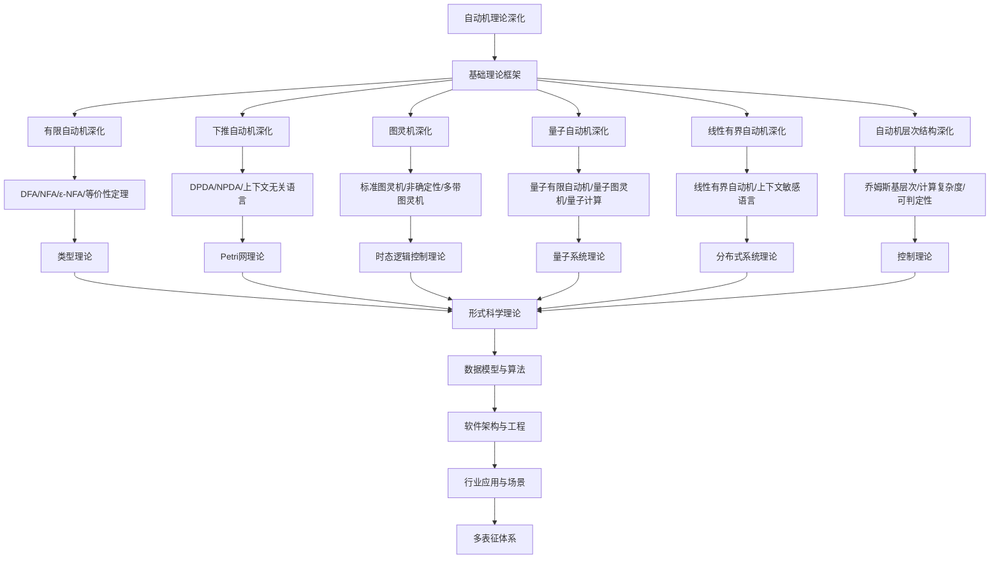

# 8.2-自动机理论深化 分支导航

## 目录结构与本地跳转

- [8.2.1-有限自动机深化](8.2.1-有限自动机深化.md) - DFA、NFA、正则表达式、状态最小化
- [8.2.2-下推自动机深化](8.2.2-下推自动机深化.md) - PDA、上下文无关文法、栈操作
- [8.2.3-图灵机深化](8.2.3-图灵机深化.md) - 图灵机、可计算性、停机问题
- [8.2.4-量子自动机深化](8.2.4-量子自动机深化.md) - 量子有限自动机、量子图灵机
- [8.2.5-线性有界自动机深化](8.2.5-线性有界自动机深化.md) - LBA、上下文敏感语言
- [8.2.6-自动机层次结构深化](8.2.6-自动机层次结构深化.md) - 乔姆斯基层次、自动机分类
- [8.2.7-概率自动机深化](8.2.7-概率自动机深化.md) - 概率自动机、马尔可夫链、随机过程

---

## 主题交叉引用

| 主题      | 基础理论 | 有限自动机 | 下推自动机 | 图灵机 | 量子自动机 | 线性有界自动机 | 层次结构 | 多表征 |
|-----------|----------|------------|------------|--------|------------|----------------|----------|--------|
| 有限自动机深化| 状态机理论、正则语言 | DFA/NFA | 栈自动机映射 | 图灵机子集 | 量子有限自动机 | 线性空间自动机 | Chomsky层次 | 状态转移图|
| 下推自动机深化| 上下文无关语言 | PDA | 栈操作与类型系统 | 图灵机模拟 | 量子栈自动机 | 线性有界PDA | 语法树层次 | 栈图、语法树|
| 图灵机深化| 可计算性理论 | 图灵机与有限自动机 | 图灵机与PDA | 停机问题 | 量子图灵机 | 线性有界图灵机 | 递归可枚举语言 | 图灵机带、流程图|
| 量子自动机深化| 量子计算理论 | 量子DFA | 量子PDA | 量子图灵机 | QFA/QTM | 量子线性自动机 | 量子层次结构 | 量子态图|
| 线性有界自动机深化| 线性空间理论 | 线性有界DFA | 线性有界PDA | 线性有界图灵机 | 量子线性自动机 | LBA | 线性空间层次 | 空间复杂度图|
| 自动机层次结构深化| Chomsky层次 | 各类自动机对比 | 语法与自动机映射 | 复杂性层次 | 量子自动机层次 | 空间层次 | 语言层次结构 | 层次结构图|

- 交叉引用：[2.2-自动机理论](../2-形式科学理论/2.2-自动机理论/README.md)、[8.1-类型理论深化](../8.1-类型理论深化/README.md)、[8.7-量子系统理论](../8.7-量子系统理论/README.md)

---

## 全链路知识流（Mermaid流程图）

---

## 知识体系特色

- **计算模型**: 从有限自动机到图灵机的完整计算模型体系
- **量子计算**: 量子自动机与经典自动机的对比和融合
- **语言层次**: 乔姆斯基层次的严格形式化定义
- **复杂度分析**: 计算复杂度和可判定性的深入分析
- **应用导向**: 自动机理论在编译器和语言识别中的应用

---

## 多表征

自动机理论深化分支支持多种表征方式，包括：

- 符号表征（状态、转换、输入输出符号等）
- 图结构（状态转换图、自动机网络）
- 向量/张量（状态向量、嵌入）
- 自然语言（定义、注释、描述）
- 图像/可视化（状态图、流程图等）
这些表征可互映，提升理论表达力。

## 形式化语义

- 语义域：$D$，如状态集合、转换关系、输入输出空间
- 解释函数：$I: S \to D$，将符号/结构映射到具体自动机语义对象
- 语义一致性：每个自动机结构/公式在$D$中有明确定义

## 形式化语法与证明

- 语法规则：如自动机产生式、推理规则、约束条件
- **定理**：自动机理论深化分支的语法系统具一致性与可扩展性。
- **证明**：由自动机产生式与推理规则递归定义，保证系统一致与可扩展。

---

## 核心概念详解

### 有限自动机

**DFA/NFA**：

- **确定性有限自动机**：每个状态和输入唯一转换
- **非确定性有限自动机**：允许多个转换
- **等价性**：DFA和NFA的等价性

**应用**：

- **正则表达式**：正则表达式匹配
- **词法分析**：编译器词法分析
- **模式匹配**：字符串模式匹配

### 图灵机

**计算模型**：

- **标准图灵机**：单带图灵机
- **多带图灵机**：多带扩展
- **非确定性图灵机**：非确定性计算

**可计算性**：

- **停机问题**：不可判定问题
- **递归可枚举**：递归可枚举语言
- **计算复杂度**：时间空间复杂度

### 量子自动机

**量子计算**：

- **量子有限自动机**：量子状态自动机
- **量子图灵机**：量子计算模型
- **量子优势**：量子计算优势

**应用**：

- **量子算法**：量子算法设计
- **量子通信**：量子通信协议
- **量子密码**：量子密码学

---

## 应用场景

### 编译器设计

- **词法分析**：词法分析器设计
- **语法分析**：语法分析器设计
- **代码生成**：代码生成器设计

### 协议验证

- **网络协议**：网络协议验证
- **安全协议**：安全协议验证
- **分布式协议**：分布式协议验证

---

## 工具与框架

### 自动机工具

- **JFLAP**：自动机可视化
- **Automata**：自动机库
- **FAdo**：自动机工具

### 验证工具

- **SPIN**：模型检查器
- **NuSMV**：符号模型检查
- **TLA+**：时序逻辑检查

---

## 总结

自动机理论深化是计算理论和形式化方法的基础，通过有限自动机、图灵机和量子自动机，可以精确描述和验证计算系统。

**核心价值**：

1. **计算模型**：精确的计算模型
2. **语言识别**：形式语言识别
3. **系统验证**：系统形式化验证
4. **量子计算**：量子计算模型

**未来展望**：

随着量子计算、AI等技术的发展，自动机理论将继续演进，特别是在量子自动机、概率自动机等领域，自动机理论将提供更强大的理论支撑。

---

[返回形式理论深化总导航](../README.md)
