# 8.3.3-Petri网分析方法深化

## 📖 理论综述

Petri网分析方法是理解和验证Petri网模型行为的核心工具。通过系统化的分析，可以揭示系统的可达性、活性、安全性、死锁、覆盖性、不变量等关键性质，为并发系统、分布式系统、实时系统等的建模与验证提供理论基础和工程手段。

### 主要分析方法

- **可达性分析**
- **活性分析**
- **安全性分析**
- **死锁检测**
- **覆盖性分析**
- **不变量分析（P-不变量、T-不变量）**
- **有界性分析**
- **结构分析**
- **性能分析**
- **模型检查**

---

## 1. 可达性分析

### 理论定义

可达性分析用于判断从初始标记出发，系统能否到达某一特定状态。它是Petri网分析中最基础也是最重要的问题之一。

- **可达性图**：以标记为节点，变迁为边，描述所有可能的状态转移。
- **可达性判定**：判断目标标记是否在可达性图中。

### 代码示例（Python）

```python
class PetriNetReachability:
    def __init__(self, net):
        self.net = net

    def reachable_markings(self):
        reachable = {tuple(self.net.initial_marking.items())}
        queue = [self.net.initial_marking]
        while queue:
            current = queue.pop(0)
            for t in self.net.transitions:
                new_marking = self.net.fire(current, t)
                if new_marking:
                    new_tuple = tuple(new_marking.items())
                    if new_tuple not in reachable:
                        reachable.add(new_tuple)
                        queue.append(new_marking)
        return [dict(m) for m in reachable]
```

---

## 2. 活性分析

### 理论定义1

活性分析用于判断Petri网中每个变迁是否在某些可达标记下始终有可能被触发。活性是衡量系统“不会永久停滞”的重要指标。

- **活性等级**：
  - 0-活性：变迁永远不会被触发
  - 1-活性：变迁至少能被触发一次
  - k-活性：变迁能被触发k次
  - ω-活性：变迁能被无限次触发
- **系统活性**：所有变迁均为ω-活性

### 代码示例（Python）1

```python
class PetriNetLiveness:
    def __init__(self, net):
        self.net = net

    def is_live(self):
        reachable = PetriNetReachability(self.net).reachable_markings()
        for t in self.net.transitions:
            if not any(self.net.can_fire(m, t) for m in reachable):
                return False
        return True
```

---

## 3. 安全性分析

### 理论定义2

安全性分析用于判断系统是否会进入“危险”状态（如资源溢出、非法访问等）。安全性是系统正确性的重要保障。

- **安全库所**：某库所的标记数在所有可达标记下均不超过1
- **k-安全**：某库所的标记数在所有可达标记下均不超过k

### 代码示例（Python）2

```python
class PetriNetSafety:
    def __init__(self, net):
        self.net = net

    def is_safe(self, place, k=1):
        reachable = PetriNetReachability(self.net).reachable_markings()
        return all(m[place] <= k for m in reachable)
```

---

## 4. 覆盖性分析

### 理论定义3

覆盖性分析用于判断系统是否能够通过变迁序列覆盖所有可能的标记。覆盖性是衡量系统“表达能力”的重要指标。

- **覆盖性图**：以标记为节点，变迁为边，描述所有可能的标记覆盖。
- **覆盖性判定**：判断目标标记是否在覆盖性图中。

### 代码示例（Python）3

```python
class PetriNetCoverability:
    def __init__(self, net):
        self.net = net

    def is_coverable(self, marking):
        reachable = PetriNetReachability(self.net).reachable_markings()
        queue = [marking]
        covered = set()
        while queue:
            current = queue.pop(0)
            if current not in covered:
                covered.add(current)
                for t in self.net.transitions:
                    new_marking = self.net.fire(current, t)
                    if new_marking:
                        new_tuple = tuple(new_marking.items())
                        if new_tuple not in covered:
                            queue.append(new_marking)
        return all(m in covered for m in reachable)
```

---

## 5. 死锁检测

### 理论定义4

死锁检测用于判断系统是否存在无法继续执行的进程或线程。死锁是并发系统中常见的问题。

- **死锁状态**：系统中存在一组进程，每个进程都在等待其他进程释放资源。
- **死锁判定**：判断系统是否存在死锁。

### 代码示例（Python）4

```python
class PetriNetDeadlock:
    def __init__(self, net):
        self.net = net

    def has_deadlock(self):
        reachable = PetriNetReachability(self.net).reachable_markings()
        for m in reachable:
            if self.net.can_fire(m, t) for t in self.net.transitions:
                return True
        return False
```

---

## 6. 不变量分析

### 理论定义5

不变量分析用于发现Petri网中保持不变的数学关系，这些关系对于理解系统行为和验证系统性质具有重要意义。

- **P-不变量**：库所标记数的线性组合在系统运行中保持不变
- **T-不变量**：变迁触发次数的线性组合使得系统回到初始状态

### 代码示例（Python）5

```python
import numpy as np

class PetriNetInvariants:
    def __init__(self, net):
        self.net = net

    def compute_p_invariants(self):
        # 构建关联矩阵
        incidence_matrix = self.build_incidence_matrix()
        # 计算P-不变量（零空间）
        p_invariants = np.linalg.null_space(incidence_matrix.T)
        return p_invariants

    def compute_t_invariants(self):
        # 构建关联矩阵
        incidence_matrix = self.build_incidence_matrix()
        # 计算T-不变量（零空间）
        t_invariants = np.linalg.null_space(incidence_matrix)
        return t_invariants

    def build_incidence_matrix(self):
        # 构建关联矩阵 C = Post - Pre
        places = list(self.net.places)
        transitions = list(self.net.transitions)
        matrix = np.zeros((len(places), len(transitions)))
        
        for i, p in enumerate(places):
            for j, t in enumerate(transitions):
                post = self.net.post_matrix.get(t, {}).get(p, 0)
                pre = self.net.pre_matrix.get(p, {}).get(t, 0)
                matrix[i, j] = post - pre
        
        return matrix
```

---

## 7. 有界性分析

### 理论定义6

有界性分析用于判断Petri网中库所的标记数是否有上界，这对于系统资源管理和安全性分析具有重要意义。

- **k-有界**：某库所的标记数在所有可达标记下均不超过k
- **有界Petri网**：所有库所均为k-有界（对某个k）

### 代码示例（Python）6

```python
class PetriNetBoundedness:
    def __init__(self, net):
        self.net = net

    def is_bounded(self, place):
        reachable = PetriNetReachability(self.net).reachable_markings()
        max_tokens = max(m.get(place, 0) for m in reachable)
        return max_tokens < float('inf')

    def get_bound(self, place):
        reachable = PetriNetReachability(self.net).reachable_markings()
        return max(m.get(place, 0) for m in reachable)
```

---

## 8. 结构分析

### 理论定义7

结构分析基于Petri网的拓扑结构，不依赖于初始标记，能够发现系统的结构性质。

- **结构活性**：存在初始标记使得系统为活的
- **结构有界性**：存在初始标记使得系统为有界的
- **结构死锁**：无论初始标记如何，系统都存在死锁

### 代码示例（Python）7

```python
class PetriNetStructuralAnalysis:
    def __init__(self, net):
        self.net = net

    def is_structurally_live(self):
        # 检查是否存在P-不变量和T-不变量
        p_invariants = PetriNetInvariants(self.net).compute_p_invariants()
        t_invariants = PetriNetInvariants(self.net).compute_t_invariants()
        
        # 结构活性检查（简化版）
        return len(p_invariants) > 0 and len(t_invariants) > 0

    def is_structurally_bounded(self):
        # 检查是否存在正的P-不变量
        p_invariants = PetriNetInvariants(self.net).compute_p_invariants()
        return any(np.all(inv > 0) for inv in p_invariants)
```

---

## 9. 性能分析

### 理论定义8

性能分析用于评估Petri网系统的吞吐量、响应时间、资源利用率等性能指标，对于系统优化具有重要意义。

- **稳态分析**：计算系统在长期运行下的性能指标
- **瞬态分析**：分析系统在特定时间点的性能表现

### 代码示例（Python）8

```python
import numpy as np
from scipy.linalg import solve

class PetriNetPerformance:
    def __init__(self, net):
        self.net = net

    def steady_state_analysis(self):
        # 构建马尔可夫链（简化版）
        reachable = PetriNetReachability(self.net).reachable_markings()
        n_states = len(reachable)
        
        # 构建转移矩阵（需要概率信息）
        transition_matrix = self.build_transition_matrix(reachable)
        
        # 求解稳态概率
        steady_state = self.solve_steady_state(transition_matrix)
        
        return {
            'steady_state': steady_state,
            'throughput': self.calculate_throughput(steady_state),
            'utilization': self.calculate_utilization(steady_state)
        }

    def build_transition_matrix(self, reachable):
        # 构建转移矩阵（简化实现）
        n_states = len(reachable)
        matrix = np.zeros((n_states, n_states))
        
        # 这里需要实际的转移概率
        # 简化实现，假设均匀分布
        for i, state in enumerate(reachable):
            enabled_transitions = [t for t in self.net.transitions 
                                 if self.net.can_fire(state, t)]
            if enabled_transitions:
                prob = 1.0 / len(enabled_transitions)
                for t in enabled_transitions:
                    new_state = self.net.fire(state, t)
                    if new_state:
                        j = reachable.index(new_state)
                        matrix[i, j] = prob
        
        return matrix

    def solve_steady_state(self, transition_matrix):
        # 求解稳态概率 π = πP
        n_states = transition_matrix.shape[0]
        
        # 构建线性方程组
        A = transition_matrix.T - np.eye(n_states)
        A[-1, :] = 1  # 概率和为1的约束
        b = np.zeros(n_states)
        b[-1] = 1
        
        # 求解线性方程组
        steady_state = solve(A, b)
        return steady_state
```

---

## 10. 模型检查

### 理论定义9

模型检查用于验证Petri网是否满足特定的时序逻辑性质，是形式化验证的重要方法。

- **CTL（计算树逻辑）**：用于描述分支时间性质
- **LTL（线性时序逻辑）**：用于描述线性时间性质
- **模型检查算法**：自动验证系统是否满足性质

### 代码示例（Python）9

```python
class PetriNetModelChecker:
    def __init__(self, net):
        self.net = net

    def check_ctl_property(self, property_formula):
        # CTL性质检查（简化实现）
        if property_formula.startswith("AG"):
            # 全局性质：所有路径都满足
            return self.check_global_property(property_formula[2:])
        elif property_formula.startswith("EF"):
            # 存在性质：存在路径满足
            return self.check_existential_property(property_formula[2:])
        else:
            return False

    def check_ltl_property(self, property_formula):
        # LTL性质检查（简化实现）
        # 将LTL转换为Büchi自动机
        buchi_automaton = self.ltl_to_buchi(property_formula)
        
        # 构建Petri网的自动机表示
        petri_automaton = self.petri_net_to_automaton()
        
        # 检查语言包含关系
        return self.check_language_inclusion(petri_automaton, buchi_automaton)

    def check_global_property(self, sub_property):
        # 检查全局性质
        reachable = PetriNetReachability(self.net).reachable_markings()
        return all(self.evaluate_property(m, sub_property) for m in reachable)

    def check_existential_property(self, sub_property):
        # 检查存在性质
        reachable = PetriNetReachability(self.net).reachable_markings()
        return any(self.evaluate_property(m, sub_property) for m in reachable)

    def evaluate_property(self, marking, property_formula):
        # 在给定标记下评估性质（简化实现）
        if property_formula == "deadlock":
            return not any(self.net.can_fire(marking, t) 
                          for t in self.net.transitions)
        elif property_formula == "live":
            return any(self.net.can_fire(marking, t) 
                      for t in self.net.transitions)
        else:
            return True  # 默认返回True
```

---

## 🔬 高级分析方法

### 1. 符号分析

#### 符号可达性分析

```haskell
-- 符号Petri网分析
data SymbolicPetriNet p t = SymbolicPetriNet {
    places :: Set p,
    transitions :: Set t,
    symbolic_marking :: SymbolicMarking p,
    constraints :: [Constraint]
}

-- 符号可达性分析
symbolicReachabilityAnalysis :: SymbolicPetriNet p t -> SymbolicReachabilityGraph
symbolicReachabilityAnalysis net = 
    let initial = symbolicMarking net
        -- 使用符号技术构建可达性图
        graph = buildSymbolicReachabilityGraph net initial
    in graph
```

### 2. 抽象分析

#### 抽象Petri网

```haskell
-- 抽象Petri网
abstractPetriNet :: PetriNet p t -> AbstractPetriNet p t
abstractPetriNet net = 
    let -- 识别等价状态
        equivalence_classes = findEquivalenceClasses net
        -- 构建抽象网
        abstract_places = map abstractPlace equivalence_classes
        abstract_transitions = map abstractTransition (transitions net)
    in AbstractPetriNet abstract_places abstract_transitions
```

### 3. 并行分析

#### 并行Petri网分析

```rust
// 并行Petri网分析
impl PetriNet {
    fn parallel_analysis(&self) -> AnalysisResult {
        let mut handles = vec![];
        
        // 并行计算可达性
        let reachable_handle = thread::spawn(|| {
            self.compute_reachable_markings()
        });
        
        // 并行计算不变量
        let invariants_handle = thread::spawn(|| {
            self.compute_invariants()
        });
        
        // 并行计算活性
        let liveness_handle = thread::spawn(|| {
            self.check_liveness()
        });
        
        // 收集结果
        let reachable = reachable_handle.join().unwrap();
        let invariants = invariants_handle.join().unwrap();
        let liveness = liveness_handle.join().unwrap();
        
        AnalysisResult {
            reachable_markings: reachable,
            invariants: invariants,
            is_live: liveness
        }
    }
}
```

---

## 🎯 应用场景与实例

### 1. 并发系统验证

#### 哲学家就餐问题分析

```python
def analyze_dining_philosophers(n_philosophers):
    net = create_dining_philosophers_net(n_philosophers)
    
    # 可达性分析
    reachable = PetriNetReachability(net).reachable_markings()
    print(f"可达标记数量: {len(reachable)}")
    
    # 死锁检测
    deadlock = PetriNetDeadlock(net).has_deadlock()
    print(f"存在死锁: {deadlock}")
    
    # 活性分析
    live = PetriNetLiveness(net).is_live()
    print(f"系统是活的: {live}")
    
    # 安全性分析
    safe = all(PetriNetSafety(net).is_safe(p) for p in net.places)
    print(f"系统是安全的: {safe}")
```

### 2. 通信协议验证

#### TCP协议分析

```python
def analyze_tcp_protocol():
    net = create_tcp_protocol_net()
    
    # 状态可达性
    reachable = PetriNetReachability(net).reachable_markings()
    print(f"TCP状态数量: {len(reachable)}")
    
    # 协议正确性验证
    # 检查是否总是能建立连接
    can_establish = check_connection_establishment(net)
    print(f"总能建立连接: {can_establish}")
    
    # 检查是否总是能正确关闭
    can_close = check_connection_closure(net)
    print(f"总能正确关闭: {can_close}")
```

### 3. 制造系统分析

#### 柔性制造系统性能分析

```python
def analyze_manufacturing_system():
    net = create_manufacturing_system_net()
    
    # 性能分析
    performance = PetriNetPerformance(net).steady_state_analysis()
    print(f"系统吞吐量: {performance['throughput']}")
    print(f"资源利用率: {performance['utilization']}")
    
    # 瓶颈分析
    bottlenecks = identify_bottlenecks(net)
    print(f"系统瓶颈: {bottlenecks}")
    
    # 优化建议
    optimizations = suggest_optimizations(net, performance)
    print(f"优化建议: {optimizations}")
```

---

## 🔗 与其他理论的交叉

### 1. 与自动机理论

#### Petri网到自动机的转换

```haskell
-- Petri网到自动机的转换
petriNetToAutomaton :: PetriNet p t -> FiniteAutomaton (Marking p) t
petriNetToAutomaton net = 
    let states = reachableMarkings net
        alphabet = transitions net
        start = initialMarking net
        delta = \m t -> case fireTransition net m t of
            Just m' -> m'
            Nothing -> m
        finals = states
    in DFA states alphabet start delta finals
```

### 2. 与图论

#### Petri网图结构分析

```haskell
-- Petri网的图结构分析
petriNetGraph :: PetriNet p t -> Graph (Either p t)
petriNetGraph (PetriNet places transitions pre post marking) = 
    let -- 构建二分图
        nodes = map Left places ++ map Right transitions
        edges = [(Left p, Right t) | p <- places, t <- transitions, pre p t > 0] ++
                [(Right t, Left p) | t <- transitions, p <- places, post t p > 0]
    in Graph nodes edges
```

### 3. 与线性代数

#### Petri网矩阵分析

```haskell
-- Petri网矩阵分析
petriNetMatrixAnalysis :: PetriNet p t -> MatrixAnalysis
petriNetMatrixAnalysis net = 
    let incidenceMatrix = buildIncidenceMatrix net
        rank = matrixRank incidenceMatrix
        nullity = matrixNullity incidenceMatrix
        eigenvalues = matrixEigenvalues incidenceMatrix
    in MatrixAnalysis rank nullity eigenvalues
```

---

## 🚀 发展前沿与挑战

### 1. 研究方向

#### 大规模Petri网分析

- **可扩展性**：处理大规模Petri网的分析算法
- **并行化**：并行Petri网分析技术
- **近似算法**：大规模Petri网的近似分析方法

#### 实时Petri网分析

- **时间约束**：时间Petri网的分析方法
- **实时性**：实时系统的Petri网分析
- **性能分析**：实时系统的性能分析

#### 概率Petri网分析

- **随机性**：概率Petri网的分析方法
- **马尔可夫链**：与马尔可夫链的结合
- **性能评估**：概率系统的性能评估

### 2. 技术挑战

#### 状态空间爆炸

```haskell
-- 状态空间爆炸问题
stateSpaceExplosion :: PetriNet p t -> Bool
stateSpaceExplosion net = 
    let reachable = reachableMarkings net
        stateCount = length reachable
        -- 检查状态数量是否超过阈值
        threshold = 1000000  -- 100万个状态
    in stateCount > threshold

-- 状态空间压缩技术
compressStateSpace :: PetriNet p t -> CompressedPetriNet p t
compressStateSpace net = 
    let -- 使用符号技术压缩状态空间
        symbolicRepresentation = buildSymbolicRepresentation net
        -- 使用抽象技术
        abstractedNet = abstractPetriNet net
    in CompressedPetriNet symbolicRepresentation abstractedNet
```

#### 分析复杂性

```haskell
-- 分析复杂性评估
analysisComplexity :: PetriNet p t -> ComplexityAnalysis
analysisComplexity net = 
    let reachableCount = length (reachableMarkings net)
        transitionCount = length (transitions net)
        placeCount = length (places net)
        
        -- 计算各种分析的复杂度
        reachabilityComplexity = reachableCount * transitionCount
        livenessComplexity = reachableCount ^ 2
        deadlockComplexity = reachableCount * transitionCount
        
        totalComplexity = reachabilityComplexity + livenessComplexity + deadlockComplexity
    in ComplexityAnalysis {
        reachabilityComplexity = reachabilityComplexity,
        livenessComplexity = livenessComplexity,
        deadlockComplexity = deadlockComplexity,
        totalComplexity = totalComplexity
    }
```

---

## 🛠️ 工具与实现

### 1. 编程语言支持

#### Python

```python
# Python中的Petri网分析工具
import numpy as np
from scipy.linalg import solve

class PetriNetAnalyzer:
    def __init__(self, net):
        self.net = net
        self.reachability_analyzer = PetriNetReachability(net)
        self.liveness_analyzer = PetriNetLiveness(net)
        self.safety_analyzer = PetriNetSafety(net)
        self.deadlock_analyzer = PetriNetDeadlock(net)
        self.invariants_analyzer = PetriNetInvariants(net)
        self.performance_analyzer = PetriNetPerformance(net)
    
    def comprehensive_analysis(self):
        """综合分析"""
        results = {}
        
        # 可达性分析
        results['reachable_markings'] = self.reachability_analyzer.reachable_markings()
        results['reachable_count'] = len(results['reachable_markings'])
        
        # 活性分析
        results['is_live'] = self.liveness_analyzer.is_live()
        
        # 安全性分析
        results['is_safe'] = all(self.safety_analyzer.is_safe(p) for p in self.net.places)
        
        # 死锁分析
        results['has_deadlock'] = self.deadlock_analyzer.has_deadlock()
        
        # 不变量分析
        results['p_invariants'] = self.invariants_analyzer.compute_p_invariants()
        results['t_invariants'] = self.invariants_analyzer.compute_t_invariants()
        
        # 性能分析
        results['performance'] = self.performance_analyzer.steady_state_analysis()
        
        return results
```

#### Java

```java
// Java中的Petri网分析工具
import java.util.*;

public class PetriNetAnalyzer {
    private PetriNet net;
    private PetriNetReachability reachabilityAnalyzer;
    private PetriNetLiveness livenessAnalyzer;
    private PetriNetSafety safetyAnalyzer;
    private PetriNetDeadlock deadlockAnalyzer;
    private PetriNetInvariants invariantsAnalyzer;
    private PetriNetPerformance performanceAnalyzer;
    
    public PetriNetAnalyzer(PetriNet net) {
        this.net = net;
        this.reachabilityAnalyzer = new PetriNetReachability(net);
        this.livenessAnalyzer = new PetriNetLiveness(net);
        this.safetyAnalyzer = new PetriNetSafety(net);
        this.deadlockAnalyzer = new PetriNetDeadlock(net);
        this.invariantsAnalyzer = new PetriNetInvariants(net);
        this.performanceAnalyzer = new PetriNetPerformance(net);
    }
    
    public AnalysisResult comprehensiveAnalysis() {
        AnalysisResult results = new AnalysisResult();
        
        // 可达性分析
        Set<Map<String, Integer>> reachable = reachabilityAnalyzer.reachableMarkings();
        results.setReachableMarkings(reachable);
        results.setReachableCount(reachable.size());
        
        // 活性分析
        boolean isLive = livenessAnalyzer.isLive();
        results.setLive(isLive);
        
        // 安全性分析
        boolean isSafe = net.getPlaces().stream()
            .allMatch(place -> safetyAnalyzer.isSafe(place));
        results.setSafe(isSafe);
        
        // 死锁分析
        boolean hasDeadlock = deadlockAnalyzer.hasDeadlock();
        results.setHasDeadlock(hasDeadlock);
        
        // 不变量分析
        double[][] pInvariants = invariantsAnalyzer.computePInvariants();
        double[][] tInvariants = invariantsAnalyzer.computeTInvariants();
        results.setPInvariants(pInvariants);
        results.setTInvariants(tInvariants);
        
        // 性能分析
        PerformanceMetrics performance = performanceAnalyzer.steadyStateAnalysis();
        results.setPerformance(performance);
        
        return results;
    }
}
```

### 2. 形式化验证工具

#### SPIN

```promela
// SPIN中的Petri网验证
proctype PetriNet() {
    int p1 = 1, p2 = 0, p3 = 0;
    int t1_enabled, t2_enabled;
    
    do
    :: atomic {
        t1_enabled = (p1 > 0);
        t2_enabled = (p2 > 0);
        
        if
        :: t1_enabled -> p1--; p2++
        :: t2_enabled -> p2--; p3++
        :: else -> break
        fi
    }
    od
}

// 性质验证
ltl liveness { []<>(p1 > 0 || p2 > 0 || p3 > 0) }
ltl safety { []!(p1 < 0 || p2 < 0 || p3 < 0) }
ltl deadlock_freedom { []<>(p1 > 0 || p2 > 0) }
```

#### PRISM

```java
// PRISM中的Petri网分析
public class StochasticPetriNetModel {
    private Map<String, Double> firingRates;
    private Map<String, String> transitions;
    
    public StochasticPetriNetModel() {
        this.firingRates = new HashMap<>();
        this.transitions = new HashMap<>();
    }
    
    public void addTransition(String name, double rate, String guard) {
        firingRates.put(name, rate);
        transitions.put(name, guard);
    }
    
    public String generatePrismModel() {
        StringBuilder model = new StringBuilder();
        model.append("ctmc\n\n");
        
        // 添加状态变量
        model.append("// State variables\n");
        model.append("formula p1 = 0..10;\n");
        model.append("formula p2 = 0..10;\n\n");
        
        // 添加变迁
        model.append("// Transitions\n");
        for (Map.Entry<String, Double> entry : firingRates.entrySet()) {
            String transition = entry.getKey();
            double rate = entry.getValue();
            String guard = transitions.get(transition);
            
            model.append(String.format("[] %s -> %f: (p1'=p1+1) & (p2'=p2-1);\n", 
                                    guard, rate));
        }
        
        return model.toString();
    }
}
```

### 3. 可视化工具

#### Graphviz



---

## 📚 学习路径

### 基础阶段

1. **Petri网分析方法基本概念**
   - 可达性分析
   - 活性分析
   - 安全性分析
   - 死锁检测

2. **基本工具使用**
   - Python实现
   - Java实现
   - 可视化工具

3. **简单应用**
   - 并发系统建模
   - 简单协议验证
   - 基本性能分析

### 进阶阶段

1. **高级分析方法**
   - 不变量分析
   - 覆盖性分析
   - 结构分析
   - 性能分析

2. **形式化验证**
   - 模型检查
   - 时序逻辑
   - 性质验证

3. **应用实践**
   - 复杂系统建模
   - 协议验证
   - 性能评估

### 高级阶段

1. **理论研究**
   - 分析算法优化
   - 复杂性分析
   - 理论前沿

2. **工具开发**
   - 分析工具开发
   - 可视化工具
   - 验证工具

3. **跨领域应用**
   - 量子计算应用
   - 生物信息学应用
   - 人工智能应用

---

## 🔗 相关链接

- [8.3.1-基础Petri网深化](8.3.1-基础Petri网深化.md)
- [8.3.2-高级Petri网变种深化](8.3.2-高级Petri网变种深化.md)
- [8.3.4-Petri网应用场景深化](8.3.4-Petri网应用场景深化.md)
- [8.3.5-Petri网与其他理论交叉深化](8.3.5-Petri网与其他理论交叉深化.md)
- [8.3.6-Petri网工具与实现深化](8.3.6-Petri网工具与实现深化.md)
- [8.2-自动机理论深化](../8.2-自动机理论深化/README.md)
- [8.4-时态逻辑控制理论深化](../8.4-时态逻辑控制理论深化/README.md)

---

**📖 返回导航**:

- [返回Petri网理论深化导航](README.md)
- [返回形式理论深化总导航](../README.md)
