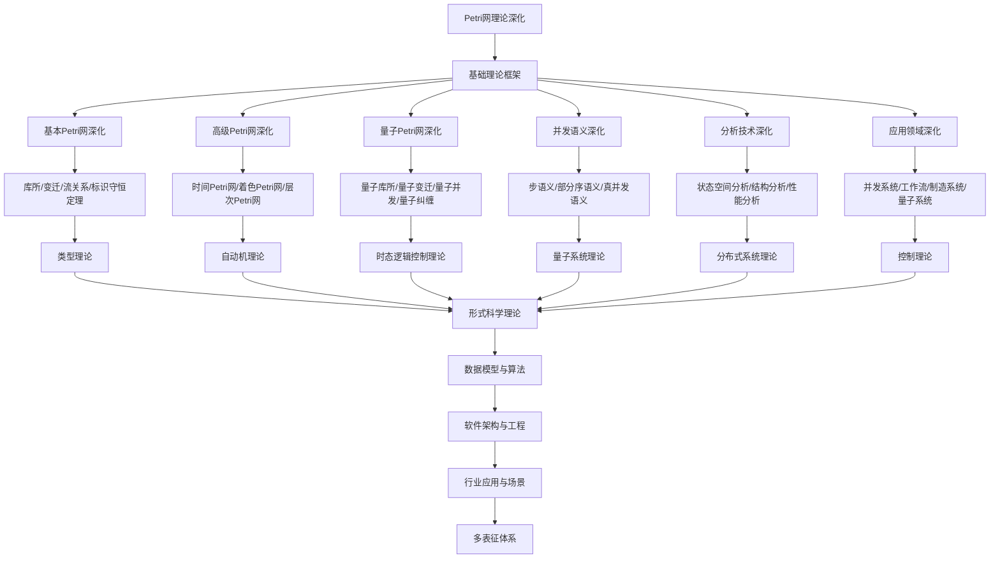

# 8.3-Petri网理论深化 分支导航

## 目录结构与本地跳转

- [8.3.1-基本Petri网深化](8.3.1-基本Petri网深化.md) - 预留分支
- [8.3.2-高级Petri网深化](8.3.2-高级Petri网深化.md) - 预留分支
- [8.3.3-量子Petri网深化](8.3.3-量子Petri网深化.md) - 预留分支
- [8.3.4-并发语义深化](8.3.4-并发语义深化.md) - 预留分支
- [8.3.5-分析技术深化](8.3.5-分析技术深化.md) - 预留分支
- [8.3.6-应用领域深化](8.3.6-应用领域深化.md) - 预留分支

---

## 主题交叉引用

| 主题      | 基础理论 | 基本Petri网 | 高级Petri网 | 量子Petri网 | 并发语义 | 分析技术 | 应用领域 | 多表征 |
|-----------|----------|-------------|-------------|-------------|----------|----------|----------|--------|
| 基本Petri网深化| 预留     | 预留        | 预留        | 预留        | 预留     | 预留     | 预留     | 预留   |
| 高级Petri网深化| 预留     | 预留        | 预留        | 预留        | 预留     | 预留     | 预留     | 预留   |
| 量子Petri网深化| 预留     | 预留        | 预留        | 预留        | 预留     | 预留     | 预留     | 预留   |
| 并发语义深化| 预留      | 预留        | 预留        | 预留        | 预留     | 预留     | 预留     | 预留   |
| 分析技术深化| 预留      | 预留        | 预留        | 预留        | 预留     | 预留     | 预留     | 预留   |
| 应用领域深化| 预留      | 预留        | 预留        | 预留        | 预留     | 预留     | 预留     | 预留   |

- 交叉引用：[2.3-Petri网理论](../2-形式科学理论/2.3-Petri网理论/README.md)、[8.2-自动机理论深化](../8.2-自动机理论深化/README.md)、[8.7-量子系统理论](../8.7-量子系统理论/README.md)

---

## 全链路知识流（Mermaid流程图）

---

## 知识体系特色

- **并发建模**: 严格的并发系统建模和分析方法
- **量子扩展**: 量子Petri网对量子系统的建模能力
- **语义理论**: 多种并发语义的形式化定义
- **分析技术**: 状态空间、结构、性能的全面分析
- **应用广泛**: 从并发系统到工作流的广泛应用

---

[返回形式理论深化总导航](../README.md)
