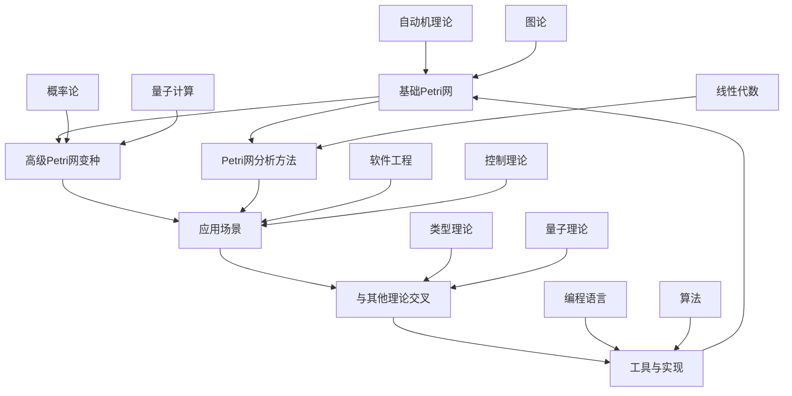

# 8.3-Petri网理论深化

## 📖 概述

Petri网理论深化是形式理论深化的重要组成部分，涵盖了Petri网的基础理论、高级变种、应用场景以及与其他形式理论的交叉融合。本目录致力于构建一个系统、完整、可扩展的Petri网理论知识体系。

## 🏗️ 目录结构

```text
8.3-Petri网理论深化/
├── README.md                           # 本文件
├── 8.3.1-基础Petri网深化.md           # 基础Petri网理论深化
├── 8.3.2-高级Petri网变种深化.md       # 高级Petri网变种深化
├── 8.3.3-Petri网分析方法深化.md       # Petri网分析方法深化
├── 8.3.4-Petri网应用场景深化.md       # Petri网应用场景深化
├── 8.3.5-Petri网与其他理论交叉深化.md # Petri网与其他理论交叉深化
└── 8.3.6-Petri网工具与实现深化.md     # Petri网工具与实现深化
```

## 🔗 交叉引用表

| 文件 | 相关理论 | 应用场景 | 工具实现 |
|------|----------|----------|----------|
| 8.3.1-基础Petri网深化.md | 自动机理论、图论 | 并发系统建模 | CPN Tools, PIPE |
| 8.3.2-高级Petri网变种深化.md | 概率论、量子计算、模糊逻辑 | 复杂系统分析、实时系统、量子系统 | Snoopy, TINA |
| 8.3.3-Petri网分析方法深化.md | 线性代数、图论、控制理论 | 系统验证、性能分析 | LoLA, MARCIE |
| 8.3.4-Petri网应用场景深化.md | 软件工程、控制理论、分布式系统 | 实际应用、协议验证、区块链 | Yasper, Renew |
| 8.3.5-Petri网与其他理论交叉深化.md | 类型理论、量子理论、时态逻辑 | 理论融合、跨学科建模 | 自定义工具、集成平台 |
| 8.3.6-Petri网工具与实现深化.md | 编程语言、算法、AI | 工具开发、自动化分析 | 多种实现 |

## 📊 知识流图



## 🎯 学习路径

### 基础阶段

1. **基础Petri网理论**
   - Petri网基本概念
   - 库所和变迁
   - 标记和触发规则
   - 可达性分析

2. **Petri网分析方法**
   - 不变量分析
   - 可达性图
   - 覆盖性分析
   - 活性分析

### 进阶阶段

1. **高级Petri网变种**
   - 时间Petri网
   - 概率Petri网
   - 颜色Petri网
   - 层次Petri网

2. **应用场景实践**
   - 并发系统建模
   - 工作流建模
   - 协议验证
   - 性能分析

### 高级阶段

1. **理论交叉融合**
   - 与自动机理论结合
   - 与量子计算结合
   - 与类型理论结合
   - 与概率论结合

2. **工具开发实践**
   - Petri网可视化工具
   - 分析算法实现
   - 验证工具开发
   - 性能优化

## 🛠️ 技术栈

### 理论基础

- **数学基础**: 图论、线性代数、概率论
- **形式理论**: 自动机理论、类型理论、量子理论
- **应用理论**: 软件工程、控制理论、并发理论

### 工具实现

- **建模工具**: CPN Tools, PIPE, Snoopy
- **分析工具**: TINA, LoLA, MARCIE
- **验证工具**: Yasper, Renew
- **编程语言**: Python, Java, C++, Haskell

### 应用领域

- **软件工程**: 并发系统设计、工作流建模
- **控制理论**: 离散事件系统、混合系统
- **人工智能**: 知识表示、推理系统
- **生物信息学**: 生物网络建模、基因调控网络

## 📚 知识体系

### 核心概念

- **Petri网**: 并发系统的数学建模工具
- **库所(Place)**: 表示系统状态或条件
- **变迁(Transition)**: 表示事件或动作
- **标记(Token)**: 表示资源或信息
- **触发(Firing)**: 变迁的执行过程

### 分析方法

- **可达性分析**: 分析系统可能达到的状态
- **不变量分析**: 分析系统的守恒性质
- **活性分析**: 分析系统的活性性质
- **安全性分析**: 分析系统的安全性性质

### 应用场景

- **并发系统**: 多进程、多线程系统建模
- **工作流**: 业务流程、工作流程建模
- **协议验证**: 通信协议、安全协议验证
- **性能分析**: 系统性能、资源利用分析

## 🚀 发展前沿

### 研究方向

1. **量子Petri网**: 结合量子计算理论
2. **概率Petri网**: 处理不确定性和随机性
3. **时间Petri网**: 处理时间约束和实时性
4. **层次Petri网**: 处理复杂系统的层次结构

### 技术挑战

1. **可扩展性**: 大规模Petri网的分析
2. **实时性**: 实时系统的Petri网建模
3. **不确定性**: 不确定环境的Petri网分析
4. **量子性**: 量子系统的Petri网建模

### 应用扩展

1. **人工智能**: 知识表示和推理
2. **生物信息学**: 生物网络建模
3. **物联网**: 物联网系统建模
4. **区块链**: 区块链协议验证

## 🔗 相关链接

### 内部链接

- [8.2-自动机理论深化](../8.2-自动机理论深化/README.md)
- [8.4-时态逻辑控制理论深化](../8.4-时态逻辑控制理论深化/README.md)
- [8.5-分布式系统理论深化](../8.5-分布式系统理论深化/README.md)
- [8.6-控制理论深化](../8.6-控制理论深化/README.md)

### 外部资源

- [Petri网维基百科](https://en.wikipedia.org/wiki/Petri_net)
- [CPN Tools官网](http://cpntools.org/)
- [PIPE项目](http://pipe2.sourceforge.net/)
- [Snoopy工具](http://www-dssz.informatik.tu-cottbus.de/DSSZ/Software/Snoopy)

---

**📖 返回导航**:

- [返回形式理论深化总导航](../README.md)

## 多表征

Petri网理论深化分支支持多种表征方式，包括：

- 符号表征（库所、变迁、标识等）
- 图结构（Petri网图、变迁图）
- 向量/张量（库所向量、标识嵌入）
- 自然语言（定义、注释、描述）
- 图像/可视化（Petri网结构图、流程图等）
这些表征可互映，提升理论表达力。

## 形式化语义

- 语义域：$D$，如库所集合、变迁集合、标识空间
- 解释函数：$I: S \to D$，将符号/结构映射到具体Petri网语义对象
- 语义一致性：每个Petri网结构/公式在$D$中有明确定义

## 形式化语法与证明

- 语法规则：如Petri网产生式、推理规则、约束条件
- **定理**：Petri网理论深化分支的语法系统具一致性与可扩展性。
- **证明**：由Petri网产生式与推理规则递归定义，保证系统一致与可扩展。
