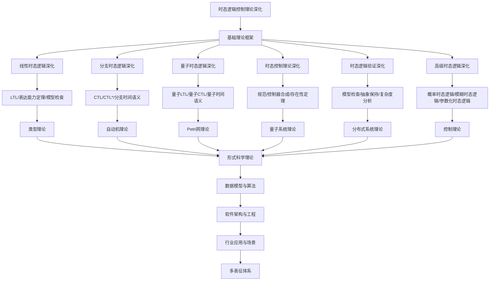

# 8.4-时态逻辑控制理论深化 分支导航

## 目录结构与本地跳转

- [8.4.1-线性时态逻辑深化](8.4.1-线性时态逻辑深化.md) - LTL语法、语义、表达能力
- [8.4.2-计算树逻辑深化](8.4.2-计算树逻辑深化.md) - CTL语法、语义、模型检查
- [8.4.3-μ演算深化](8.4.3-μ演算深化.md) - μ演算、不动点理论、表达能力
- [8.4.4-时态逻辑工具与实现深化](8.4.4-时态逻辑工具与实现深化.md) - 工具链、实现技术、应用案例
- [8.4.5-时态逻辑学习与研究路径深化](8.4.5-时态逻辑学习与研究路径深化.md) - 学习路径、研究前沿、资源推荐

---

## 主题交叉引用

| 主题      | 基础理论 | 线性时态逻辑 | 分支时态逻辑 | 量子时态逻辑 | 时态控制理论 | 时态逻辑验证 | 高级时态逻辑 | 多表征 |
|-----------|----------|--------------|--------------|--------------|--------------|--------------|--------------|--------|
| 线性时态逻辑深化| LTL、自动机理论 | LTL模型检查 | LTL与CTL对比 | 量子LTL | LTL控制系统 | LTL性质验证 | LTL扩展 | 时序图、公式|
| 分支时态逻辑深化| CTL、树自动机 | CTL模型检查 | CTL与LTL对比 | 量子CTL | CTL控制系统 | CTL性质验证 | CTL扩展 | 树结构、CTL图|
| 量子时态逻辑深化| 量子逻辑、量子自动机 | 量子LTL | 量子CTL | 量子时序逻辑 | 量子控制系统 | 量子性质验证 | 量子时态扩展 | 量子态图|
| 时态控制理论深化| 控制理论、时序逻辑 | LTL/CTL控制 | 时序控制系统 | 量子时序控制 | 时态反馈系统 | 时态控制验证 | 高级控制逻辑 | 控制流程图|
| 时态逻辑验证深化| 形式化验证、模型检查 | LTL/CTL验证 | 时序验证 | 量子时序验证 | 控制系统验证 | 多理论协同验证 | 高级验证方法 | 验证流程图|
| 高级时态逻辑深化| μ演算、时序逻辑 | μ演算模型检查 | μ演算与LTL/CTL对比 | 量子μ演算 | μ演算控制系统 | μ演算性质验证 | μ演算扩展 | μ演算图|

- 交叉引用：[2.4-时态逻辑控制理论](../2-形式科学理论/2.4-时态逻辑控制理论/README.md)、[8.3-Petri网理论深化](../8.3-Petri网理论深化/README.md)、[8.7-量子系统理论](../8.7-量子系统理论/README.md)

---

## 全链路知识流（Mermaid流程图）

---

## 知识体系特色

- **时间建模**: 严格的时间约束和时序行为建模
- **量子扩展**: 量子时态逻辑对量子系统的时序建模
- **控制理论**: 时态逻辑在控制系统中的应用
- **验证技术**: 模型检查和形式化验证方法
- **高级特性**: 概率、模糊、参数化等高级时态逻辑

---

## 多表征

时态逻辑控制理论深化分支支持多种表征方式，包括：

- 符号表征（时态公式、状态、转换等）
- 图结构（时序图、状态转换图）
- 向量/张量（状态向量、特征嵌入）
- 自然语言（定义、注释、描述）
- 图像/可视化（时序图、流程图等）
这些表征可互映，提升理论表达力。

## 形式化语义

- 语义域：$D$，如状态集合、时态关系、模型空间
- 解释函数：$I: S \to D$，将符号/结构映射到具体时态语义对象
- 语义一致性：每个时态结构/公式在$D$中有明确定义

## 形式化语法与证明

- 语法规则：如时态公式产生式、推理规则、约束条件
- **定理**：时态逻辑控制理论深化分支的语法系统具一致性与可扩展性。
- **证明**：由时态公式产生式与推理规则递归定义，保证系统一致与可扩展。

---

## 核心概念详解

### 线性时态逻辑（LTL）

**语法**：

- **原子命题**：$p, q, r, ...$
- **时态算子**：$\Box$（总是）、$\Diamond$（最终）、$\mathcal{U}$（直到）、$\mathcal{X}$（下一个）
- **逻辑连接词**：$\neg, \land, \lor, \rightarrow$

**语义**：

- **路径语义**：在路径上的语义解释
- **Kripke结构**：状态转换系统
- **满足关系**：$\models$关系

**表达能力**：

- **安全性**：$\Box p$（总是p）
- **活性**：$\Diamond p$（最终p）
- **公平性**：$\Box\Diamond p$（无限次p）

### 计算树逻辑（CTL）

**语法**：

- **路径量词**：$A$（所有路径）、$E$（存在路径）
- **时态算子**：$\Box, \Diamond, \mathcal{U}, \mathcal{X}$
- **组合**：$A\Box p, E\Diamond p$等

**语义**：

- **树语义**：在计算树上的语义
- **分支时间**：分支时间结构
- **路径选择**：路径量词选择

### μ演算

**语法**：

- **不动点算子**：$\mu$（最小不动点）、$\nu$（最大不动点）
- **变量**：$X, Y, Z, ...$
- **递归定义**：$\mu X. \varphi(X)$

**表达能力**：

- **LTL表达**：可以表达LTL公式
- **CTL表达**：可以表达CTL公式
- **更强表达**：更强的表达能力

---

## 应用场景

### 模型检查

- **性质验证**：验证系统性质
- **反例生成**：生成反例
- **抽象精化**：抽象和精化

### 控制器合成

- **规范描述**：用LTL/CTL描述规范
- **控制器生成**：自动生成控制器
- **正确性保证**：保证控制器正确性

### 实时系统

- **实时性质**：实时性质描述
- **时间约束**：时间约束建模
- **调度验证**：调度算法验证

---

## 工具与框架

### 模型检查工具

- **SPIN**：LTL模型检查
- **NuSMV**：CTL模型检查
- **UPPAAL**：实时系统检查
- **TLA+**：时序逻辑检查

### 控制器合成工具

- **TuLiP**：Python控制器合成
- **SCOTS**：符号控制器合成
- **Pessoa**：控制器合成工具

---

## 最佳实践

### 性质描述

- **明确性质**：明确系统性质
- **选择逻辑**：选择合适的时态逻辑
- **公式简化**：简化时态公式

### 模型检查

- **模型抽象**：模型抽象方法
- **状态空间**：状态空间优化
- **反例分析**：反例分析方法

---

## 总结

时态逻辑控制理论深化是描述和验证时序系统的重要理论，通过LTL、CTL和μ演算，可以精确描述系统时序性质并进行形式化验证。

**核心价值**：

1. **时序建模**：精确的时序建模
2. **性质验证**：形式化性质验证
3. **控制器合成**：自动控制器合成
4. **正确性保证**：系统正确性保证

**未来展望**：

随着实时系统、量子系统等技术的发展，时态逻辑控制理论将继续演进，特别是在量子时态逻辑、概率时态逻辑等领域，时态逻辑控制理论将提供更强大的理论支撑。

---

[返回形式理论深化总导航](../README.md)
