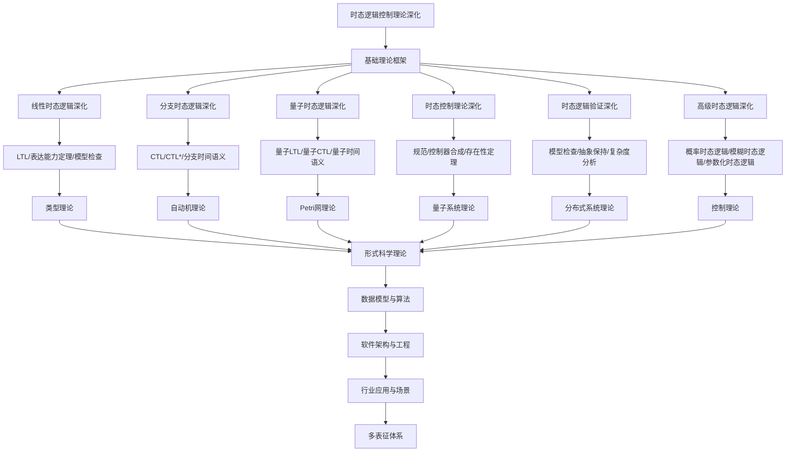

# 8.4-时态逻辑控制理论深化 分支导航

## 目录结构与本地跳转
- [8.4.1-线性时态逻辑深化](8.4.1-线性时态逻辑深化.md) - 预留分支
- [8.4.2-分支时态逻辑深化](8.4.2-分支时态逻辑深化.md) - 预留分支
- [8.4.3-量子时态逻辑深化](8.4.3-量子时态逻辑深化.md) - 预留分支
- [8.4.4-时态控制理论深化](8.4.4-时态控制理论深化.md) - 预留分支
- [8.4.5-时态逻辑验证深化](8.4.5-时态逻辑验证深化.md) - 预留分支
- [8.4.6-高级时态逻辑深化](8.4.6-高级时态逻辑深化.md) - 预留分支

---

## 主题交叉引用
| 主题      | 基础理论 | 线性时态逻辑 | 分支时态逻辑 | 量子时态逻辑 | 时态控制理论 | 时态逻辑验证 | 高级时态逻辑 | 多表征 |
|-----------|----------|--------------|--------------|--------------|--------------|--------------|--------------|--------|
| 线性时态逻辑深化| 预留     | 预留         | 预留         | 预留         | 预留         | 预留         | 预留         | 预留   |
| 分支时态逻辑深化| 预留     | 预留         | 预留         | 预留         | 预留         | 预留         | 预留         | 预留   |
| 量子时态逻辑深化| 预留     | 预留         | 预留         | 预留         | 预留         | 预留         | 预留         | 预留   |
| 时态控制理论深化| 预留     | 预留         | 预留         | 预留         | 预留         | 预留         | 预留         | 预留   |
| 时态逻辑验证深化| 预留     | 预留         | 预留         | 预留         | 预留         | 预留         | 预留         | 预留   |
| 高级时态逻辑深化| 预留     | 预留         | 预留         | 预留         | 预留         | 预留         | 预留         | 预留   |

- 交叉引用：[2.4-时态逻辑控制理论](../2-形式科学理论/2.4-时态逻辑控制理论/README.md)、[8.3-Petri网理论深化](../8.3-Petri网理论深化/README.md)、[8.7-量子系统理论](../8.7-量子系统理论/README.md)

---

## 全链路知识流（Mermaid流程图）

---

## 知识体系特色
- **时间建模**: 严格的时间约束和时序行为建模
- **量子扩展**: 量子时态逻辑对量子系统的时序建模
- **控制理论**: 时态逻辑在控制系统中的应用
- **验证技术**: 模型检查和形式化验证方法
- **高级特性**: 概率、模糊、参数化等高级时态逻辑

---

[返回形式理论深化总导航](../README.md) 