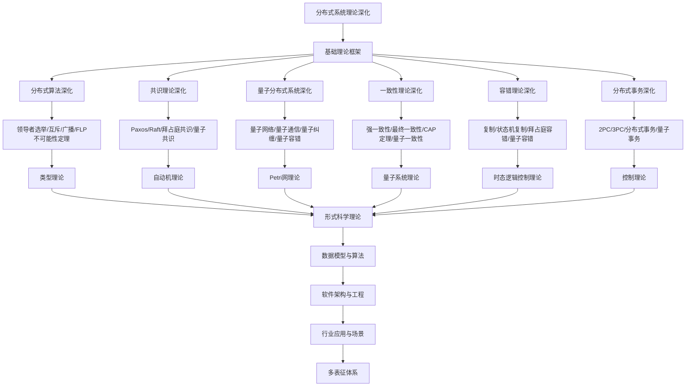

# 8.5-分布式系统理论深化 分支导航

## 目录结构与本地跳转

- [8.5.1-分布式一致性理论深化](8.5.1-分布式一致性理论深化.md) - CAP定理、一致性模型、共识算法
- [8.5.2-分布式算法理论深化](8.5.2-分布式算法理论深化.md) - 分布式算法、拜占庭容错、Paxos算法
- [8.5.3-分布式系统架构理论深化](8.5.3-分布式系统架构理论深化.md) - 微服务架构、服务网格、事件驱动架构
- [8.5.4-分布式系统学习与研究路径深化](8.5.4-分布式系统学习与研究路径深化.md) - 学习路径、研究前沿、工具资源

---

## 主题交叉引用

| 主题      | 基础理论 | 分布式算法 | 共识理论 | 量子分布式系统 | 一致性理论 | 容错理论 | 分布式事务 | 多表征 |
|-----------|----------|------------|----------|----------------|------------|----------|------------|--------|
| 分布式算法深化| 分布式计算、网络理论 | Paxos、Raft、Gossip | 共识机制 | 量子分布式算法 | 一致性协议 | 容错机制 | 分布式数据库 | 算法流程图|
| 共识理论深化| 共识算法、博弈论 | Paxos、BFT | 拜占庭容错 | 量子共识 | 一致性与容错 | 共识安全性 | 区块链共识 | 共识流程图|
| 量子分布式系统深化| 量子信息、量子网络 | 量子分布式协议 | 量子共识机制 | 量子网络系统 | 量子一致性 | 量子容错 | 量子分布式事务 | 量子网络图|
| 一致性理论深化| 一致性模型、CAP定理 | 一致性协议 | 共识与一致性 | 量子一致性 | 强/弱一致性 | 一致性与容错 | 分布式一致性事务 | 一致性模型图|
| 容错理论深化| 容错机制、可靠性理论 | 容错算法 | 容错与共识 | 量子容错 | 一致性与容错 | 容错协议 | 容错事务 | 容错结构图|
| 分布式事务深化| 事务理论、数据库 | 分布式事务协议 | 共识与事务 | 量子事务 | 一致性事务 | 容错事务 | 分布式数据库事务 | 事务流程图|

- 交叉引用：[2.5-分布式系统理论](../2-形式科学理论/2.5-分布式系统理论/README.md)、[8.4-时态逻辑控制理论深化](../8.4-时态逻辑控制理论深化/README.md)、[8.7-量子系统理论](../8.7-量子系统理论/README.md)

---

## 全链路知识流（Mermaid流程图）

---

## 知识体系特色

- **算法设计**: 严格的分布式算法设计和正确性证明
- **共识机制**: 从经典共识到量子共识的完整理论
- **量子扩展**: 量子分布式系统的独特特性
- **一致性理论**: CAP定理和一致性模型的深入分析
- **容错机制**: 从经典容错到量子容错的容错理论

---

## 多表征

分布式系统理论深化分支支持多种表征方式，包括：

- 符号表征（进程、消息、同步原语等）
- 图结构（进程通信图、网络拓扑）
- 向量/张量（状态向量、特征嵌入）
- 自然语言（定义、注释、描述）
- 图像/可视化（网络结构图、流程图等）
这些表征可互映，提升理论表达力。

## 形式化语义

- 语义域：$D$，如进程集合、消息空间、同步关系、模型空间
- 解释函数：$I: S \to D$，将符号/结构映射到具体分布式语义对象
- 语义一致性：每个分布式结构/公式在$D$中有明确定义

## 形式化语法与证明

- 语法规则：如进程产生式、消息规则、同步约束
- **定理**：分布式系统理论深化分支的语法系统具一致性与可扩展性。
- **证明**：由进程产生式与消息规则递归定义，保证系统一致与可扩展。

---

## 核心概念详解

### 分布式一致性理论

**一致性模型**：

- **强一致性**：线性一致性、顺序一致性
- **弱一致性**：最终一致性、因果一致性
- **会话一致性**：会话内一致性
- **单调一致性**：单调读、单调写

**CAP定理**：

- **一致性（Consistency）**：所有节点看到相同数据
- **可用性（Availability）**：系统持续可用
- **分区容错（Partition tolerance）**：网络分区容错
- **权衡**：三者不可兼得

### 共识算法

**经典共识**：

- **Paxos**：经典共识算法
- **Raft**：可理解共识算法
- **PBFT**：实用拜占庭容错
- **Gossip**：流行病协议

**区块链共识**：

- **PoW**：工作量证明
- **PoS**：权益证明
- **DPoS**：委托权益证明
- **BFT**：拜占庭容错

### 分布式算法

**基础算法**：

- **领导者选举**：选举领导者
- **互斥**：分布式互斥
- **广播**：可靠广播
- **快照**：全局快照

**高级算法**：

- **向量时钟**：事件排序
- **逻辑时钟**：逻辑时间
- **分布式快照**：一致性快照
- **检查点**：故障恢复

---

## 应用场景

### 分布式存储

- **分布式文件系统**：HDFS、GFS
- **分布式数据库**：Cassandra、MongoDB
- **对象存储**：S3、Swift

### 分布式计算

- **MapReduce**：大规模数据处理
- **Spark**：内存计算框架
- **Flink**：流式计算框架

### 微服务架构

- **服务发现**：服务注册与发现
- **负载均衡**：请求分发
- **服务网格**：服务间通信

---

## 工具与框架

### 分布式框架

- **Kubernetes**：容器编排
- **Docker Swarm**：容器集群
- **Mesos**：资源管理

### 分布式数据库

- **Cassandra**：列式数据库
- **MongoDB**：文档数据库
- **Redis Cluster**：内存数据库集群

---

## 最佳实践

### 系统设计

- **容错设计**：故障容错设计
- **可扩展性**：水平扩展
- **一致性选择**：选择合适的一致性模型

### 性能优化

- **数据分片**：数据分片策略
- **缓存策略**：多级缓存
- **负载均衡**：智能负载均衡

---

## 总结

分布式系统理论深化是构建大规模分布式系统的理论基础，通过一致性理论、共识算法和分布式算法，可以构建可靠、可扩展的分布式系统。

**核心价值**：

1. **系统可靠性**：保证系统可靠性
2. **可扩展性**：支持系统扩展
3. **一致性保证**：保证数据一致性
4. **容错能力**：系统容错能力

**未来展望**：

随着云计算、边缘计算等技术的发展，分布式系统理论将继续演进，特别是在量子分布式、边缘分布式等领域，分布式系统理论将提供更强大的理论支撑。

---

[返回形式理论深化总导航](../README.md)
