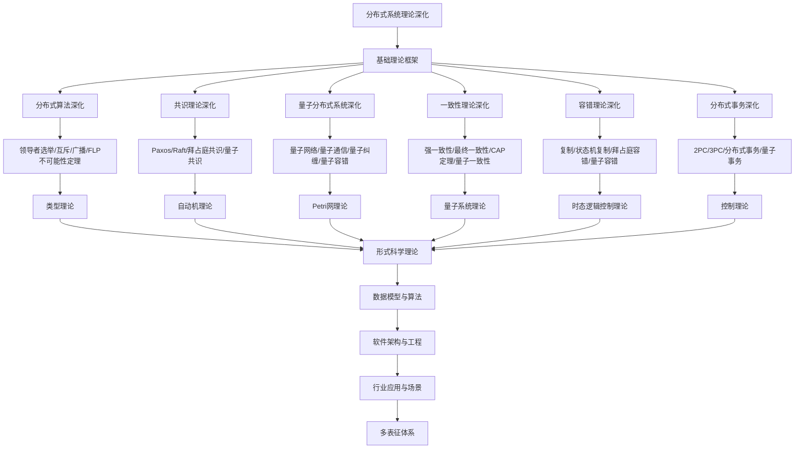

# 8.5-分布式系统理论深化 分支导航

## 目录结构与本地跳转

- [8.5.1-分布式一致性理论深化](8.5.1-分布式一致性理论深化.md) - CAP定理、一致性模型、共识算法
- [8.5.2-分布式算法理论深化](8.5.2-分布式算法理论深化.md) - 分布式算法、拜占庭容错、Paxos算法
- [8.5.3-分布式系统架构理论深化](8.5.3-分布式系统架构理论深化.md) - 微服务架构、服务网格、事件驱动架构
- [8.5.4-分布式系统学习与研究路径深化](8.5.4-分布式系统学习与研究路径深化.md) - 学习路径、研究前沿、工具资源

---

## 主题交叉引用

| 主题      | 基础理论 | 分布式算法 | 共识理论 | 量子分布式系统 | 一致性理论 | 容错理论 | 分布式事务 | 多表征 |
|-----------|----------|------------|----------|----------------|------------|----------|------------|--------|
| 分布式算法深化| 分布式计算、网络理论 | Paxos、Raft、Gossip | 共识机制 | 量子分布式算法 | 一致性协议 | 容错机制 | 分布式数据库 | 算法流程图|
| 共识理论深化| 共识算法、博弈论 | Paxos、BFT | 拜占庭容错 | 量子共识 | 一致性与容错 | 共识安全性 | 区块链共识 | 共识流程图|
| 量子分布式系统深化| 量子信息、量子网络 | 量子分布式协议 | 量子共识机制 | 量子网络系统 | 量子一致性 | 量子容错 | 量子分布式事务 | 量子网络图|
| 一致性理论深化| 一致性模型、CAP定理 | 一致性协议 | 共识与一致性 | 量子一致性 | 强/弱一致性 | 一致性与容错 | 分布式一致性事务 | 一致性模型图|
| 容错理论深化| 容错机制、可靠性理论 | 容错算法 | 容错与共识 | 量子容错 | 一致性与容错 | 容错协议 | 容错事务 | 容错结构图|
| 分布式事务深化| 事务理论、数据库 | 分布式事务协议 | 共识与事务 | 量子事务 | 一致性事务 | 容错事务 | 分布式数据库事务 | 事务流程图|

- 交叉引用：[2.5-分布式系统理论](../2-形式科学理论/2.5-分布式系统理论/README.md)、[8.4-时态逻辑控制理论深化](../8.4-时态逻辑控制理论深化/README.md)、[8.7-量子系统理论](../8.7-量子系统理论/README.md)

---

## 全链路知识流（Mermaid流程图）

---

## 知识体系特色

- **算法设计**: 严格的分布式算法设计和正确性证明
- **共识机制**: 从经典共识到量子共识的完整理论
- **量子扩展**: 量子分布式系统的独特特性
- **一致性理论**: CAP定理和一致性模型的深入分析
- **容错机制**: 从经典容错到量子容错的容错理论

---

## 多表征

分布式系统理论深化分支支持多种表征方式，包括：

- 符号表征（进程、消息、同步原语等）
- 图结构（进程通信图、网络拓扑）
- 向量/张量（状态向量、特征嵌入）
- 自然语言（定义、注释、描述）
- 图像/可视化（网络结构图、流程图等）
这些表征可互映，提升理论表达力。

## 形式化语义

- 语义域：$D$，如进程集合、消息空间、同步关系、模型空间
- 解释函数：$I: S \to D$，将符号/结构映射到具体分布式语义对象
- 语义一致性：每个分布式结构/公式在$D$中有明确定义

## 形式化语法与证明

- 语法规则：如进程产生式、消息规则、同步约束
- **定理**：分布式系统理论深化分支的语法系统具一致性与可扩展性。
- **证明**：由进程产生式与消息规则递归定义，保证系统一致与可扩展。

---

## 核心概念详解

### 分布式一致性理论

**一致性模型**：

- **强一致性**：线性一致性、顺序一致性
- **弱一致性**：最终一致性、因果一致性
- **会话一致性**：会话内一致性
- **单调一致性**：单调读、单调写

**CAP定理**：

- **一致性（Consistency）**：所有节点看到相同数据
- **可用性（Availability）**：系统持续可用
- **分区容错（Partition tolerance）**：网络分区容错
- **权衡**：三者不可兼得

### 共识算法

**经典共识**：

- **Paxos**：经典共识算法
- **Raft**：可理解共识算法
- **PBFT**：实用拜占庭容错
- **Gossip**：流行病协议

**区块链共识**：

- **PoW**：工作量证明
- **PoS**：权益证明
- **DPoS**：委托权益证明
- **BFT**：拜占庭容错

### 分布式算法

**基础算法**：

- **领导者选举**：选举领导者
- **互斥**：分布式互斥
- **广播**：可靠广播
- **快照**：全局快照

**高级算法**：

- **向量时钟**：事件排序
- **逻辑时钟**：逻辑时间
- **分布式快照**：一致性快照
- **检查点**：故障恢复

---

## 应用场景

### 分布式存储

- **分布式文件系统**：HDFS、GFS
- **分布式数据库**：Cassandra、MongoDB
- **对象存储**：S3、Swift

### 分布式计算

- **MapReduce**：大规模数据处理
- **Spark**：内存计算框架
- **Flink**：流式计算框架

### 微服务架构

- **服务发现**：服务注册与发现
- **负载均衡**：请求分发
- **服务网格**：服务间通信

---

## 工具与框架

### 分布式框架

- **Kubernetes**：容器编排
- **Docker Swarm**：容器集群
- **Mesos**：资源管理

### 分布式数据库

- **Cassandra**：列式数据库
- **MongoDB**：文档数据库
- **Redis Cluster**：内存数据库集群

---

## 最佳实践

### 系统设计

- **容错设计**：故障容错设计
- **可扩展性**：水平扩展
- **一致性选择**：选择合适的一致性模型

### 性能优化

- **数据分片**：数据分片策略
- **缓存策略**：多级缓存
- **负载均衡**：智能负载均衡

---

## 总结

分布式系统理论深化是构建大规模分布式系统的理论基础，通过一致性理论、共识算法和分布式算法，可以构建可靠、可扩展的分布式系统。

**核心价值**：

1. **系统可靠性**：保证系统可靠性
2. **可扩展性**：支持系统扩展
3. **一致性保证**：保证数据一致性
4. **容错能力**：系统容错能力

**未来展望**：

随着云计算、边缘计算等技术的发展，分布式系统理论将继续演进，特别是在量子分布式、边缘分布式等领域，分布式系统理论将提供更强大的理论支撑。

---

## 深入学习建议

### 理论基础强化

**数学基础**：

- **图论**：网络拓扑、图算法
- **概率论**：随机过程、概率分布
- **线性代数**：矩阵运算、特征值
- **离散数学**：集合论、逻辑、关系

**计算机科学基础**：

- **算法设计**：分布式算法设计
- **数据结构**：分布式数据结构
- **网络协议**：网络协议原理
- **操作系统**：分布式操作系统

### 实践能力提升

**编程能力**：

- **系统编程**：C/C++、Rust、Go
- **分布式框架**：Kubernetes、Docker、Mesos
- **消息队列**：Kafka、RabbitMQ、Redis
- **数据库**：Cassandra、MongoDB、Redis

**系统设计**：

- **架构设计**：分布式架构设计
- **性能优化**：系统性能优化
- **容错设计**：容错机制设计
- **监控运维**：系统监控和运维

### 研究能力培养

**文献阅读**：

- **经典论文**：分布式系统经典论文
- **前沿研究**：最新研究进展
- **系统论文**：实际系统论文
- **会议论文**：顶级会议论文

---

## 学习资源汇总

### 在线课程

- **Coursera**：分布式系统课程
- **edX**：分布式计算课程
- **Udemy**：Kubernetes、Docker课程
- **YouTube**：分布式系统教程

### 书籍推荐

- **入门书籍**：《分布式系统概念与设计》
- **进阶书籍**：《Designing Data-Intensive Applications》
- **实践书籍**：《Kubernetes in Action》
- **理论书籍**：《分布式算法》

### 学术资源

- **期刊**：ACM TOCS、IEEE TPDS、OSDI
- **会议**：OSDI、SOSP、NSDI、PODC
- **数据库**：IEEE Xplore、ACM Digital Library
- **预印本**：arXiv、ResearchGate

---

## 实践项目建议

### 基础项目

- **分布式存储**：实现分布式文件系统
- **分布式计算**：实现MapReduce框架
- **消息队列**：实现消息队列系统
- **服务发现**：实现服务注册与发现

### 进阶项目

- **分布式数据库**：实现分布式数据库
- **共识算法**：实现Raft/Paxos
- **微服务框架**：实现微服务框架
- **容器编排**：实现容器编排系统

### 高级项目

- **云原生平台**：构建云原生平台
- **边缘计算**：边缘计算系统
- **区块链系统**：区块链实现
- **量子分布式**：量子分布式系统

---

## 常见问题与解决方案

### 分布式系统挑战

**挑战1：一致性保证**

- **问题**：分布式环境下的数据一致性
- **解决方案**：
  - 共识算法（Raft、Paxos）
  - 分布式事务（2PC、3PC）
  - 最终一致性
  - 强一致性协议

**挑战2：容错性**

- **问题**：节点故障处理
- **解决方案**：
  - 复制机制
  - 故障检测
  - 故障恢复
  - 冗余设计

**挑战3：性能优化**

- **问题**：分布式系统性能问题
- **解决方案**：
  - 负载均衡
  - 缓存策略
  - 数据分片
  - 并行处理

### 性能优化建议

**系统架构优化**：

- **微服务架构**：采用微服务架构
- **服务网格**：使用服务网格
- **API网关**：统一API网关
- **消息队列**：异步消息处理

**数据存储优化**：

- **数据分片**：合理分片数据
- **复制策略**：优化复制策略
- **缓存机制**：多级缓存
- **索引优化**：优化索引设计

---

## 行业应用案例

### 云计算平台

**应用场景**：

- **云存储**：分布式存储系统
- **云计算**：分布式计算平台
- **云数据库**：分布式数据库
- **云服务**：微服务架构

**技术要点**：

- 分布式架构
- 负载均衡
- 容错机制
- 弹性扩展

### 区块链系统

**应用场景**：

- **加密货币**：区块链货币系统
- **智能合约**：智能合约平台
- **去中心化应用**：DApp开发
- **供应链管理**：区块链供应链

**技术要点**：

- 共识算法
- 分布式账本
- 加密技术
- 智能合约

### 微服务架构

**应用场景**：

- **大型应用**：大型应用拆分
- **服务治理**：服务注册与发现
- **API管理**：API网关管理
- **服务监控**：分布式监控

**技术要点**：

- 服务拆分
- 服务通信
- 服务治理
- 服务监控

---

## 最佳实践

### 分布式系统设计最佳实践

1. **CAP权衡**：理解CAP定理
2. **一致性选择**：选择合适的一致性模型
3. **容错设计**：设计容错机制
4. **性能优化**：关注性能优化
5. **监控运维**：建立监控体系

### 分布式算法最佳实践

1. **算法选择**：选择合适的算法
2. **参数调优**：调优算法参数
3. **性能测试**：进行性能测试
4. **故障测试**：进行故障测试
5. **文档化**：文档化算法设计

### 系统运维最佳实践

1. **监控体系**：建立完善的监控
2. **日志管理**：统一日志管理
3. **告警机制**：建立告警机制
4. **自动化运维**：自动化运维流程
5. **故障处理**：建立故障处理流程

---

## 职业发展路径

### 学术研究

- **研究方向**：分布式算法、一致性理论、容错理论
- **职业路径**：博士研究、博士后、教职、研究机构

### 工业应用

- **应用领域**：云计算、微服务、区块链
- **职业路径**：分布式系统工程师、架构师、技术专家

---

## 技术发展趋势

### 分布式系统架构演进

**云原生架构**：

- **容器化**：容器化部署和管理
- **微服务**：微服务架构设计
- **服务网格**：服务网格技术
- **Serverless**：无服务器架构

**边缘计算**：

- **边缘节点**：边缘计算节点
- **边缘智能**：边缘AI和智能
- **边缘存储**：边缘数据存储
- **边缘网络**：边缘网络架构

### 分布式算法发展

**共识算法**：

- **Raft优化**：Raft算法优化
- **Paxos改进**：Paxos算法改进
- **新共识算法**：新型共识算法
- **混合共识**：混合共识机制

**分布式事务**：

- **Saga模式**：Saga分布式事务
- **TCC模式**：TCC事务模式
- **最终一致性**：最终一致性保证
- **事务优化**：事务性能优化

---

## 应用前景

### 云计算平台

- **公有云**：更强大的公有云服务
- **私有云**：更灵活的私有云方案
- **混合云**：更完善的混合云架构
- **多云管理**：更智能的多云管理

### 分布式应用

- **微服务应用**：更成熟的微服务应用
- **分布式数据库**：更高效的分布式数据库
- **分布式存储**：更可靠的分布式存储
- **分布式计算**：更强大的分布式计算

---

[返回形式理论深化总导航](../README.md)
