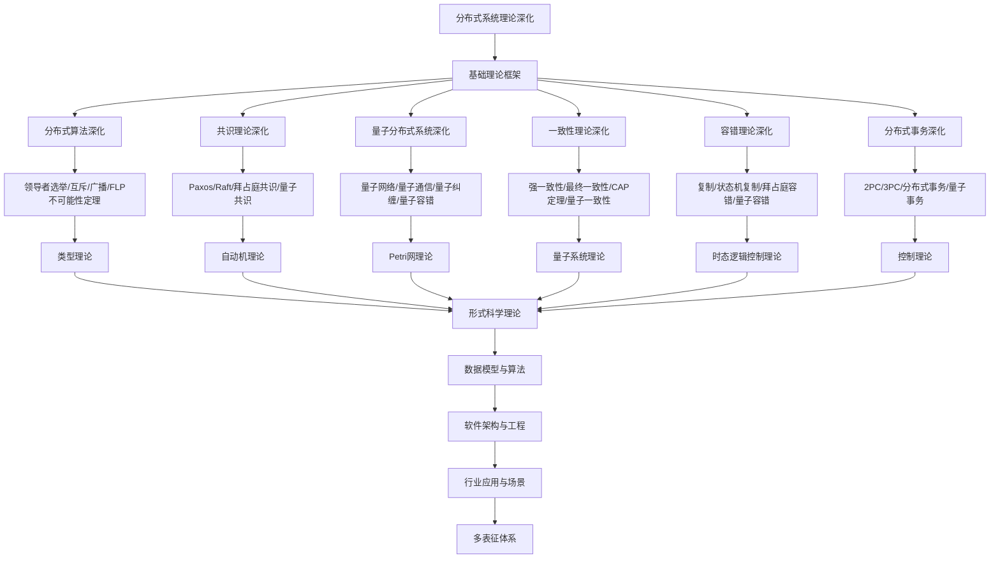

# 8.5-分布式系统理论深化 分支导航

## 目录结构与本地跳转

- [8.5.1-分布式算法深化](8.5.1-分布式算法深化.md) - 预留分支
- [8.5.2-共识理论深化](8.5.2-共识理论深化.md) - 预留分支
- [8.5.3-量子分布式系统深化](8.5.3-量子分布式系统深化.md) - 预留分支
- [8.5.4-一致性理论深化](8.5.4-一致性理论深化.md) - 预留分支
- [8.5.5-容错理论深化](8.5.5-容错理论深化.md) - 预留分支
- [8.5.6-分布式事务深化](8.5.6-分布式事务深化.md) - 预留分支

---

## 主题交叉引用

| 主题      | 基础理论 | 分布式算法 | 共识理论 | 量子分布式系统 | 一致性理论 | 容错理论 | 分布式事务 | 多表征 |
|-----------|----------|------------|----------|----------------|------------|----------|------------|--------|
| 分布式算法深化| 预留     | 预留       | 预留     | 预留           | 预留       | 预留     | 预留       | 预留   |
| 共识理论深化| 预留     | 预留       | 预留     | 预留           | 预留       | 预留     | 预留       | 预留   |
| 量子分布式系统深化| 预留 | 预留       | 预留     | 预留           | 预留       | 预留     | 预留       | 预留   |
| 一致性理论深化| 预留     | 预留       | 预留     | 预留           | 预留       | 预留     | 预留       | 预留   |
| 容错理论深化| 预留     | 预留       | 预留     | 预留           | 预留       | 预留     | 预留       | 预留   |
| 分布式事务深化| 预留     | 预留       | 预留     | 预留           | 预留       | 预留     | 预留       | 预留   |

- 交叉引用：[2.5-分布式系统理论](../2-形式科学理论/2.5-分布式系统理论/README.md)、[8.4-时态逻辑控制理论深化](../8.4-时态逻辑控制理论深化/README.md)、[8.7-量子系统理论](../8.7-量子系统理论/README.md)

---

## 全链路知识流（Mermaid流程图）

---

## 知识体系特色

- **算法设计**: 严格的分布式算法设计和正确性证明
- **共识机制**: 从经典共识到量子共识的完整理论
- **量子扩展**: 量子分布式系统的独特特性
- **一致性理论**: CAP定理和一致性模型的深入分析
- **容错机制**: 从经典容错到量子容错的容错理论

---

[返回形式理论深化总导航](../README.md)
