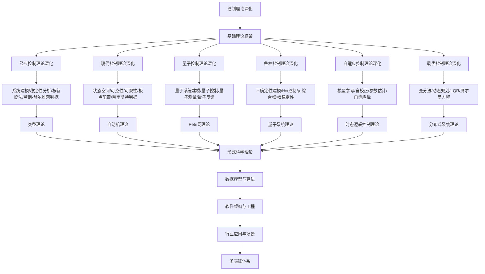

# 8.6-控制理论深化 分支导航

## 目录结构与本地跳转
- [8.6.1-经典控制理论深化](8.6.1-经典控制理论深化.md) - 预留分支
- [8.6.2-现代控制理论深化](8.6.2-现代控制理论深化.md) - 预留分支
- [8.6.3-量子控制理论深化](8.6.3-量子控制理论深化.md) - 预留分支
- [8.6.4-鲁棒控制理论深化](8.6.4-鲁棒控制理论深化.md) - 预留分支
- [8.6.5-自适应控制理论深化](8.6.5-自适应控制理论深化.md) - 预留分支
- [8.6.6-最优控制理论深化](8.6.6-最优控制理论深化.md) - 预留分支

---

## 主题交叉引用
| 主题      | 基础理论 | 经典控制理论 | 现代控制理论 | 量子控制理论 | 鲁棒控制理论 | 自适应控制理论 | 最优控制理论 | 多表征 |
|-----------|----------|--------------|--------------|--------------|--------------|----------------|--------------|--------|
| 经典控制理论深化| 预留     | 预留         | 预留         | 预留         | 预留         | 预留           | 预留         | 预留   |
| 现代控制理论深化| 预留     | 预留         | 预留         | 预留         | 预留         | 预留           | 预留         | 预留   |
| 量子控制理论深化| 预留     | 预留         | 预留         | 预留         | 预留         | 预留           | 预留         | 预留   |
| 鲁棒控制理论深化| 预留     | 预留         | 预留         | 预留         | 预留         | 预留           | 预留         | 预留   |
| 自适应控制理论深化| 预留   | 预留         | 预留         | 预留         | 预留         | 预留           | 预留         | 预留   |
| 最优控制理论深化| 预留     | 预留         | 预留         | 预留         | 预留         | 预留           | 预留         | 预留   |

- 交叉引用：[2.6-控制理论](../2-形式科学理论/2.6-控制理论/README.md)、[8.5-分布式系统理论深化](../8.5-分布式系统理论深化/README.md)、[8.7-量子系统理论](../8.7-量子系统理论/README.md)

---

## 全链路知识流（Mermaid流程图）

---

## 知识体系特色
- **系统建模**: 从经典到量子的系统建模方法
- **稳定性分析**: 严格的稳定性理论和判据
- **量子控制**: 量子系统的控制理论和应用
- **鲁棒性**: 对不确定性的鲁棒控制方法
- **最优性**: 最优控制理论和算法设计

---

[返回形式理论深化总导航](../README.md) 