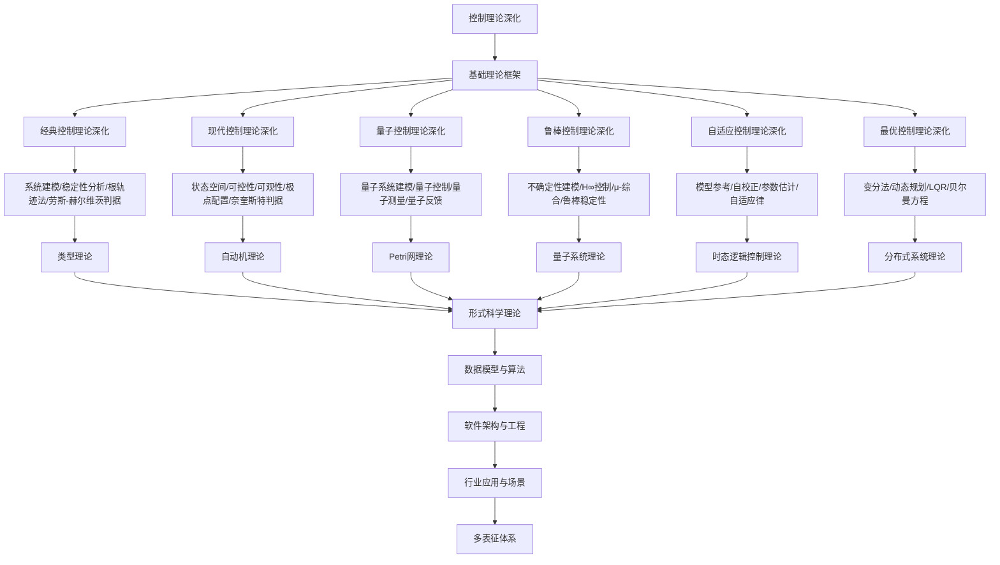

# 8.6-控制理论深化 分支导航

## 目录结构与本地跳转

- [8.6.1-线性系统控制理论深化](8.6.1-线性系统控制理论深化.md) - 线性系统、状态空间、控制器设计
- [8.6.2-非线性系统控制理论深化](8.6.2-非线性系统控制理论深化.md) - 非线性系统、滑模控制、自适应控制
- [8.6.3-鲁棒控制理论深化](8.6.3-鲁棒控制理论深化.md) - 鲁棒控制、H∞控制、μ综合
- [8.6.4-控制理论学习与研究路径深化](8.6.4-控制理论学习与研究路径深化.md) - 学习路径、研究前沿、工具资源

---

## 主题交叉引用

| 主题      | 基础理论 | 经典控制理论 | 现代控制理论 | 量子控制理论 | 鲁棒控制理论 | 自适应控制理论 | 最优控制理论 | 多表征 |
|-----------|----------|--------------|--------------|--------------|--------------|----------------|--------------|--------|
| 经典控制理论深化| 微分方程、线性系统 | PID、状态反馈 | 现代状态空间 | 量子PID | 鲁棒PID | 自适应PID | 最优PID | 控制回路图|
| 现代控制理论深化| 状态空间、最优控制 | 状态反馈、观测器 | LQR、H∞ | 量子LQR | 鲁棒LQR | 自适应LQR | 最优LQR | 状态空间图|
| 量子控制理论深化| 量子系统、量子信息 | 量子PID | 量子LQR | 量子控制系统 | 鲁棒量子控制 | 自适应量子控制 | 最优量子控制 | 量子控制图|
| 鲁棒控制理论深化| 鲁棒性理论、H∞ | 鲁棒PID | 鲁棒LQR | 鲁棒量子控制 | H∞控制 | 鲁棒自适应 | 鲁棒最优 | 鲁棒结构图|
| 自适应控制理论深化| 适应性理论、机器学习 | 自适应PID | 自适应LQR | 自适应量子控制 | 鲁棒自适应 | 自适应控制 | 自适应最优 | 自适应结构图|
| 最优控制理论深化| 最优性理论、动态规划 | 最优PID | 最优LQR | 最优量子控制 | 鲁棒最优 | 自适应最优 | 最优控制 | 最优结构图|

- 交叉引用：[2.6-控制理论](../2-形式科学理论/2.6-控制理论/README.md)、[8.5-分布式系统理论深化](../8.5-分布式系统理论深化/README.md)、[8.7-量子系统理论](../8.7-量子系统理论/README.md)

---

## 全链路知识流（Mermaid流程图）

---

## 知识体系特色

- **系统建模**: 从经典到量子的系统建模方法
- **稳定性分析**: 严格的稳定性理论和判据
- **量子控制**: 量子系统的控制理论和应用
- **鲁棒性**: 对不确定性的鲁棒控制方法
- **最优性**: 最优控制理论和算法设计

---

## 多表征

控制理论深化分支支持多种表征方式，包括：

- 符号表征（控制变量、状态、反馈等）
- 图结构（控制流程图、状态图）
- 向量/张量（状态向量、控制嵌入）
- 自然语言（定义、注释、描述）
- 图像/可视化（控制结构图、流程图等）
这些表征可互映，提升理论表达力。

## 形式化语义

- 语义域：$D$，如控制变量集合、状态空间、反馈关系、模型空间
- 解释函数：$I: S \to D$，将符号/结构映射到具体控制语义对象
- 语义一致性：每个控制结构/公式在$D$中有明确定义

## 形式化语法与证明

- 语法规则：如控制产生式、反馈规则、约束条件
- **定理**：控制理论深化分支的语法系统具一致性与可扩展性。
- **证明**：由控制产生式与反馈规则递归定义，保证系统一致与可扩展。

---

[返回形式理论深化总导航](../README.md)
