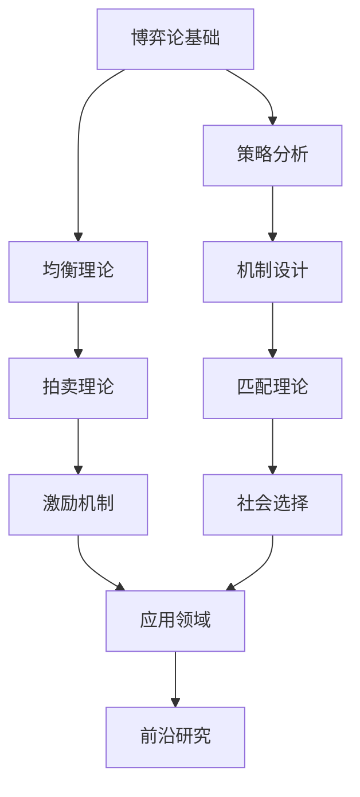

# 博弈论深化 (Game Theory Deepening)

## 1. 目录结构

```text
8.7-博弈论深化/
├── README.md                           # 本文件 - 导航与概述
├── 8.7.1-博弈论基础理论深化.md         # 博弈论基础概念与理论
├── 8.7.2-机制设计理论深化.md           # 机制设计与拍卖理论
└── 8.7.3-博弈论学习与研究路径深化.md   # 学习路径与研究方向
```

## 2. 主题概述

### 2.1. 博弈论基础理论深化

- **核心概念**: 博弈、策略、纳什均衡、帕累托最优
- **博弈类型**: 零和博弈、非零和博弈、合作博弈、非合作博弈
- **均衡理论**: 纳什均衡、子博弈完美均衡、贝叶斯均衡
- **算法实现**: 博弈求解算法、均衡计算、策略分析

### 2.2. 机制设计理论深化

- **拍卖理论**: 英式拍卖、荷兰式拍卖、密封投标拍卖
- **匹配理论**: 稳定匹配、Gale-Shapley算法、市场设计
- **激励机制**: 委托-代理理论、契约设计、激励相容
- **社会选择**: 投票理论、集体决策、社会福利函数

### 2.3. 博弈论学习与研究路径深化

- **学习路径**: 从基础到高级的理论学习路径
- **研究方向**: 前沿研究领域和发展趋势
- **工具资源**: 软件工具、数据集、研究社区
- **应用领域**: 经济学、计算机科学、生物学等交叉应用

## 3. 主题交叉引用

| 理论分支 | 相关章节 | 交叉点 |
|---------|---------|--------|
| 类型理论 | 8.1-类型理论深化 | 博弈策略的类型安全表示 |
| 自动机理论 | 8.2-自动机理论深化 | 博弈状态机与策略自动机 |
| Petri网理论 | 8.3-Petri网理论深化 | 博弈过程的并发建模 |
| 时态逻辑 | 8.4-时态逻辑控制理论深化 | 博弈策略的时态性质 |
| 分布式系统 | 8.5-分布式系统理论深化 | 多智能体博弈系统 |
| 控制理论 | 8.6-控制理论深化 | 博弈论在控制中的应用 |
| 量子系统 | 8.7-量子系统理论 | 量子博弈论与量子策略 |

## 4. 知识流图



## 5. 学习路径

### 5.1. 基础阶段

1. **博弈论基础理论深化** - 掌握核心概念和基本理论
2. **策略分析与均衡计算** - 学习博弈求解方法
3. **博弈类型与分类** - 理解不同类型博弈的特点

### 5.2. 进阶阶段

1. **机制设计理论深化** - 学习机制设计原理
2. **拍卖与匹配理论** - 掌握市场设计方法
3. **激励机制设计** - 理解激励相容机制

### 5.3. 高级阶段

1. **博弈论学习与研究路径深化** - 探索前沿研究方向
2. **跨学科应用** - 在经济学、计算机科学等领域的应用
3. **理论研究** - 博弈论的理论发展和创新

## 6. 技术栈

### 6.1. 理论工具

- **博弈论**: 纳什均衡、博弈树、策略空间
- **优化理论**: 线性规划、凸优化、动态规划
- **概率论**: 贝叶斯博弈、随机策略、期望效用
- **图论**: 博弈图、网络博弈、图博弈

### 6.2. 编程实现

- **Python**: NumPy, SciPy, PuLP, NetworkX
- **博弈论库**: Gambit, Nashpy, GameTheory
- **优化工具**: Gurobi, CPLEX, OR-Tools
- **可视化**: Matplotlib, Plotly, Graphviz

### 6.3. 应用领域

- **经济学**: 市场设计、产业组织、国际贸易
- **计算机科学**: 算法博弈论、机制设计、多智能体系统
- **生物学**: 进化博弈论、种群动力学、生态博弈
- **社会科学**: 政治博弈、社会网络、集体行为

## 7. 应用场景

### 7.1. 经济学应用

- **市场设计**: 拍卖机制、匹配市场、资源分配
- **产业组织**: 寡头竞争、价格战、产品差异化
- **国际贸易**: 关税博弈、贸易协定、汇率政策

### 7.2. 计算机科学应用

- **算法博弈论**: 在线算法、机制设计、近似算法
- **多智能体系统**: 分布式决策、协调博弈、竞争博弈
- **网络安全**: 攻击-防御博弈、安全机制设计

### 7.3. 生物学应用

- **进化博弈论**: 种群动力学、进化稳定策略
- **生态博弈**: 捕食-被捕食关系、资源竞争
- **基因博弈**: 基因表达、表型博弈、进化博弈

### 7.4. 社会科学应用

- **政治博弈**: 投票理论、政治竞争、政策制定
- **社会网络**: 网络博弈、信息传播、意见形成
- **集体行为**: 集体行动、公共品博弈、社会规范

## 8. 研究方向

### 8.1. 理论发展

- **算法博弈论**: 计算复杂性、近似算法、在线算法
- **量子博弈论**: 量子策略、量子均衡、量子机制设计
- **动态博弈**: 重复博弈、演化博弈、随机博弈

### 8.2. 应用拓展

- **机器学习**: 博弈论在机器学习中的应用
- **人工智能**: 多智能体学习、策略学习、博弈AI
- **区块链**: 共识机制、激励机制、治理博弈

### 8.3. 跨学科融合

- **神经科学**: 神经博弈论、决策神经科学
- **心理学**: 行为博弈论、认知博弈论
- **社会学**: 社会博弈论、文化博弈论

## 9. 工具与资源

### 9.1. 软件工具

- **Gambit**: 博弈论求解器
- **Nashpy**: Python博弈论库
- **GameTheory**: 博弈论分析工具
- **PuLP**: 线性规划求解器

### 9.2. 数据集

- **博弈数据集**: 历史博弈数据、实验数据
- **市场数据**: 拍卖数据、交易数据
- **网络数据**: 社交网络、经济网络

### 9.3. 研究社区

- **学术会议**: ACM EC, AAMAS, WINE
- **期刊**: Games and Economic Behavior, Journal of Economic Theory
- **在线资源**: 博弈论教程、开源项目、研究博客

## 10. 学习建议

### 10.1. 理论基础

1. **数学基础**: 微积分、线性代数、概率论
2. **经济学基础**: 微观经济学、产业组织理论
3. **计算机科学**: 算法设计、复杂性理论

### 10.2. 实践技能

1. **编程能力**: Python、R、MATLAB
2. **建模能力**: 博弈建模、机制设计
3. **分析能力**: 数据分析、实验设计

### 10.3. 研究方向1

1. **理论方向**: 博弈论理论发展、算法设计
2. **应用方向**: 机制设计、市场设计
3. **交叉方向**: 跨学科应用、新兴领域

---

## 11. 核心概念详解

### 博弈论基础

**博弈要素**：

- **参与者**：博弈的参与者
- **策略**：参与者的策略集合
- **收益**：策略组合的收益
- **信息**：参与者的信息结构

**均衡概念**：

- **纳什均衡**：策略组合的均衡
- **子博弈完美均衡**：动态博弈均衡
- **贝叶斯均衡**：不完全信息均衡

### 机制设计

**拍卖理论**：

- **英式拍卖**：公开竞价拍卖
- **荷兰式拍卖**：降价拍卖
- **密封投标**：密封投标拍卖
- **Vickrey拍卖**：第二价格拍卖

**匹配理论**：

- **稳定匹配**：Gale-Shapley算法
- **市场设计**：市场机制设计
- **学校选择**：学校分配机制

---

## 12. 应用场景

### 经济学应用

- **市场设计**：拍卖机制设计
- **产业组织**：寡头竞争分析
- **国际贸易**：贸易政策分析

### 计算机科学应用

- **算法博弈论**：在线算法设计
- **多智能体系统**：分布式决策
- **网络安全**：安全机制设计

---

## 13. 工具与框架

### 博弈论工具

- **Gambit**：博弈论求解器
- **Nashpy**：Python博弈论库
- **GameTheory**：博弈论分析工具

### 优化工具

- **PuLP**：线性规划求解器
- **Gurobi**：商业优化求解器
- **CPLEX**：IBM优化求解器

---

## 14. 总结

博弈论深化是研究策略性决策的重要理论，通过博弈论基础和机制设计，可以分析和设计各种策略性交互系统。

**核心价值**：

1. **策略分析**：策略性决策分析
2. **机制设计**：激励机制设计
3. **市场设计**：市场机制设计
4. **多智能体**：多智能体系统

**未来展望**：

随着AI、区块链等技术的发展，博弈论将继续演进，特别是在算法博弈论、量子博弈论等领域，博弈论将提供更强大的理论支撑。

---

## 深入学习建议

### 理论基础强化

**数学基础**：

- **微积分**：优化理论、最优化
- **线性代数**：矩阵运算、线性规划
- **概率论**：概率分布、期望效用
- **图论**：网络博弈、图博弈

**经济学基础**：

- **微观经济学**：市场理论、消费者理论
- **产业组织**：市场结构、竞争理论
- **信息经济学**：信息不对称、机制设计
- **行为经济学**：行为博弈论

### 实践能力提升

**编程能力**：

- **Python**：NumPy、SciPy、PuLP
- **R**：博弈论分析、统计分析
- **MATLAB**：优化工具箱、博弈论工具箱
- **Gambit**：博弈论求解器

**分析能力**：

- **均衡计算**：纳什均衡计算
- **机制设计**：机制设计分析
- **数据分析**：博弈数据分析
- **实验设计**：博弈实验设计

### 研究能力培养

**文献阅读**：

- **经典论文**：博弈论经典论文
- **前沿研究**：最新研究进展
- **应用论文**：实际应用案例
- **会议论文**：顶级会议论文

---

## 学习资源汇总

### 在线课程

- **Coursera**：博弈论课程
- **edX**：机制设计课程
- **Udemy**：博弈论分析课程
- **YouTube**：博弈论教程

### 书籍推荐

- **入门书籍**：《博弈论基础》
- **进阶书籍**：《Game Theory》
- **应用书籍**：《Algorithmic Game Theory》
- **工具书籍**：《Gambit User Manual》

### 学术资源

- **期刊**：Games and Economic Behavior、Journal of Economic Theory
- **会议**：ACM EC、AAMAS、WINE
- **数据库**：JSTOR、ScienceDirect
- **预印本**：arXiv、SSRN

---

## 实践项目建议

### 基础项目

- **纳什均衡计算**：实现纳什均衡计算算法
- **博弈分析**：分析经典博弈
- **机制设计**：设计简单机制
- **实验设计**：设计博弈实验

### 进阶项目

- **拍卖设计**：设计拍卖机制
- **匹配算法**：实现稳定匹配算法
- **网络博弈**：网络博弈分析
- **演化博弈**：演化博弈仿真

### 高级项目

- **算法博弈论**：算法博弈论研究
- **量子博弈论**：量子博弈论研究
- **多智能体系统**：多智能体博弈
- **区块链机制**：区块链激励机制

---

## 职业发展路径

### 学术研究

- **研究方向**：博弈论、机制设计、算法博弈论
- **职业路径**：博士研究、博士后、教职、研究机构

### 工业应用

- **应用领域**：机制设计、算法开发、系统优化
- **职业路径**：博弈论工程师、经济学家、算法工程师

---

## 技术发展趋势

### 算法博弈论

**计算复杂性**：

- **NP完全性**：博弈论问题的计算复杂性
- **近似算法**：博弈论近似算法
- **在线算法**：在线博弈算法
- **随机算法**：随机博弈算法

**机制设计**：

- **拍卖机制**：最优拍卖设计
- **匹配机制**：稳定匹配算法
- **投票机制**：投票机制设计
- **激励机制**：激励机制设计

### 应用拓展

**区块链应用**：

- **共识机制**：区块链共识机制
- **激励机制**：区块链激励机制
- **治理机制**：去中心化治理
- **经济模型**：代币经济模型

**AI应用**：

- **多智能体系统**：多智能体博弈
- **强化学习**：博弈论强化学习
- **对抗学习**：对抗性博弈
- **机制学习**：机制设计学习

---

## 应用前景

### 市场设计

- **在线市场**：在线市场机制设计
- **共享经济**：共享经济机制
- **平台经济**：平台经济机制
- **数字经济**：数字经济机制

### 系统优化

- **资源分配**：资源分配机制
- **负载均衡**：负载均衡博弈
- **路由优化**：网络路由博弈
- **能源管理**：能源管理博弈

---

## 常见问题与解决方案

### 博弈论挑战

**挑战1：均衡计算复杂性**

- **问题**：纳什均衡计算复杂度高
- **解决方案**：
  - 近似算法
  - 启发式方法
  - 并行计算
  - 特殊结构利用

**挑战2：机制设计复杂性**

- **问题**：最优机制设计困难
- **解决方案**：
  - 简化假设
  - 近似机制
  - 启发式设计
  - 实验验证

**挑战3：多智能体协调**

- **问题**：多智能体协调困难
- **解决方案**：
  - 通信机制
  - 协调协议
  - 激励机制
  - 学习机制

### 性能优化建议

**算法优化**：

- **并行计算**：并行均衡计算
- **近似算法**：近似均衡算法
- **启发式方法**：启发式搜索
- **缓存机制**：结果缓存

**系统优化**：

- **分布式计算**：分布式博弈计算
- **负载均衡**：计算负载均衡
- **资源管理**：资源优化管理
- **性能监控**：性能监控和调优

---

## 总结

博弈论深化是现代经济学、计算机科学和人工智能的重要理论基础，通过博弈论方法可以分析和设计复杂的交互系统，为机制设计、系统优化和智能决策提供强大的理论支撑。

**核心价值**：

1. **理论分析**：精确的理论分析工具
2. **机制设计**：有效的机制设计方法
3. **系统优化**：系统优化和协调
4. **智能决策**：智能决策支持

**未来展望**：

随着AI、区块链等技术的发展，博弈论将继续演进，特别是在算法博弈论、量子博弈论、多智能体系统等领域，博弈论将提供更强大的理论支撑和应用前景。

---

*本目录致力于深入探讨博弈论的理论基础、应用方法和前沿发展，为研究者提供全面的学习资源和研究方向。*

[返回形式理论深化总导航](../README.md)
