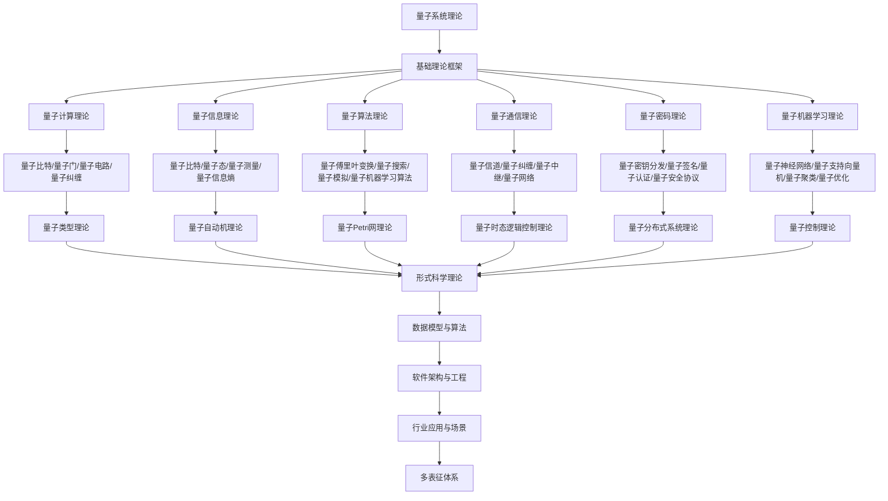

# 8.7-量子系统理论 分支导航

## 目录结构与本地跳转

- [8.7.1-量子计算基础理论深化](8.7.1-量子计算基础理论深化.md) - 量子比特、量子门、量子电路
- [8.7.2-量子信息理论深化](8.7.2-量子信息理论深化.md) - 量子信息论、量子纠缠、量子测量
- [8.7.3-量子系统学习与研究路径深化](8.7.3-量子系统学习与研究路径深化.md) - 学习路径、研究前沿、工具资源
- [8.7.4-量子通信理论深化](8.7.4-量子通信理论深化.md) - 量子密钥分发、量子网络、量子中继
- [8.7.5-量子密码理论深化](8.7.5-量子密码理论深化.md) - 量子密码学、量子安全协议、量子攻击模型
- [8.7.6-量子机器学习理论深化](8.7.6-量子机器学习理论深化.md) - 量子神经网络、量子算法、量子优化

---

## 主题交叉引用

| 理论分支 | 相关章节 | 交叉点 |
|---------|---------|--------|
| 类型理论 | 8.1-类型理论深化 | 量子类型系统、量子类型安全 |
| 自动机理论 | 8.2-自动机理论深化 | 量子自动机、量子状态机 |
| Petri网理论 | 8.3-Petri网理论深化 | 量子Petri网、量子并发系统 |
| 时态逻辑 | 8.4-时态逻辑控制理论深化 | 量子时态逻辑、量子控制 |
| 分布式系统 | 8.5-分布式系统理论深化 | 量子分布式系统、量子网络 |
| 控制理论 | 8.6-控制理论深化 | 量子控制理论、量子反馈 |
| 博弈论 | 8.7-博弈论深化 | 量子博弈论、量子策略 |

- 交叉引用：[8.1-类型理论深化](../8.1-类型理论深化/README.md)、[8.2-自动机理论深化](../8.2-自动机理论深化/README.md)、[8.3-Petri网理论深化](../8.3-Petri网理论深化/README.md)

---

## 全链路知识流（Mermaid流程图）

---

## 知识体系特色

- **量子计算**: 量子比特、量子门、量子电路的基础理论
- **量子信息**: 量子信息论和量子通信理论
- **量子算法**: 从经典算法到量子算法的算法理论
- **量子安全**: 量子密码学和量子安全协议
- **量子AI**: 量子机器学习理论和应用

---

## 多表征

量子系统理论分支支持多种表征方式，包括：

- 量子态向量/算符
- 量子图结构（量子节点、量子边）
- 逻辑/代数符号
- 自然语言与可视化
这些表征可互映，提升理论的多模态表达。

## 形式化语义

- 语义域：$D$，如希尔伯特空间、量子态集、测量算符集
- 解释函数：$I: S \to D$，将符号/结构映射到量子语义对象
- 语义一致性：每个量子结构/公式在$D$中有明确定义

## 形式化语法与证明

- 语法规则：如量子态产生式、测量规则、推理规则
- **定理**：量子系统理论分支的语法系统具一致性与可扩展性。
- **证明**：由量子态产生式与推理规则递归定义，保证系统一致与可扩展。

---

## 核心概念详解

### 量子计算基础

**量子比特**：

- **叠加态**：$|\psi\rangle = \alpha|0\rangle + \beta|1\rangle$
- **纠缠态**：多量子比特纠缠
- **测量**：量子测量和坍缩
- **量子门**：单量子比特门、多量子比特门

**量子电路**：

- **量子门序列**：量子门的组合
- **量子算法**：Shor算法、Grover算法
- **量子纠错**：量子错误纠正

### 量子信息理论

**量子信息**：

- **量子比特**：量子信息单位
- **量子纠缠**：量子纠缠资源
- **量子信道**：量子信息传输
- **量子容量**：量子信道容量

**量子测量**：

- **投影测量**：投影到本征态
- **POVM**：正算子值测度
- **弱测量**：弱耦合测量

### 量子算法

**经典量子算法**：

- **Shor算法**：大数因子分解
- **Grover算法**：无序搜索
- **量子傅里叶变换**：QFT算法

**量子机器学习**：

- **量子神经网络**：量子神经网络
- **量子支持向量机**：QSVM
- **量子优化**：量子优化算法

---

## 应用场景

### 量子计算

- **量子模拟**：量子系统模拟
- **量子优化**：组合优化问题
- **量子机器学习**：量子ML算法

### 量子通信

- **量子密钥分发**：QKD协议
- **量子网络**：量子网络架构
- **量子中继**：量子中继器

### 量子密码

- **量子密码学**：量子密码协议
- **量子安全**：量子安全通信
- **后量子密码**：抗量子攻击密码

---

## 工具与框架

### 量子编程

- **Qiskit**：IBM量子框架
- **Cirq**：Google量子框架
- **Quipper**：函数式量子编程
- **Q#**：Microsoft量子语言

### 量子模拟

- **量子模拟器**：经典量子模拟
- **量子硬件**：量子计算机
- **量子云**：量子云计算

---

## 总结

量子系统理论是量子计算和量子信息的基础理论，通过量子计算、量子信息和量子算法，可以构建强大的量子计算系统。

**核心价值**：

1. **量子计算**：量子计算能力
2. **量子信息**：量子信息处理
3. **量子安全**：量子安全通信
4. **量子优势**：量子计算优势

**未来展望**：

随着量子计算技术的发展，量子系统理论将继续演进，特别是在量子机器学习、量子网络、量子密码等领域，量子系统理论将提供更强大的理论支撑。

---

[返回形式理论深化总导航](../README.md)
