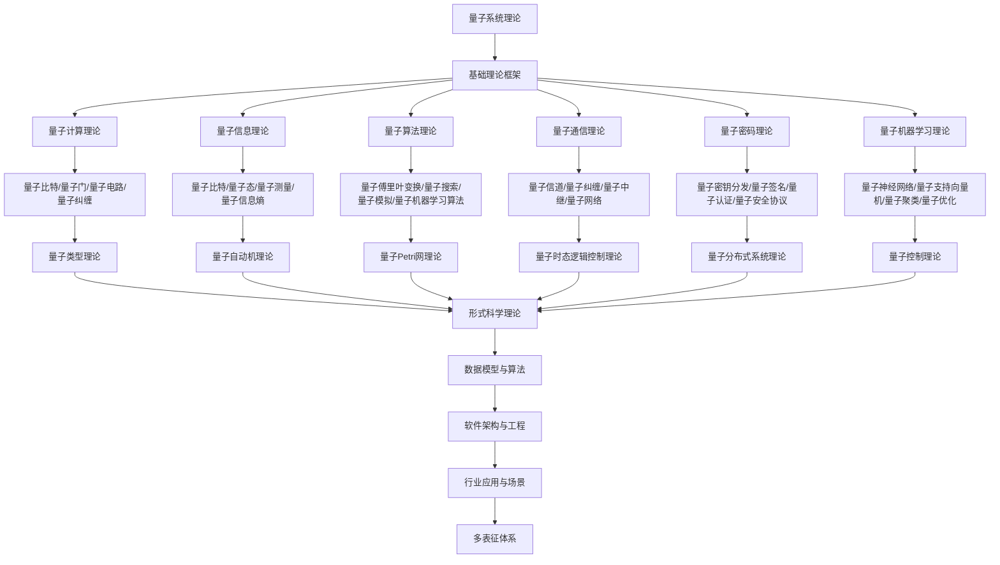

# 8.7-量子系统理论 分支导航

## 目录结构与本地跳转

- [8.7.1-量子计算基础理论深化](8.7.1-量子计算基础理论深化.md) - 量子比特、量子门、量子电路
- [8.7.2-量子信息理论深化](8.7.2-量子信息理论深化.md) - 量子信息论、量子纠缠、量子测量
- [8.7.3-量子系统学习与研究路径深化](8.7.3-量子系统学习与研究路径深化.md) - 学习路径、研究前沿、工具资源
- [8.7.4-量子通信理论深化](8.7.4-量子通信理论深化.md) - 量子密钥分发、量子网络、量子中继
- [8.7.5-量子密码理论深化](8.7.5-量子密码理论深化.md) - 量子密码学、量子安全协议、量子攻击模型
- [8.7.6-量子机器学习理论深化](8.7.6-量子机器学习理论深化.md) - 量子神经网络、量子算法、量子优化

---

## 主题交叉引用

| 理论分支 | 相关章节 | 交叉点 |
|---------|---------|--------|
| 类型理论 | 8.1-类型理论深化 | 量子类型系统、量子类型安全 |
| 自动机理论 | 8.2-自动机理论深化 | 量子自动机、量子状态机 |
| Petri网理论 | 8.3-Petri网理论深化 | 量子Petri网、量子并发系统 |
| 时态逻辑 | 8.4-时态逻辑控制理论深化 | 量子时态逻辑、量子控制 |
| 分布式系统 | 8.5-分布式系统理论深化 | 量子分布式系统、量子网络 |
| 控制理论 | 8.6-控制理论深化 | 量子控制理论、量子反馈 |
| 博弈论 | 8.7-博弈论深化 | 量子博弈论、量子策略 |

- 交叉引用：[8.1-类型理论深化](../8.1-类型理论深化/README.md)、[8.2-自动机理论深化](../8.2-自动机理论深化/README.md)、[8.3-Petri网理论深化](../8.3-Petri网理论深化/README.md)

---

## 全链路知识流（Mermaid流程图）

---

## 知识体系特色

- **量子计算**: 量子比特、量子门、量子电路的基础理论
- **量子信息**: 量子信息论和量子通信理论
- **量子算法**: 从经典算法到量子算法的算法理论
- **量子安全**: 量子密码学和量子安全协议
- **量子AI**: 量子机器学习理论和应用

---

## 多表征

量子系统理论分支支持多种表征方式，包括：

- 量子态向量/算符
- 量子图结构（量子节点、量子边）
- 逻辑/代数符号
- 自然语言与可视化
这些表征可互映，提升理论的多模态表达。

## 形式化语义

- 语义域：$D$，如希尔伯特空间、量子态集、测量算符集
- 解释函数：$I: S \to D$，将符号/结构映射到量子语义对象
- 语义一致性：每个量子结构/公式在$D$中有明确定义

## 形式化语法与证明

- 语法规则：如量子态产生式、测量规则、推理规则
- **定理**：量子系统理论分支的语法系统具一致性与可扩展性。
- **证明**：由量子态产生式与推理规则递归定义，保证系统一致与可扩展。

---

## 核心概念详解

### 量子计算基础

**量子比特**：

- **叠加态**：$|\psi\rangle = \alpha|0\rangle + \beta|1\rangle$
- **纠缠态**：多量子比特纠缠
- **测量**：量子测量和坍缩
- **量子门**：单量子比特门、多量子比特门

**量子电路**：

- **量子门序列**：量子门的组合
- **量子算法**：Shor算法、Grover算法
- **量子纠错**：量子错误纠正

### 量子信息理论

**量子信息**：

- **量子比特**：量子信息单位
- **量子纠缠**：量子纠缠资源
- **量子信道**：量子信息传输
- **量子容量**：量子信道容量

**量子测量**：

- **投影测量**：投影到本征态
- **POVM**：正算子值测度
- **弱测量**：弱耦合测量

### 量子算法

**经典量子算法**：

- **Shor算法**：大数因子分解
- **Grover算法**：无序搜索
- **量子傅里叶变换**：QFT算法

**量子机器学习**：

- **量子神经网络**：量子神经网络
- **量子支持向量机**：QSVM
- **量子优化**：量子优化算法

---

## 应用场景

### 量子计算

- **量子模拟**：量子系统模拟
- **量子优化**：组合优化问题
- **量子机器学习**：量子ML算法

### 量子通信

- **量子密钥分发**：QKD协议
- **量子网络**：量子网络架构
- **量子中继**：量子中继器

### 量子密码

- **量子密码学**：量子密码协议
- **量子安全**：量子安全通信
- **后量子密码**：抗量子攻击密码

---

## 工具与框架

### 量子编程

- **Qiskit**：IBM量子框架
- **Cirq**：Google量子框架
- **Quipper**：函数式量子编程
- **Q#**：Microsoft量子语言

### 量子模拟

- **量子模拟器**：经典量子模拟
- **量子硬件**：量子计算机
- **量子云**：量子云计算

---

## 总结

量子系统理论是量子计算和量子信息的基础理论，通过量子计算、量子信息和量子算法，可以构建强大的量子计算系统。

**核心价值**：

1. **量子计算**：量子计算能力
2. **量子信息**：量子信息处理
3. **量子安全**：量子安全通信
4. **量子优势**：量子计算优势

**未来展望**：

随着量子计算技术的发展，量子系统理论将继续演进，特别是在量子机器学习、量子网络、量子密码等领域，量子系统理论将提供更强大的理论支撑。

---

## 深入学习建议

### 理论基础强化

**数学基础**：

- **线性代数**：向量空间、矩阵运算、特征值
- **复变函数**：复分析、解析函数
- **概率论**：概率分布、随机过程
- **群论**：群、表示论

**物理基础**：

- **量子力学**：量子态、测量、纠缠
- **量子信息**：量子比特、量子门
- **量子计算**：量子算法、量子电路
- **量子通信**：量子信道、量子协议

### 实践能力提升

**编程能力**：

- **Python**：Qiskit、Cirq、PennyLane
- **Q#**：Microsoft量子语言
- **Quipper**：函数式量子编程
- **Julia**：QuantumOptics.jl

**工具使用**：

- **Qiskit**：IBM量子框架
- **Cirq**：Google量子框架
- **Q#**：Microsoft量子开发工具包
- **量子模拟器**：经典量子模拟

### 研究能力培养

**文献阅读**：

- **经典论文**：量子计算经典论文
- **前沿研究**：最新研究进展
- **应用论文**：实际应用案例
- **会议论文**：顶级会议论文

---

## 学习资源汇总

### 在线课程

- **Coursera**：量子计算课程
- **edX**：量子信息课程
- **Udemy**：Qiskit课程
- **YouTube**：量子计算教程

### 书籍推荐

- **入门书籍**：《Quantum Computation and Quantum Information》
- **进阶书籍**：《Quantum Computing: An Applied Approach》
- **应用书籍**：《Programming Quantum Computers》
- **工具书籍**：《Qiskit Textbook》

### 学术资源

- **期刊**：Physical Review、Quantum Information Processing
- **会议**：QIP、QCMC、QCE
- **数据库**：arXiv、IEEE Xplore
- **预印本**：arXiv、ResearchGate

---

## 实践项目建议

### 基础项目

- **量子电路**：实现量子电路
- **量子算法**：实现Shor、Grover算法
- **量子模拟**：量子系统模拟
- **量子测量**：量子测量实现

### 进阶项目

- **量子机器学习**：量子ML算法
- **量子优化**：量子优化算法
- **量子通信**：量子通信协议
- **量子密码**：量子密码协议

### 高级项目

- **量子网络**：量子网络系统
- **量子纠错**：量子错误纠正
- **量子硬件**：量子硬件控制
- **量子应用**：实际应用系统

---

## 常见问题与解决方案

### 量子系统挑战

**挑战1：量子退相干**

- **问题**：量子态易受环境影响
- **解决方案**：
  - 量子纠错
  - 量子错误纠正
  - 环境隔离
  - 量子控制

**挑战2：量子门实现**

- **问题**：量子门实现精度
- **解决方案**：
  - 门优化
  - 校准技术
  - 容错设计
  - 门分解

**挑战3：量子算法设计**

- **问题**：量子算法设计复杂
- **解决方案**：
  - 算法模板
  - 量子编程语言
  - 算法库
  - 优化工具

### 性能优化建议

**量子算法优化**：

- **算法选择**：选择合适的算法
- **门优化**：优化量子门序列
- **电路优化**：优化量子电路
- **资源优化**：优化资源使用

**量子硬件优化**：

- **门保真度**：提高门保真度
- **相干时间**：延长相干时间
- **连接性**：优化量子比特连接
- **校准**：定期校准系统

---

## 行业应用案例

### 量子计算

**应用场景**：

- **密码破解**：量子密码破解
- **优化问题**：量子优化算法
- **机器学习**：量子机器学习
- **模拟仿真**：量子系统模拟

**技术要点**：

- 量子算法
- 量子电路
- 量子编程
- 量子硬件

### 量子通信

**应用场景**：

- **量子密钥分发**：安全密钥分发
- **量子网络**：量子网络通信
- **量子中继**：量子中继技术
- **量子互联网**：量子互联网

**技术要点**：

- 量子纠缠
- 量子信道
- 量子协议
- 量子网络

### 量子密码

**应用场景**：

- **量子密钥分发**：量子密钥分发协议
- **量子签名**：量子数字签名
- **量子认证**：量子身份认证
- **后量子密码**：后量子密码学

**技术要点**：

- 量子密钥分发
- 量子密码协议
- 量子安全
- 后量子算法

---

## 最佳实践

### 量子算法设计最佳实践

1. **问题分析**：分析问题特点
2. **算法选择**：选择合适的算法
3. **电路设计**：设计量子电路
4. **优化改进**：优化算法性能
5. **验证测试**：验证算法正确性

### 量子编程最佳实践

1. **语言选择**：选择合适的量子语言
2. **代码组织**：组织代码结构
3. **测试验证**：进行测试验证
4. **性能优化**：优化代码性能
5. **文档维护**：维护代码文档

### 量子系统开发最佳实践

1. **硬件选择**：选择合适的硬件
2. **系统设计**：设计系统架构
3. **错误处理**：设计错误处理
4. **性能监控**：监控系统性能
5. **持续改进**：持续改进系统

---

## 职业发展路径

### 学术研究

- **研究方向**：量子计算、量子信息、量子算法
- **职业路径**：博士研究、博士后、教职、研究机构

### 工业应用

- **应用领域**：量子计算、量子通信、量子密码
- **职业路径**：量子工程师、量子算法工程师、量子硬件工程师

---

## 技术发展趋势

### 量子计算硬件

**量子处理器**：

- **超导量子**：超导量子处理器
- **离子阱量子**：离子阱量子处理器
- **光子量子**：光子量子处理器
- **拓扑量子**：拓扑量子处理器

**量子纠错**：

- **量子错误纠正**：量子错误纠正码
- **容错量子计算**：容错量子计算
- **量子纠错算法**：量子纠错算法优化
- **错误率降低**：量子错误率降低

### 量子算法发展

**量子机器学习**：

- **量子神经网络**：量子神经网络
- **量子优化**：量子优化算法
- **量子分类**：量子分类算法
- **量子降维**：量子降维方法

**量子模拟**：

- **量子化学模拟**：量子化学系统模拟
- **量子材料模拟**：量子材料模拟
- **量子物理模拟**：量子物理系统模拟
- **量子优化模拟**：量子优化问题模拟

---

## 应用前景

### 量子计算应用

- **密码破解**：量子密码破解
- **优化问题**：量子优化求解
- **机器学习**：量子机器学习
- **科学计算**：量子科学计算

### 量子通信应用

- **安全通信**：量子安全通信
- **量子网络**：量子互联网
- **量子中继**：量子中继网络
- **量子传感**：量子传感技术

### 量子密码应用

- **量子密钥分发**：量子密钥分发系统
- **量子数字签名**：量子数字签名系统
- **后量子密码**：后量子密码算法
- **量子安全通信**：量子安全通信协议

---

## 总结

量子系统理论是量子计算、量子通信和量子密码的基础，通过量子力学原理和量子信息理论，可以构建更强大的计算和通信系统，为未来技术发展提供重要支撑。

**核心价值**：

1. **量子计算**：突破经典计算限制
2. **量子通信**：实现绝对安全通信
3. **量子密码**：提供量子安全保证
4. **量子优势**：展现量子计算优势

**未来展望**：

随着量子技术的不断发展，量子系统理论将继续演进，特别是在量子机器学习、量子网络、量子密码等领域，量子系统理论将提供更强大的理论支撑和应用前景。

---

[返回形式理论深化总导航](../README.md)
