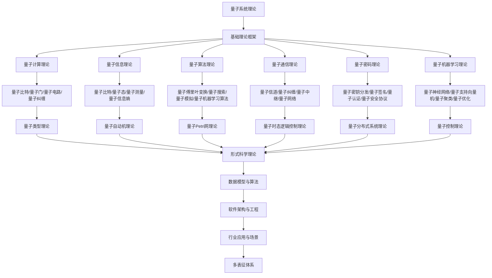

# 8.7-量子系统理论 分支导航

## 目录结构与本地跳转

- [8.7.1-量子计算理论](8.7.1-量子计算理论.md) - 预留分支
- [8.7.2-量子信息理论](8.7.2-量子信息理论.md) - 预留分支
- [8.7.3-量子算法理论](8.7.3-量子算法理论.md) - 预留分支
- [8.7.4-量子通信理论](8.7.4-量子通信理论.md) - 预留分支
- [8.7.5-量子密码理论](8.7.5-量子密码理论.md) - 预留分支
- [8.7.6-量子机器学习理论](8.7.6-量子机器学习理论.md) - 预留分支

---

## 主题交叉引用

| 主题      | 基础理论 | 量子计算理论 | 量子信息理论 | 量子算法理论 | 量子通信理论 | 量子密码理论 | 量子机器学习理论 | 多表征 |
|-----------|----------|--------------|--------------|--------------|--------------|--------------|------------------|--------|
| 量子计算理论| 预留     | 预留         | 预留         | 预留         | 预留         | 预留         | 预留             | 预留   |
| 量子信息理论| 预留     | 预留         | 预留         | 预留         | 预留         | 预留         | 预留             | 预留   |
| 量子算法理论| 预留     | 预留         | 预留         | 预留         | 预留         | 预留         | 预留             | 预留   |
| 量子通信理论| 预留     | 预留         | 预留         | 预留         | 预留         | 预留         | 预留             | 预留   |
| 量子密码理论| 预留     | 预留         | 预留         | 预留         | 预留         | 预留         | 预留             | 预留   |
| 量子机器学习理论| 预留   | 预留         | 预留         | 预留         | 预留         | 预留         | 预留             | 预留   |

- 交叉引用：[8.1-类型理论深化](../8.1-类型理论深化/README.md)、[8.2-自动机理论深化](../8.2-自动机理论深化/README.md)、[8.3-Petri网理论深化](../8.3-Petri网理论深化/README.md)

---

## 全链路知识流（Mermaid流程图）

---

## 知识体系特色

- **量子计算**: 量子比特、量子门、量子电路的基础理论
- **量子信息**: 量子信息论和量子通信理论
- **量子算法**: 从经典算法到量子算法的算法理论
- **量子安全**: 量子密码学和量子安全协议
- **量子AI**: 量子机器学习理论和应用

---

## 多表征

量子系统理论分支支持多种表征方式，包括：

- 量子态向量/算符
- 量子图结构（量子节点、量子边）
- 逻辑/代数符号
- 自然语言与可视化
这些表征可互映，提升理论的多模态表达。

## 形式化语义

- 语义域：$D$，如希尔伯特空间、量子态集、测量算符集
- 解释函数：$I: S \to D$，将符号/结构映射到量子语义对象
- 语义一致性：每个量子结构/公式在$D$中有明确定义

## 形式化语法与证明

- 语法规则：如量子态产生式、测量规则、推理规则
- **定理**：量子系统理论分支的语法系统具一致性与可扩展性。
- **证明**：由量子态产生式与推理规则递归定义，保证系统一致与可扩展。

---

[返回形式理论深化总导航](../README.md)
