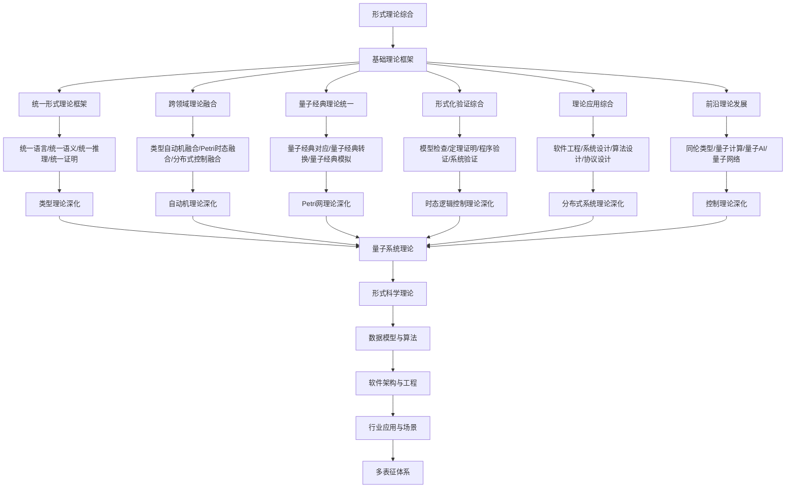

# 8.8-形式理论综合 分支导航

## 目录结构与本地跳转

- [8.8.1-形式理论综合基础](8.8.1-形式理论综合基础.md) - 统一框架、综合方法、理论基础
- [8.8.2-形式理论综合应用深化](8.8.2-形式理论综合应用深化.md) - 跨领域应用、综合方法、案例研究
- [8.8.3-形式理论综合学习与研究路径](8.8.3-形式理论综合学习与研究路径.md) - 学习路径、研究方向、工具资源

---

## 主题交叉引用

| 理论分支 | 相关章节 | 交叉点 |
|---------|---------|--------|
| 类型理论 | 8.1-类型理论深化 | 类型系统综合、类型安全统一 |
| 自动机理论 | 8.2-自动机理论深化 | 自动机综合、状态机统一 |
| Petri网理论 | 8.3-Petri网理论深化 | Petri网综合、并发系统统一 |
| 时态逻辑 | 8.4-时态逻辑控制理论深化 | 时态逻辑综合、控制理论统一 |
| 分布式系统 | 8.5-分布式系统理论深化 | 分布式系统综合、网络理论统一 |
| 控制理论 | 8.6-控制理论深化 | 控制理论综合、系统理论统一 |
| 量子系统 | 8.7-量子系统理论 | 量子经典统一、量子综合理论 |
| 博弈论 | 8.7-博弈论深化 | 博弈论综合、策略理论统一 |

- 交叉引用：[8.1-类型理论深化](../8.1-类型理论深化/README.md)、[8.7-量子系统理论](../8.7-量子系统理论/README.md)、[2-形式科学理论](../2-形式科学理论/README.md)

---

## 全链路知识流（Mermaid流程图）

---

## 知识体系特色

- **理论统一**: 各形式理论的统一框架和语言
- **跨领域融合**: 不同理论分支间的深度融合
- **量子经典统一**: 量子理论与经典理论的统一
- **验证综合**: 形式化验证方法的综合应用
- **前沿发展**: 最新理论发展和前沿应用

---

## 多表征

形式理论综合分支支持多种表征方式，包括：

- 各分支理论的符号、图、向量、自然语言、可视化等多模态表征
- 统一映射机制，实现多表征互通
这些表征可互映，提升理论的综合表达力。

## 形式化语义

- 语义域：$D$，如各分支理论的对象集、结构集、模型空间
- 解释函数：$I: S \to D$，将符号/结构映射到综合语义对象
- 语义一致性：每个综合结构/公式在$D$中有明确定义

## 形式化语法与证明

- 语法规则：如综合产生式、推理规则、约束条件
- **定理**：形式理论综合分支的语法系统具一致性与可扩展性。
- **证明**：由综合产生式与推理规则递归定义，保证系统一致与可扩展。

---

[返回形式理论深化总导航](../README.md)
