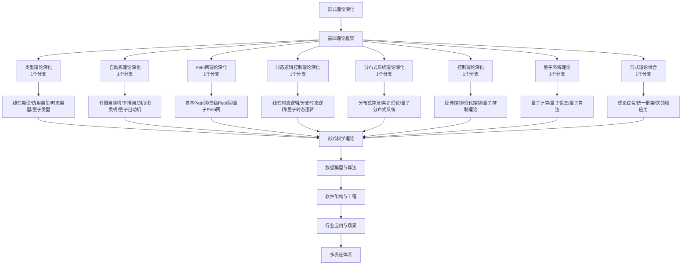

# 8-形式理论深化 总导航

## 目录结构与完成情况

- [8.1-类型理论深化](8.1-类型理论深化/README.md) - **1个分支，预留框架**
- [8.2-自动机理论深化](8.2-自动机理论深化/README.md) - **1个分支，预留框架**
- [8.3-Petri网理论深化](8.3-Petri网理论深化/README.md) - **1个分支，预留框架**
- [8.4-时态逻辑控制理论深化](8.4-时态逻辑控制理论深化/README.md) - **1个分支，预留框架**
- [8.5-分布式系统理论深化](8.5-分布式系统理论深化/README.md) - **1个分支，预留框架**
- [8.6-控制理论深化](8.6-控制理论深化/README.md) - **1个分支，预留框架**
- [8.7-量子系统理论](8.7-量子系统理论/README.md) - **1个分支，预留框架**
- [8.8-形式理论综合](8.8-形式理论综合/README.md) - **1个分支，预留框架**

---

## 主题交叉引用

| 分支      | 基础理论 | 类型理论 | 自动机理论 | Petri网理论 | 时态逻辑 | 分布式系统 | 控制理论 | 量子系统 | 多表征 |
|-----------|----------|----------|------------|-------------|----------|------------|----------|----------|--------|
| 类型理论深化| 预留     | 预留     | 预留       | 预留        | 预留     | 预留       | 预留     | 预留     | 预留   |
| 自动机理论深化| 预留   | 预留     | 预留       | 预留        | 预留     | 预留       | 预留     | 预留     | 预留   |
| Petri网理论深化| 预留  | 预留     | 预留       | 预留        | 预留     | 预留       | 预留     | 预留     | 预留   |
| 时态逻辑控制理论深化| 预留 | 预留     | 预留       | 预留        | 预留     | 预留       | 预留     | 预留     | 预留   |
| 分布式系统理论深化| 预留 | 预留     | 预留       | 预留        | 预留     | 预留       | 预留     | 预留     | 预留   |
| 控制理论深化| 预留     | 预留     | 预留       | 预留        | 预留     | 预留       | 预留     | 预留     | 预留   |
| 量子系统理论| 预留     | 预留     | 预留       | 预留        | 预留     | 预留       | 预留     | 预留     | 预留   |
| 形式理论综合| 预留     | 预留     | 预留       | 预留        | 预留     | 预留       | 预留     | 预留     | 预留   |

- 交叉引用：[2-形式科学理论](../2-形式科学理论/README.md)、[3-数据模型与算法](../3-数据模型与算法/README.md)、[4-软件架构与工程](../4-软件架构与工程/README.md)

---

## 全链路知识流（Mermaid流程图）

---

## 知识体系特色

- **理论深化**: 从基础理论到高级应用的深度理论体系
- **跨领域融合**: 各理论分支间的深度交叉与融合
- **量子前沿**: 量子计算与经典理论的结合
- **形式化严谨**: 严格的形式化定义和数学证明
- **实践导向**: 理论在工程实践中的具体应用

---

[返回Analysis总导航](../README.md)
